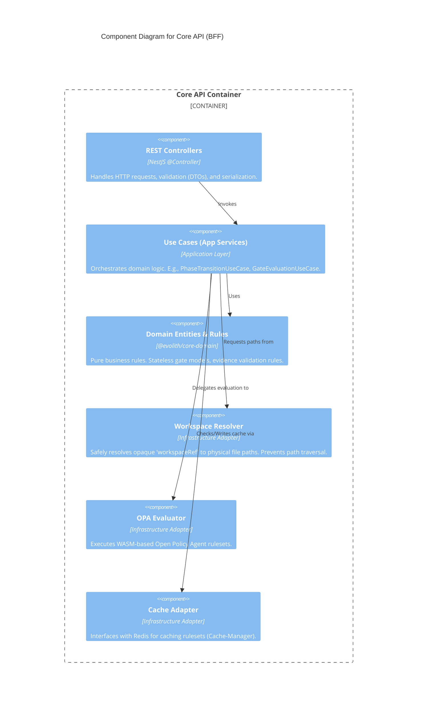

# C4 Level 3: Core API Components

> **Bilingual Navigation:** [Versión en Español](./core-api-components.es.md)

**Status:** Approved  
**Level:** 3 - Components  
**Parent:** [C4 Level 3: Components Hub](./README.md)

## 1. Container Context

The **Core API (BFF)** is the stateless evaluation engine of Evolith. It receives HTTP REST requests, resolves workspace references to find the appropriate reference corpus, evaluates gates using OPA or a Native Engine, and returns a technical evaluation result.

It strictly adheres to **Clean Architecture**.

## 2. Component Diagram

## 3. Key Components Breakdown

| Component | Responsibility |
|-----------|----------------|
| **REST Controllers** | Expose endpoints like `POST /v1/gates/evaluate`. Ensure input payloads meet DTO schemas. |
| **Use Cases** | Coordinate the flow: get input -> resolve workspace -> fetch ruleset (cache or disk) -> evaluate via OPA -> return result. |
| **@evolith/core-domain** | The core business logic, decoupled from NestJS. Defines what a `Gate` is, what `Evidence` is. |
| **Workspace Resolver** | Security boundary. Translates an opaque `workspaceRef` token (provided by Tracker) into a safe, validated absolute path to the reference corpus on disk. |
| **OPA Evaluator** | Loads `.wasm` policies compiled from Rego, injects the JSON rulesets and the input evidence, and returns the evaluation result. |

---
[Back to Level 3: Components Hub](./README.md)
