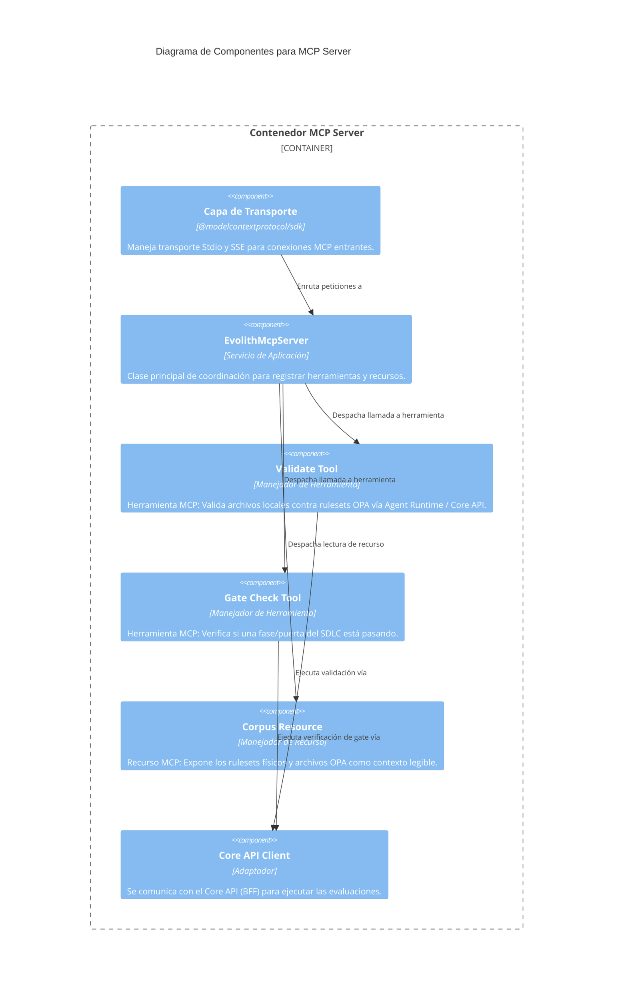

# C4 Nivel 3: Componentes del MCP Server

> **Navegación Bilingüe:** [Ver Versión en Inglés](./mcp-server-components.md)

**Estado:** Aprobado  
**Nivel:** 3 - Componentes  
**Padre:** [C4 Nivel 3: Hub de Componentes](./README.es.md)

## 1. Contexto del Contenedor

El **Standalone MCP Server** expone las capacidades de gobernanza de Evolith hacia Agentes IA externos (como Claude vía Claude Desktop, u otros flujos de trabajo agénticos) utilizando el Model Context Protocol estándar. Está completamente desacoplado del Smart CLI.

## 2. Diagrama de Componentes

## 3. Desglose de Componentes Clave

| Componente | Responsabilidad |
|------------|-----------------|
| **Capa de Transporte** | SDK estándar de MCP que maneja el ciclo de vida de la conexión (Stdio para procesos locales, SSE para streaming remoto). |
| **EvolithMcpServer** | El punto de entrada de la aplicación que registra el esquema de herramientas y recursos disponibles con el LLM que se conecta. |
| **Manejadores de Herramientas** | Acciones específicas y limitadas que la IA puede tomar (ej. `validate_artifact`, `check_gate`). |
| **Manejadores de Recursos** | Contexto de solo-lectura que la IA puede solicitar (ej. `ruleset://...`). |
| **Core API Client** | En lugar de duplicar lógica de negocio, el MCP Server hace llamadas REST al `Core API` para procesar validaciones y leer topologías. |

---
[Volver al Nivel 3: Hub de Componentes](./README.es.md)
