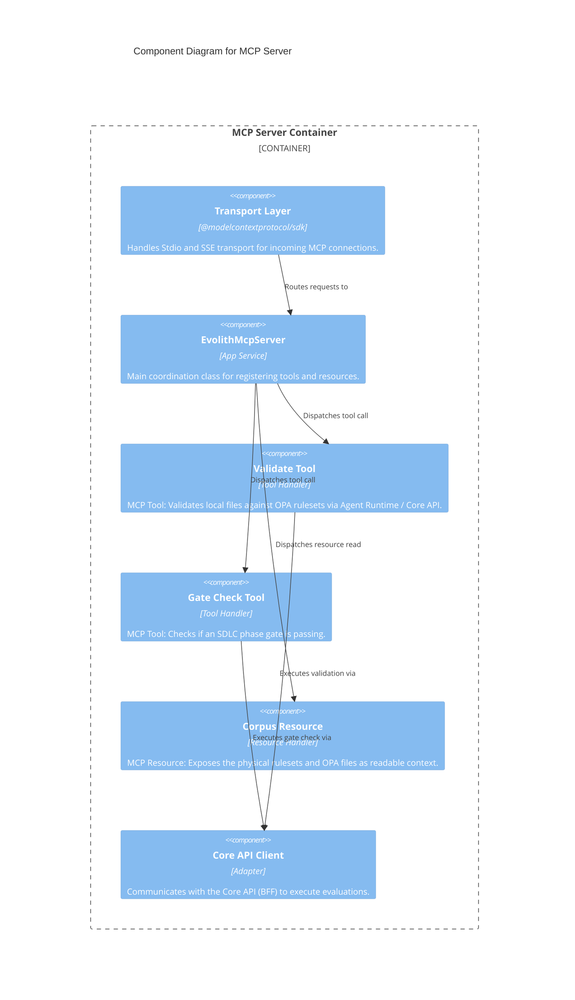

# C4 Level 3: MCP Server Components

> **Bilingual Navigation:** [Versión en Español](./mcp-server-components.es.md)

**Status:** Approved  
**Level:** 3 - Components  
**Parent:** [C4 Level 3: Components Hub](./README.md)

## 1. Container Context

The **Standalone MCP Server** exposes Evolith's governance capabilities to external AI Agents (such as Claude via Claude Desktop, or other capable agentic workflows) using the standard Model Context Protocol. It is fully decoupled from the Smart CLI.

## 2. Component Diagram

## 3. Key Components Breakdown

| Component | Responsibility |
|-----------|----------------|
| **Transport Layer** | Standard MCP SDK managing connection lifecycle (Stdio for local processes, SSE for remote streaming). |
| **EvolithMcpServer** | The application entry point that registers the available tool and resource schema with the connecting LLM. |
| **Tool Handlers** | Specific, bounded actions the AI can take (e.g., `validate_artifact`, `check_gate`). |
| **Resource Handlers** | Read-only context the AI can request (e.g., `ruleset://...`). |
| **Core API Client** | Instead of duplicating business logic, the MCP Server makes REST calls to the `Core API` to process validations and read topologies. |

---
[Back to Level 3: Components Hub](./README.md)
