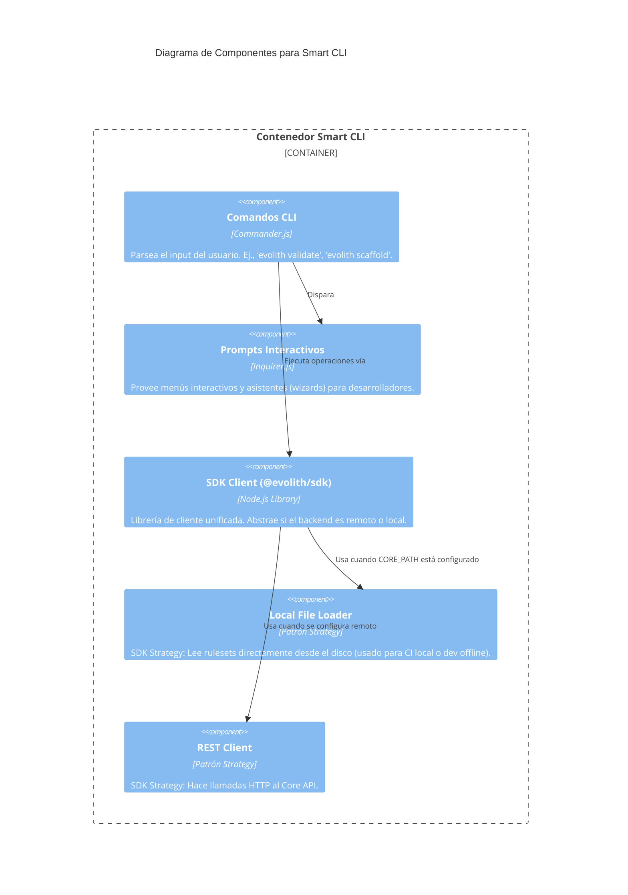

# C4 Nivel 3: Componentes de Smart CLI

> **Navegación Bilingüe:** [Ver Versión en Inglés](./smart-cli-components.md)

**Estado:** Aprobado  
**Nivel:** 3 - Componentes  
**Padre:** [C4 Nivel 3: Hub de Componentes](./README.es.md)

## 1. Contexto del Contenedor

La **Smart CLI** es la interfaz interactiva local para ingenieros que trabajan dentro de Evolith. Utiliza el `@evolith/sdk-client` para comunicarse con el Core API remoto, o bien para cargar reglas físicas localmente si la variable `CORE_PATH` está configurada.

## 2. Diagrama de Componentes

## 3. Desglose de Componentes Clave

| Componente | Responsabilidad |
|------------|-----------------|
| **Comandos CLI** | Los puntos de entrada (`bin/evolith.js`). Manejados por Commander.js para parsear argumentos y flags. |
| **Prompts Interactivos** | Entrevistas tipo wizard para recolectar metadatos necesarios si el usuario omite flags (ej. preguntar qué artefacto generar). |
| **SDK Client** | La librería central que expone métodos como `.validateArtifact()`. La CLI no contiene lógica de negocio; delega todo al SDK. |
| **Estrategias Local / REST** | El SDK determina en runtime si puede resolver la solicitud localmente (leyendo el sistema de archivos) o si debe llamar al Core API. |

---
[Volver al Nivel 3: Hub de Componentes](./README.es.md)
