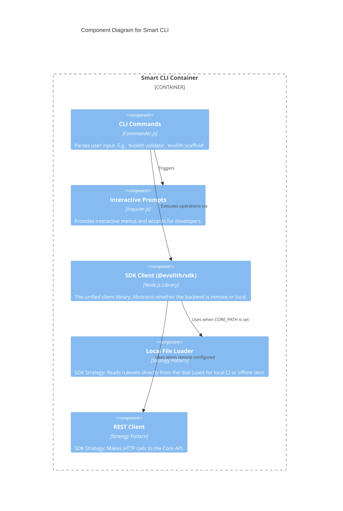

# C4 Level 3: Smart CLI Components

> **Bilingual Navigation:** [Versión en Español](./smart-cli-components.es.md)

**Status:** Approved  
**Level:** 3 - Components  
**Parent:** [C4 Level 3: Components Hub](./README.md)

## 1. Container Context

The **Smart CLI** is the local interactive interface for engineers working within Evolith. It uses the `@evolith/sdk-client` to either communicate with the remote Core API or to load physical rulesets locally if the `CORE_PATH` is set.

## 2. Component Diagram

## 3. Key Components Breakdown

| Component | Responsibility |
|-----------|----------------|
| **CLI Commands** | The entry points (`bin/evolith.js`). Handled by Commander.js to parse arguments and flags. |
| **Interactive Prompts** | Wizard-style interviews to gather necessary metadata if the user omits flags (e.g., asking which artifact to scaffold). |
| **SDK Client** | The core library that exposes methods like `.validateArtifact()`. The CLI does not contain business logic; it delegates entirely to the SDK. |
| **Local / REST Strategies** | The SDK determines at runtime whether it can fulfill the request locally (by reading the file system directly) or if it must call out to the Core API. |

---
[Back to Level 3: Components Hub](./README.md)
