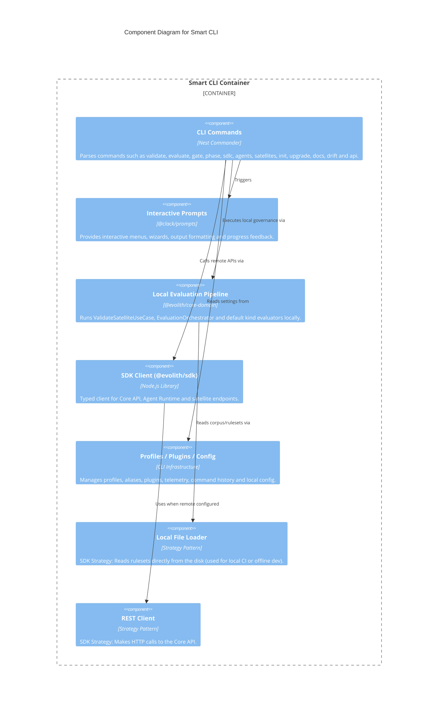

# C4 Level 3: Smart CLI Components

> **Bilingual Navigation:** [Versión en Español](./smart-cli-components.es.md)

**Status:** Approved  
**Level:** 3 - Components  
**Parent:** [C4 Level 3: Components Hub](./README.md)

## 1. Container Context

The **Smart CLI** is the local interactive interface for engineers working with Evolith and satellite repositories. It uses Nest Commander commands, shared `@evolith/core-domain` use cases, local filesystem providers, and `@evolith/sdk` clients to support both local/offline governance and remote Core/Agent Runtime calls.

## 2. Component Diagram

## 3. Key Components Breakdown

| Component | Responsibility |
|-----------|----------------|
| **CLI Commands** | Entry points implemented as Nest Commander providers in `sdk/cli/src/commands/**`. |
| **Interactive Prompts** | Wizard-style flows, menus, progress output, and formatted command feedback for developer workflows. |
| **Local Evaluation Pipeline** | Runs `ValidateSatelliteUseCase`, `EvaluationOrchestrator`, native/OPA evaluators, topology checks, and phase gate validation locally. |
| **SDK Client** | Typed HTTP client for remote Core API, Agent Runtime, and satellite registry workflows. |
| **Profiles / Plugins / Config** | Local shell around aliases, profiles, plugin loading, telemetry, command history, and environment-specific defaults. |

---
[Back to Level 3: Components Hub](./README.md)
