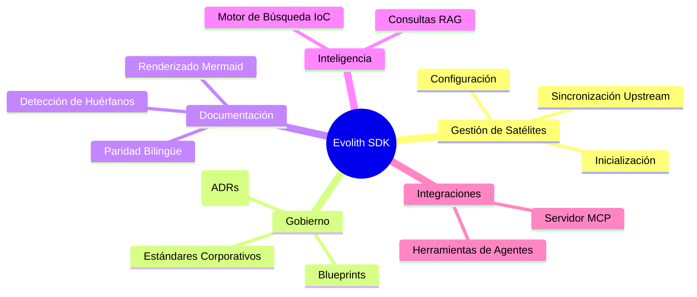
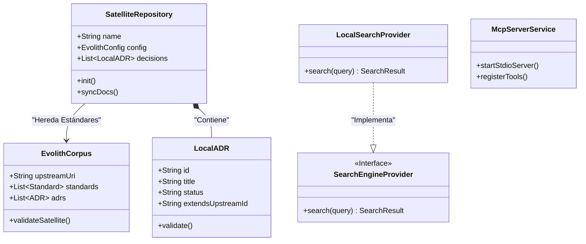

# Evolith SDK: Modelo de Dominio

Este documento describe los Contextos Delimitados (Bounded Contexts) del Diseño Guiado por el Dominio (DDD) y las entidades que componen el Evolith SDK y su interfaz CLI.

## Contextos Delimitados

La arquitectura está construida en torno a varios dominios interconectados que aseguran la separación de responsabilidades entre la manipulación cruda de archivos, el gobierno de estándares y la integración continua.

## Entidades Principales

## Lógica de Dominio

1. **Gestión de Satélites**: Maneja las configuraciones `.evolith` y el análisis YAML, asegurando que el repositorio local cumpla con la estructura básica sin sobrescribir la lógica de aplicación crítica.
2. **Gobierno**: Analiza y valida documentos Markdown buscando específicamente los metadatos y la sintaxis `extends` necesaria para vincular decisiones locales con patrones de arquitectura corporativa.
3. **Inteligencia**: Expone herramientas de búsqueda mediante Inversión de Control para asegurar que los agentes y usuarios puedan recuperar orientación arquitectónica específica de forma offline.
