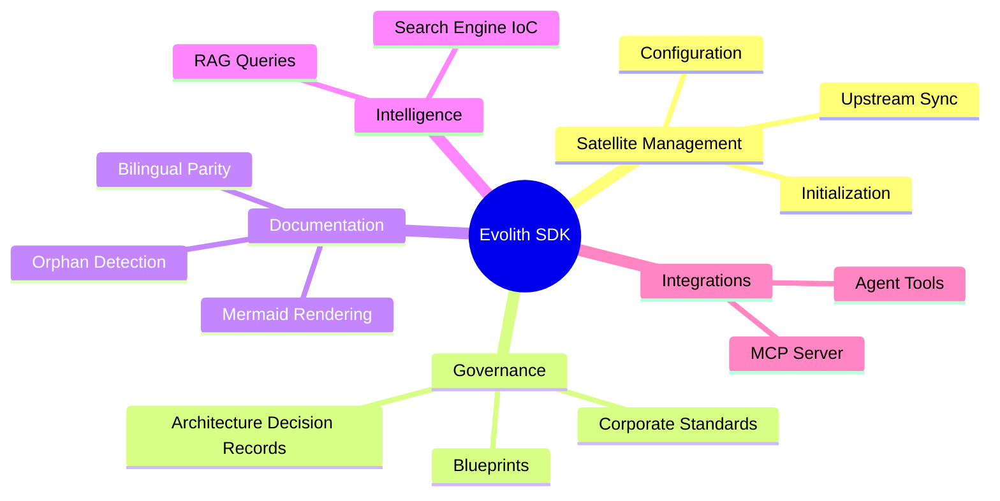
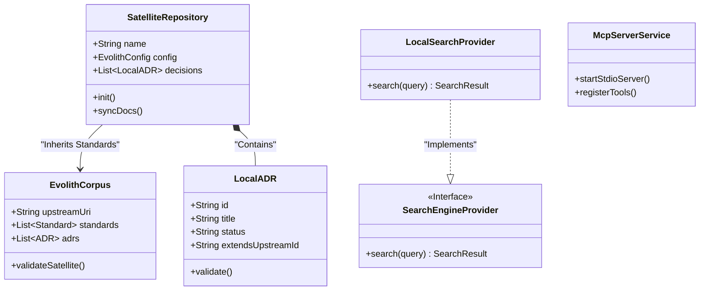

# Evolith SDK: Domain Model

This document outlines the Domain-Driven Design (DDD) Bounded Contexts and entities that compose the Evolith SDK and its CLI interface.

## Bounded Contexts

The architecture is built around several interconnected domains that ensure the separation of concerns between raw file manipulation, standard governance, and continuous integration.

## Core Entities

## Domain Logic

1. **Satellite Management**: Handles the `.evolith` configurations and YAML parsing, ensuring the local repository adheres to the basic structure without overwriting critical application logic.
2. **Governance**: Parses and validates Markdown documents specifically looking for the exact frontmatter and `extends` syntax needed to link local decisions to corporate architecture patterns.
3. **Intelligence**: Exposes search tools via Inversion of Control to ensure that agents and users can retrieve specific architectural guidance offline.
