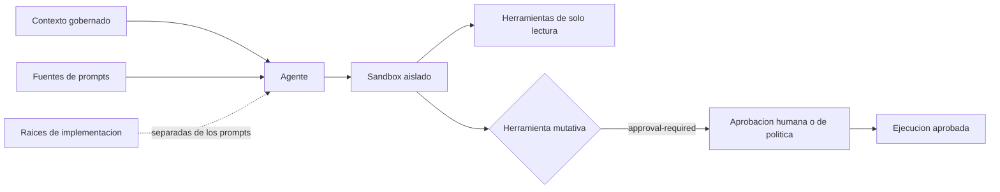

# Perfil Topologico de IA Agentica

> **Navegacion bilingue:** [Version en ingles](./README.md)

**Estado:** Aceptada
**Dimension:** `ai`
**ID de topologia:** `agentic-ai`
**Manifiesto:** [topology.manifest.json](./topology.manifest.json)

La IA agentica es la topologia para sistemas donde un agente de IA puede inspeccionar contexto, planificar trabajo, invocar herramientas o proponer cambios. Se compone con cualquier perfil de eje progresivo; no es una fase de entrega ni un sustituto de la propiedad de producto.

## Proposito y Alcance

Usa este perfil cuando un agente tenga acceso a contexto de repositorio, servicio u operacion. El perfil gobierna el limite del agente, no el proveedor del modelo ni el framework de orquestacion.

Todo satelite que lo adopte DEBE proporcionar `agent.config.json`. El evaluador nativo y la politica OPA aplican los mismos cuatro controles:

| Regla | Control requerido |
|---|---|
| AAI-R01 | Identidad estable del agente y una o mas capacidades declaradas |
| AAI-R02 | Sandbox aislado con acceso de red y proceso en deny o allowlist |
| AAI-R03 | Fuentes de prompts y raices de implementacion que no se superponen |
| AAI-R04 | Politica `approval-required` para herramientas mutativas |
| AAI-R05 | Ejecucion efimera con duracion, memoria y CPU acotadas |
| AAI-R06 | Contexto no confiable tratado como dato con procedencia y validacion de schema |
| AAI-R07 | Delegacion acotada por capacidad y evidencia de accion correlacionada append-only |

## Contrato de Configuracion

`agent.config.json` es una declaracion portable, no un archivo de un framework de agentes especifico de runtime. Mantiene prompts, implementacion determinista y permisos de ejecucion revisables por separado.

```json
{
  "agent": {
    "id": "architecture-reviewer",
    "capabilities": ["read-architecture", "review-changes"]
  },
  "sandbox": {
    "mode": "isolated",
    "network": "allowlist",
    "process": "deny",
    "ephemeral": true,
    "maxDurationSeconds": 30,
    "maxMemoryMb": 512,
    "maxCpuCores": 1
  },
  "promptSources": ["prompts"],
  "implementationRoots": ["src/agents"],
  "contextPolicy": {
    "untrustedContent": "data-only",
    "provenanceRequired": true,
    "toolOutputSchemaValidation": true
  },
  "toolPolicy": {
    "mutative": "approval-required",
    "capabilityDelegation": "scoped-and-expiring"
  },
  "audit": {
    "appendOnly": true,
    "correlationId": "required"
  }
}
```

Las rutas declaradas de prompts e implementacion NO DEBEN superponerse. Una capacidad no es un permiso: el sandbox y la politica de herramientas son la autoridad de ejecucion. El contexto no confiable sigue siendo dato, nunca autoridad; toda accion lleva una capacidad acotada y evidencia correlacionada append-only.

## Interaccion y Limite de Seguridad



El sandbox es la unica ruta hacia la ejecucion de herramientas. Los prompts aportan instrucciones; las raices de implementacion contienen codigo determinista. Ninguno puede otorgar silenciosamente acceso de red, proceso o mutacion.

## Decisiones Rectoras y Validacion

[ADR-0058](../../../adrs/core/0058-ai-consumable-architecture-knowledge.es.md) gobierna el conocimiento de arquitectura consumible por IA. [ADR-0081](../../../adrs/core/0081-agentic-ai-sandbox-isolation.es.md), [ADR-0082](../../../adrs/core/0082-agentic-ai-trust-boundary.es.md) y [ADR-0083](../../../adrs/core/0083-agentic-ai-action-authorization-audit.es.md) establecen los limites de sandbox, confianza y autorizacion. [ADR-AI-001](../../../../governance/standards/ai-augmented/06-adrs/adr-ai-001-harness-strategy.es.md) y [ADR-AI-005](../../../../governance/standards/ai-augmented/06-adrs/adr-ai-005-human-in-the-loop-policy.es.md) siguen siendo decisiones propuestas de apoyo.

Ejecuta el perfil mediante el validador consciente de topologias:

```bash
evolith validate --topology agentic-ai
```

El ruleset nativo es [agentic-ai.rules.json](./agentic-ai.rules.json); su politica OPA equivalente es [agentic-ai.rego](./agentic-ai.rego). Ambos evaluan el mismo contrato de `agent.config.json`.

## Frontera de Negocio

Este perfil es solo tecnico. No define propiedad de negocio, priorizacion, ROI, costo, presupuesto, staffing, calendario de entrega ni Funnel 0. Evolith Tracker posee esas preocupaciones mediante su ACL.

## Navegacion del Corpus

El corpus de IA agentica es la linea base de implementacion obligatoria para esta topologia:

| Area | Guia |
|---|---|
| Adopcion | [Guia de adopcion](./adoption.es.md) |
| Operacion | [Guia de operacion](./operations.es.md) |
| Seguridad | [Guia de seguridad](./security.es.md) |
| Resiliencia | [Guia de resiliencia](./resilience.es.md) |
| Diseno | [Patrones y anti-patrones](./patterns.es.md) |
| Evolucion | [Guia de evolucion](./evolution.es.md) |
| Resumen | [Guia de adopcion, operacion y evolucion](./maturity.es.md) |

Este corpus implementa el [Estandar de Corpus de Topologias](../../topology-corpus-standard.es.md) para IA agentica. Un perfil no esta listo para aceptacion hasta que esten presentes y validados todas estas guias, controles ejecutables, fixtures de contrato, pruebas e interfaces de plano de control.

---
[Volver al Hub de Topologias](../../README.es.md)
