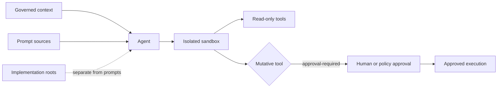

# Agentic AI Topology Profile

> **Bilingual Navigation:** [Version en Espanol](./README.es.md)

**Status:** Draft
**Dimension:** `ai`
**Topology ID:** `agentic-ai`
**Manifest:** [topology.manifest.json](./topology.manifest.json)

Agentic AI is the topology for systems where an AI agent can inspect context, plan work, call tools, or propose changes. It is composable with every progressive-axis profile; it is not a delivery phase or a substitute for product ownership.

## Purpose and Scope

Use this profile when an agent has access to repository, service, or operational context. The profile governs the agent boundary, not the model vendor or orchestration framework.

Every adopting satellite MUST provide `agent.config.json`. The native evaluator and the OPA policy enforce the same four controls:

| Rule | Required control |
|---|---|
| AAI-R01 | Stable agent identity and one or more declared capabilities |
| AAI-R02 | An isolated sandbox with deny or allowlist network and process access |
| AAI-R03 | Non-overlapping prompt sources and implementation roots |
| AAI-R04 | `approval-required` policy for mutative tools |
| AAI-R05 | Ephemeral execution with bounded duration, memory, and CPU |
| AAI-R06 | Untrusted context treated as data with provenance and schema validation |
| AAI-R07 | Capability-scoped delegation and append-only correlated action evidence |

## Configuration Contract

`agent.config.json` is a portable declaration, not a runtime-specific agent framework file. It keeps prompts, deterministic implementation, and execution permissions independently reviewable.

```json
{
  "agent": {
    "id": "architecture-reviewer",
    "capabilities": ["read-architecture", "review-changes"]
  },
  "sandbox": {
    "mode": "isolated",
    "network": "allowlist",
    "process": "deny",
    "ephemeral": true,
    "maxDurationSeconds": 30,
    "maxMemoryMb": 512,
    "maxCpuCores": 1
  },
  "promptSources": ["prompts"],
  "implementationRoots": ["src/agents"],
  "contextPolicy": {
    "untrustedContent": "data-only",
    "provenanceRequired": true,
    "toolOutputSchemaValidation": true
  },
  "toolPolicy": {
    "mutative": "approval-required",
    "capabilityDelegation": "scoped-and-expiring"
  },
  "audit": {
    "appendOnly": true,
    "correlationId": "required"
  }
}
```

The declared prompt and implementation paths MUST not overlap. A capability is not permission: the sandbox and tool policy are the execution authority. Untrusted context remains data, never authority; every action carries a scoped capability and append-only correlated evidence.

## Interaction and Security Boundary



The sandbox is the only route to tool execution. Prompts provide instructions; implementation roots contain deterministic code. Neither can silently grant network, process, or mutative access.

## Governing Decisions and Validation

[ADR-0058](../../../adrs/core/0058-ai-consumable-architecture-knowledge.md) governs AI-consumable architecture knowledge. [ADR-0081](../../../adrs/core/0081-agentic-ai-sandbox-isolation.md), [ADR-0082](../../../adrs/core/0082-agentic-ai-trust-boundary.md), and [ADR-0083](../../../adrs/core/0083-agentic-ai-action-authorization-audit.md) establish the sandbox, trust, and authorization boundaries. [ADR-AI-001](../../../../governance/standards/ai-augmented/06-adrs/adr-ai-001-harness-strategy.md) and [ADR-AI-005](../../../../governance/standards/ai-augmented/06-adrs/adr-ai-005-human-in-the-loop-policy.md) remain supporting proposed decisions.

Run the profile through the topology-aware validator:

```bash
evolith validate --topology agentic-ai
```

The native ruleset is [agentic-ai.rules.json](./agentic-ai.rules.json); its equivalent OPA policy is [agentic-ai.rego](./agentic-ai.rego). Both evaluate the same `agent.config.json` contract.

## Business Boundary

This profile is technical-only. It does not define business ownership, prioritization, ROI, cost, budget, staffing, delivery timing, or Funnel 0. Evolith Tracker owns those concerns through its ACL.

---
[Back to Topology Hub](../../README.md)
