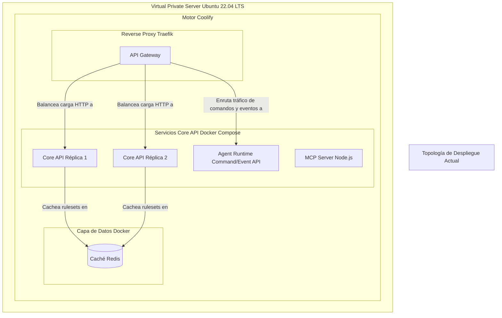
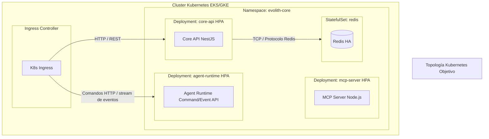

# Vista de Arquitectura: Despliegue

> **Navegación Bilingüe:** [Ver Versión en Inglés](./view-by-deployment.md)

**Estado:** Aprobado  
**Padre:** [C4 Master Architecture](../C4-MASTER-ARCHITECTURE.es.md)

## 1. Despliegue Actual (VPS / Coolify)

Evolith utiliza actualmente una configuración en contenedores de alta disponibilidad ejecutándose en un Virtual Private Server orquestado por Coolify.
Esta topología equilibra eficiencia de costos con resiliencia.

## 2. Despliegue Futuro (Kubernetes)

A medida que el ecosistema escale, Evolith transicionará a un modelo de despliegue nativo de Kubernetes para soportar HPA (Horizontal Pod Autoscaling) automatizado y políticas de red (NetworkPolicies) estrictas.

---
[Volver a la Arquitectura Maestra](../C4-MASTER-ARCHITECTURE.es.md)
