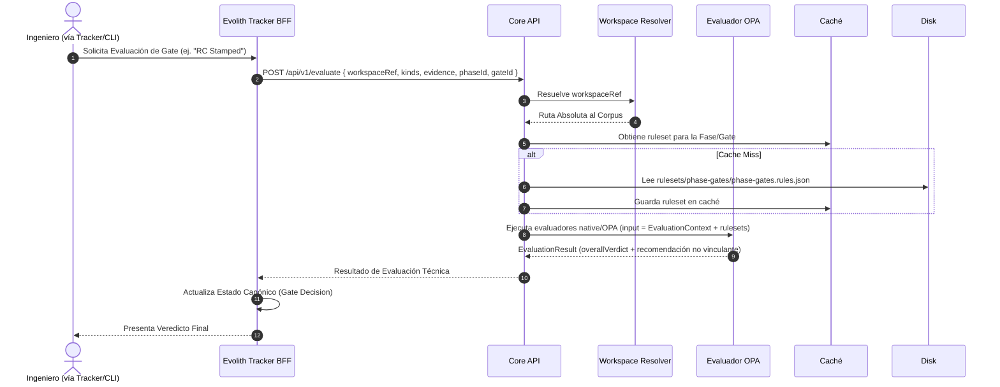
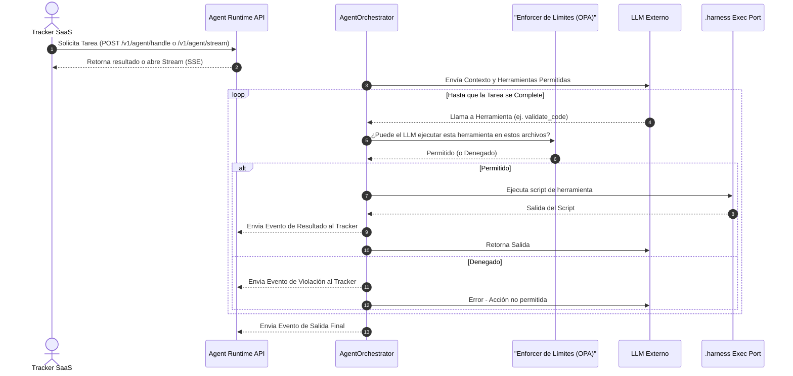

# Vista de Arquitectura: Flujos y Gobernanza

> **Navegación Bilingüe:** [Ver Versión en Inglés](./view-by-flow.md)

**Estado:** Aprobado  
**Padre:** [C4 Master Architecture](../C4-MASTER-ARCHITECTURE.es.md)

## 1. Visión General de Flujos

Esta vista detalla el flujo sistémico paso a paso de cómo Evolith hace cumplir sus reglas de gobernanza. Demuestra la trazabilidad desde el SaaS Tracker (donde se solicita el proceso) a través del Core Engine (donde se evalúa) hasta el resultado final.

## 2. Flujo Estándar de Evaluación de Gate

Esta secuencia muestra cómo ocurre una evaluación de un "Gate" (puerta de fase) activada por un humano o de forma automatizada.

## 3. Flujo de Trabajo Agéntico (SSE)

Esta secuencia muestra cómo se gobierna a un Agente IA en tiempo real al realizar tareas de múltiples pasos.

---
[Volver a la Arquitectura Maestra](../C4-MASTER-ARCHITECTURE.es.md)
