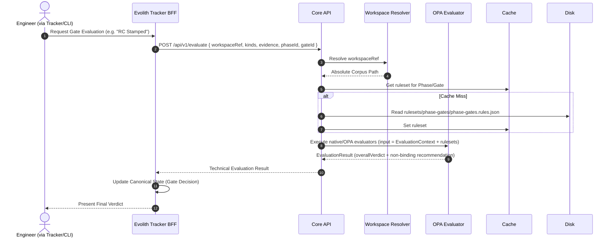
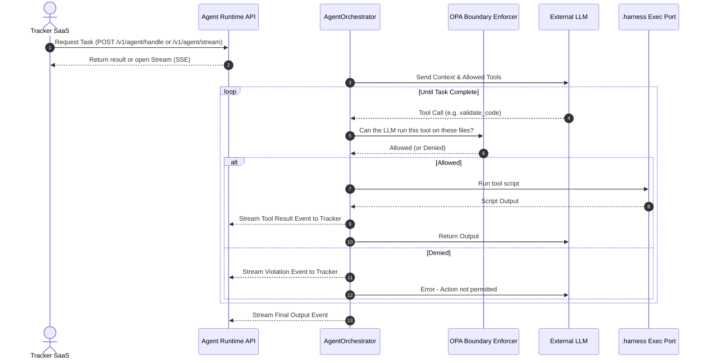

# Architecture View: Flows & Governance

> **Bilingual Navigation:** [Versión en Español](./view-by-flow.es.md)

**Status:** Approved  
**Parent:** [C4 Master Architecture](../C4-MASTER-ARCHITECTURE.md)

## 1. Flow Overview

This view details the step-by-step systemic flow of how Evolith enforces its governance rules. It demonstrates the traceability from the Tracker SaaS (where the process is requested) through the Core Engine (where it is evaluated) to the final output.

## 2. Standard Gate Evaluation Flow

This sequence shows how an automated or human-triggered gate assessment occurs.

## 3. Agentic Workflow (SSE)

This sequence shows how an AI Agent is governed in real time when performing multi-step tasks.

---
[Back to Master Architecture](../C4-MASTER-ARCHITECTURE.md)
