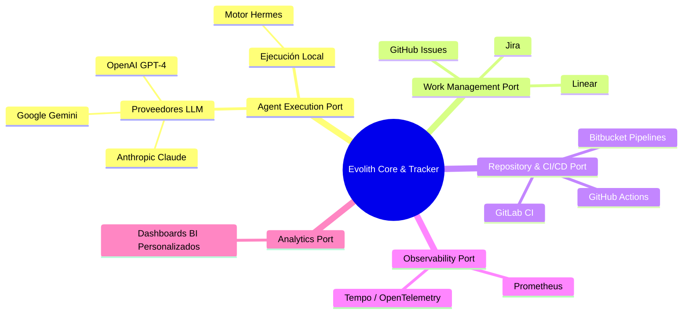

# Vista de Arquitectura: Integraciones y Ecosistema

> **Navegación Bilingüe:** [Ver Versión en Inglés](./view-by-integration.md)

**Estado:** Aprobado  
**Padre:** [C4 Master Architecture](../C4-MASTER-ARCHITECTURE.es.md)

## 1. Estrategia de Integración

Evolith no reinventa capacidades tipo "commodity". Opera bajo una estrategia de **Composición Gobernada (Governed Composition)**. Las herramientas y plataformas externas se componen detrás de *Puertos de Proveedor (Provider Ports)* para asegurar que Evolith mantenga la autoridad canónica sobre los Gates de las Fases y la traza de ejecución.

## 2. Mapa de Integraciones

Este mapa describe los principales sistemas externos con los que Evolith se integra, y el puerto a través del cual se acceden.

## 3. Modelo de Puertos y Adaptadores

Para integrar una nueva capacidad (por ejemplo, un nuevo proveedor de LLM), el desarrollador implementa la interfaz apropiada (por ejemplo, `IAgentEnginePort`) en la capa `@evolith/agent-runtime` o un nuevo adaptador en Evolith Tracker.

Los rulesets y el modelo de gobernanza del Core **no cambian** cuando un proveedor cambia.

---
[Volver a la Arquitectura Maestra](../C4-MASTER-ARCHITECTURE.es.md)
