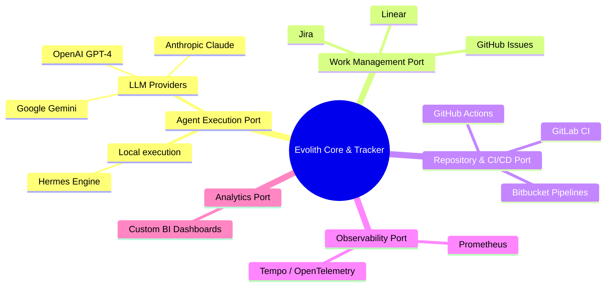

# Architecture View: Integrations & Ecosystem

> **Bilingual Navigation:** [Versión en Español](./view-by-integration.es.md)

**Status:** Approved  
**Parent:** [C4 Master Architecture](../C4-MASTER-ARCHITECTURE.md)

## 1. Integration Strategy

Evolith does not reinvent commodity capabilities. It operates on a **Governed Composition** strategy. External tools and platforms are composed behind *Provider Ports* (Adapters) to ensure Evolith maintains canonical authority over the Phase Gates and execution trace.

## 2. Integration Map

This map outlines the major external systems Evolith integrates with, and the port through which they are accessed.

## 3. The Port and Adapter Model

To integrate a new capability (e.g., a new LLM provider), the developer implements the appropriate interface (e.g., `IAgentEnginePort`) in the `@evolith/agent-runtime` layer or a new adapter in Evolith Tracker. 

The Core rulesets and governance model **do not change** when a provider changes.

---
[Back to Master Architecture](../C4-MASTER-ARCHITECTURE.md)
