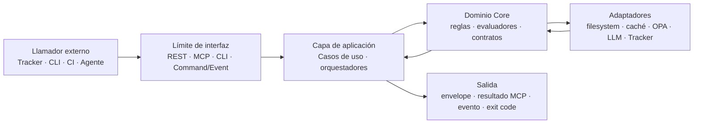
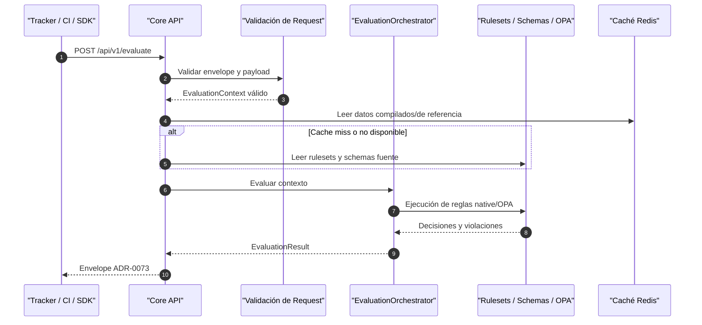
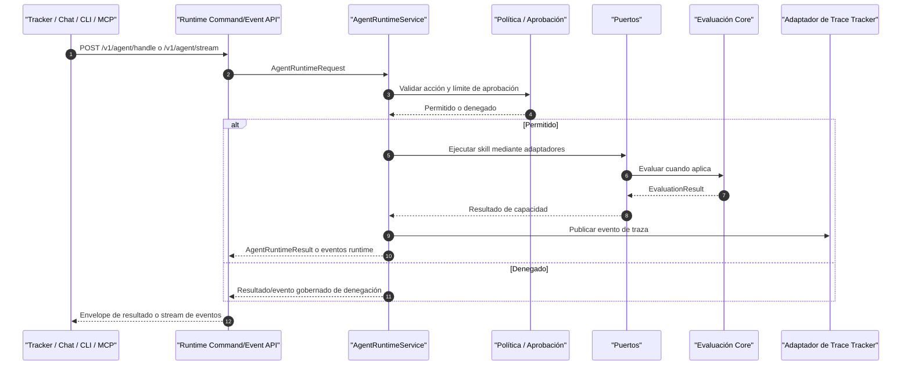

# Vista de Arquitectura: Flujos de Interfaces del Core

> **Navegación Bilingüe:** [Ver Versión en Inglés](./view-by-interface-flow.md)

**Estado:** Aprobado  
**Padre:** [C4 Master Architecture](../C4-MASTER-ARCHITECTURE.es.md)  
**Última Actualización:** 2026-07-01

## 1. Propósito y Alcance

Esta vista documenta cómo fluye la comunicación a través de las interfaces de Evolith Core. C4 muestra la forma estructural del sistema; esta vista lo complementa haciendo explícita cada interfaz en términos operativos: quién la llama, qué entra, qué sale, qué capa la maneja y cómo el sistema se degrada o falla.

El alcance incluye las superficies Core implementadas en este repositorio: Core API REST, MCP Server, Agent Runtime Command/Event API, Smart CLI, llamadas remotas mediadas por SDK, endpoints de salud/métricas, lecturas del corpus estructurado, límites de integración con Tracker y el registro transitorio de satélites.

Fuera de alcance: internos del UI/BFF de Tracker, internos de UMS, comportamiento específico de proveedores LLM y autorización tenant específica de producto. Eso pertenece a sus repositorios de producto o perfiles específicos de runtime.

## 2. Taxonomía de Interfaces

| Tipo de Interfaz | Llamador Principal | Estilo de Contrato | Ownership de Estado | Salida Principal |
|---|---|---|---|---|
| Core API REST | Tracker, CI, clientes SDK, Smart CLI remoto | Request/response HTTP síncrono | Core posee solo evaluación técnica; Tracker posee estado de producto | Envelope ADR-0073 o problema RFC 9457 |
| MCP Server | Agentes IA, asistentes de editor, hosts locales de agente | Llamada tool/resource/prompt por MCP stdio o Streamable HTTP | Core posee contrato de ejecución de tools; el llamador posee estado conversacional | Envelope de resultado MCP, resource, prompt, auditoría/métricas |
| Agent Runtime Command/Event API | Tracker, chat, CLI, puente MCP, clientes externos | Comando explícito más stream opcional servidor-a-cliente | Runtime posee traza de ejecución; Tracker posee estado vinculante de workflow | `AgentRuntimeResult` o stream de eventos |
| Smart CLI | Desarrollador, CI, proceso de agente local | Comando de terminal sobre filesystem local y HTTP SDK opcional | Workspace local posee archivos; reglas Core poseen semántica de validación | Salida de consola, envelope JSON, código de salida |
| Corpus Estructurado | Core API, MCP, CLI, adaptadores de Agent Runtime | Lectura filesystem de schemas, rulesets, OPA, manifests | El corpus del repositorio es la verdad de gobernanza ejecutable | Reglas, schemas, políticas y requisitos parseados |
| Salud y Métricas | Orquestador, balanceador, operador | HTTP version-neutral | El proceso runtime posee liveness/readiness; métricas son evidencia operativa | JSON de salud o texto Prometheus |
| Límite de Trazas Tracker | Agent Runtime, adaptadores hacia Core | Adaptador HTTP de publicación trace/event | Tracker posee la línea de tiempo canónica de trazas cuando está configurado | Evento de traza aceptado o fallo controlado del adaptador |

## 3. Mapa de Comunicación End-to-End

### 3.1 Flujo por Capas

Cada interfaz sigue el mismo patrón direccional: contrato de borde, caso de uso de aplicación, dominio/evaluador, adaptador de infraestructura y luego envelope de salida o evento.

### 3.2 Límite de Estado del Core

Core puede recibir identificadores tenant/product/initiative como contexto opaco y puede reflejarlos en `meta.context`, eventos o trazas para correlación. Core no autoriza usuarios, no persiste ownership tenant ni toma decisiones de producto vinculantes. Tracker sigue siendo el owner canónico del estado tenant, estado de producto, aprobaciones y decisiones de gate.

## 4. Matriz de Flujos de Interfaces

| Interfaz | IN | Ruta de Procesamiento | OUT | Comportamiento de Resiliencia |
|---|---|---|---|---|
| `POST /api/v1/evaluate` | `EvaluationContext`, referencia de workspace, evidencia, contexto opaco opcional | Controller -> validación -> `EvaluationOrchestrator` -> evaluadores native/OPA -> corpus/caché | `EvaluationResult` técnico en envelope ADR-0073 | Errores de schema fallan rápido; cache miss cae al corpus; fallos de evaluación retornan problema/envelope, no estado parcial |
| `POST /api/v1/gates/:gateId/evaluate` | Gate id, payload de fase/evidencia | `GatesController` -> `EvaluateGateUseCase` -> `PhaseGateValidatorService` | Evidencia/recomendación de gate | Gate/fase inválidos fallan validación; el resultado es técnico y no vinculante hasta que Tracker registre la decisión |
| `POST /api/v1/phases/transition` | Transición de fase propuesta y evidencia | `PhasesController` -> caso de uso de transición -> checks de gate | Recomendación de transición | Evidencia obligatoria faltante bloquea; Core no muta estado Tracker |
| `GET /api/v1/rulesets`, gates, requirements | Path/id de consulta | `ReferenceController` -> servicio de query de referencia -> caché/filesystem | Ruleset, gate o documento de requisitos | Cache miss lee filesystem; referencia faltante retorna error HTTP controlado |
| Llamada tool MCP | Nombre de tool, input de tool, contexto de usuario autenticado en modo HTTP | Transporte MCP -> auth/ABAC -> registro de tools -> handler -> caso de uso de dominio | Envelope de resultado MCP más auditoría/métricas | Auth HTTP falla cerrado en producción; tool desconocida/no autorizada se deniega y audita |
| Lectura resource/prompt MCP | URI de resource o nombre de prompt | Transporte MCP -> servicio de resources/prompts -> lookup de corpus/servicio | Payload de resource o prompt | Resource/prompt faltante retorna error de protocolo; logs van a stderr en stdio |
| Agent Runtime `POST /v1/agent/handle` | Comando `AgentRuntimeRequest` | Controller -> runtime service -> skills -> policy/approval -> puertos/adaptadores | Un `AgentRuntimeResult` | Denegación de política/aprobación retorna resultado gobernado; fallos de adaptador se capturan en trace |
| Agent Runtime `POST /v1/agent/stream` | Comando `AgentRuntimeRequest` | Misma ruta runtime, con stream servidor-a-cliente | Eventos de progreso/tool/violación/final | SSE es solo transporte de eventos; acciones de cliente siguen siendo comandos HTTP/MCP explícitos |
| Comando local Smart CLI | Args CLI, cwd, archivos locales | Nest Commander -> comando -> providers locales/core-domain | Salida humana, envelope JSON, exit code | Amigable offline; args inválidos fallan antes de efectos; errores filesystem emergen como errores de comando |
| Llamada remota SDK | Request de cliente tipado | Cliente SDK -> endpoint REST -> Core/Runtime | Respuesta tipada | Errores de red quedan en el límite SDK; el llamador decide retry/circuit |
| `/health`, `/metrics` | Request de probe/lectura | Controller público -> servicio/registry | JSON de salud o exposición Prometheus | Probes públicos evitan API key; errores de métricas no deben romper evaluación de dominio |
| Registro de satélites | Payload create/list/link de satélite | `SatellitesController` -> servicio de compatibilidad in-memory | Respuesta de registro | Solo transitorio; nunca estado tenant/producto canónico |

## 5. Flujos de Proceso por Interfaz

### 5.1 Evaluación REST del Core API

**Resiliencia:** la validación falla antes de evaluar; Redis es una optimización y no debe convertirse en fuente de verdad; reglas faltantes o evidencia inválida retornan errores controlados. El resultado es evidencia técnica, no mutación de estado Tracker.

### 5.2 Gobernanza de Gates y Fases

La evaluación de gates y los endpoints de transición de fase son flujos REST especializados sobre el mismo contrato de evaluación. Un resultado de gate indica si la evidencia satisface criterios de gobernanza; solo Tracker o un workflow de producto registra la decisión vinculante.

| Paso | Responsabilidad |
|---|---|
| El llamador envía evidencia de gate/fase | Proveer fase, gate, clase de actor, workspace/evidencia |
| Core valida payload | Rechazar phase keys, actor classes y evidencia malformada |
| Core evalúa reglas | Aplicar reglas phase-gate y validators native/OPA |
| Core retorna recomendación | Retornar detalles pass/block/warn y referencias de evidencia |
| Tracker registra decisión | Persistir aprobación, waiver o rechazo fuera de Core |

**Resiliencia:** fallos de evidencia obligatoria bloquean; input malformado falla rápido; waivers deben ser artefactos explícitos de gobernanza, no bypass informal.

### 5.3 Lecturas de Referencia y Descubrimiento de Rulesets

Los endpoints de referencia exponen rulesets activos, gates, requisitos de fase y datos de referencia arquitectónica para clientes que necesitan descubrimiento antes de evaluar.

**IN:** ruleset id, gate id, phase id, topology id o query de descubrimiento.  
**OUT:** documento de referencia estructurado, metadata de ruleset, requisitos de gate o error not-found controlado.  
**Proceso:** controller -> servicio de query -> caché/filesystem -> envelope.  
**Resiliencia:** cache miss lee archivos del repositorio; ids inválidos fallan con problem details; la documentación nunca sobreescribe la verdad de schemas/rulesets.

### 5.4 Tools, Resources y Prompts MCP

MCP expone las mismas capacidades de gobernanza a agentes mediante tools, resources y prompts gobernados. No es un motor de reglas separado.

| Sub-interfaz | IN | OUT | Resiliencia |
|---|---|---|---|
| Tool call | Nombre de tool e input JSON | Envelope de resultado de tool | Tools desconocidas fallan; tools mutativas requieren autorización y auditoría |
| Resource read | URI `evolith://...` | Payload de resource | Resources faltantes retornan error de protocolo |
| Prompt read | Nombre/argumentos de prompt | Contenido de prompt | El lookup de prompt es determinístico y versionado por release del servidor |
| Auth de transporte HTTP | API key o roles JWT | Contexto de usuario para ABAC | HTTP en producción falla cerrado cuando falta auth o política ABAC |
| Transporte stdio | Stream JSON-RPC | Resultado JSON-RPC | Logs van a stderr; stdout permanece solo para protocolo |

**Resiliencia:** MCP registra métricas por tool y eventos de auditoría; ABAC evalúa al momento de invocar la tool; la ausencia de política OPA falla cerrado en producción para decisiones protegidas.

### 5.5 Agent Runtime Command/Event API

La API command/event separa intención del cliente y eventos del servidor:

- `POST /v1/agent/handle` envía un comando y espera un resultado final.
- `POST /v1/agent/stream` envía un comando y mantiene abierto un stream de eventos.
- SSE es solo transporte de eventos servidor-a-cliente. Las acciones siguientes son nuevos comandos HTTP/MCP correlacionados con la tarea activa.

**Resiliencia:** los checks de política y aprobación ocurren antes de completar efectos; fallos de adaptadores se capturan en resultado runtime y traza; una interrupción de stream no autoriza trabajo oculto.

### 5.6 Flujos Locales y Remotos de Smart CLI

La CLI es tanto una interfaz local de gobernanza como un cliente remoto cuando está configurada para llamar Core API o Agent Runtime mediante SDK.

| Modo | IN | Procesamiento | OUT | Resiliencia |
|---|---|---|---|---|
| Validación local | cwd, archivos, flags | Commander -> providers locales -> core-domain | stdout/JSON, exit code | Funciona offline; errores filesystem son explícitos |
| Evaluación de gate | flags de fase/gate, evidencia | command -> `EvaluateGateUseCase` | envelope de evidencia de gate | Actor/fase inválidos fallan rápido |
| Check remoto | configuración SDK y request | SDK -> HTTPS Core/Runtime | respuesta tipada | errores de red quedan fuera de semántica de dominio |
| MCP serve | comando CLI delega al paquete MCP server | arranque de binary/package | servidor MCP stdio o HTTP | HTTP en producción requiere auth |

**Resiliencia:** los comandos validan flags antes de efectos; la salida JSON sirve para CI; exit codes no cero son el límite de automatización.

### 5.7 Salud, Métricas y Observabilidad

Los endpoints operativos no son comandos de dominio. Permiten a orquestadores y operadores saber si un proceso está vivo, listo y produciendo telemetría útil.

| Superficie | IN | OUT | Resiliencia |
|---|---|---|---|
| Core API `/health`, `/health/live`, `/health/ready` | HTTP probe | JSON de health/readiness | Probes públicos evitan API key; readiness puede reportar dependencias degradadas |
| Core API `/metrics` | HTTP scrape | texto Prometheus | Exposición de métricas evita envelope ADR cuando Prometheus lo requiere |
| MCP `/health` | HTTP probe | JSON de salud de transporte | Liveness público funciona sin credenciales |
| Agent Runtime `/health` | HTTP probe | JSON de salud runtime | Salud pública queda separada de comandos gobernados |
| Interceptores OTLP/métricas | lifecycle de request | trazas, contadores, latencia | fallo de telemetría no debe mutar veredictos de dominio |

### 5.8 Integración con Tracker y Publicación de Trazas

Tracker consume Core y Agent Runtime como cliente externo. Core no llama a Tracker para pedir autoridad tenant. Agent Runtime puede publicar eventos de traza mediante `ITrackerTracePort` cuando está configurado.

**IN desde Tracker:** request autorizado de producto, referencia de workspace, contexto opaco, evidencia, comando.  
**OUT hacia Tracker:** resultado de evaluación, resultado runtime, evento de traza o error controlado.  
**Resiliencia:** si falla la publicación de trazas hacia Tracker, el runtime reporta/registra fallo de adaptador según configuración; Core sigue sin persistir estado Tracker.

### 5.9 Registro Transitorio de Satélites

El registro de satélites bajo `/api/v1/satellites` es una superficie in-memory de compatibilidad/referencia. Soporta flujos create/list/read/link para escenarios de referencia, pero no debe usarse como store canónico de Tracker.

**Resiliencia:** un reinicio de proceso puede perder datos del registro; clientes que necesiten ownership durable tenant/producto deben usar Tracker o un store propiedad del producto.

## 6. Matriz de Resiliencia

| Modo de Falla | Límite que lo Detecta | Comportamiento Esperado |
|---|---|---|
| API key faltante o inválida | Guard de Core/MCP/Runtime | Falla cerrado excepto rutas públicas de health/readiness |
| JSON inválido o mismatch de schema | Capa controller/validación | Rechazar antes de ejecutar dominio |
| Redis no disponible | Adaptador de caché | Fallback a filesystem/fuente de referencia donde esté soportado |
| Ruleset/schema faltante | Capa de referencia/evaluación | Retornar error controlado; no inventar defaults |
| Política OPA no disponible | Capa evaluador/política ABAC | Fallar cerrado en producción para decisiones protegidas; usar fallback native documentado solo donde el contrato lo permita |
| Tool no autorizada | ABAC MCP o límite de política runtime | Denegar, auditar y retornar error/resultado gobernado |
| Fallo de proveedor LLM | Adaptador engine de Agent Runtime | Retornar error runtime gobernado; nunca saltar checks de policy/gate |
| Desconexión de SSE/event stream | Límite Agent Runtime API/cliente | Dejar de entregar eventos; el cliente debe reintentar/enviar un comando explícito correlacionado o flujo de consulta |
| Tracker no disponible para publicar traza | Adaptador de traza Tracker | Reportar fallo/degradación de adaptador; no persistir estado de producto en Core |
| Filesystem ilegible | Adaptador filesystem CLI/Core/MCP | Exponer error de comando/API; evitar veredictos exitosos parciales |
| Backend de métricas/telemetría no disponible | Adaptador de observabilidad | Degradar telemetría; no cambiar decisión de dominio |

## 7. Correlación, Auditoría e Idempotencia

Todo flujo externo debe preservar un correlation id mediante envelope, metadata de evento, registro de auditoría o salida JSON de CLI. La correlación no es ownership: vincula una request con trazas y resultados sin dar autoridad a Core sobre estado tenant/producto.

| Preocupación | Contrato |
|---|---|
| Correlación | `correlationId`, runtime task id, trace id o command id debe fluir por logs y respuestas |
| Auditoría | Tools MCP mutativas, efectos runtime gobernados y denegaciones de política deben emitir evidencia de auditoría/traza |
| Idempotencia | Los clientes deben tratar evaluación como repetible y stateless; decisiones stateful de producto permanecen fuera de Core |
| Reintentos | Reintentar solo comandos seguros por contrato o con protección de correlación/idempotencia del llamador |
| Orden | Los event streams están ordenados por stream de comando activo, no son un bus de eventos global |

## 8. Guía para Clientes

- Usa Core API REST para evaluación determinística y lecturas de referencia.
- Usa MCP cuando un agente necesita descubrimiento de tools/resources/prompts bajo ABAC y auditoría.
- Usa Agent Runtime cuando el cliente necesita ejecución de agente multi-paso gobernada, límites de política, aprobaciones, memoria o publicación de trazas.
- Usa Smart CLI para gobernanza local/offline y ejecución amigable para CI.
- No uses SSE como canal de comandos. Es un transporte de entrega de eventos después de un comando explícito.
- No conectes agentes directamente a Tracker para contexto gobernado o tools. Usa MCP o Agent Runtime.
- No trates `/api/v1/satellites` como ownership durable de tenant o producto.

## 9. Referencias Relacionadas

- [C4 Master Architecture](../C4-MASTER-ARCHITECTURE.es.md)
- [Nivel 2: Contenedores](../c4-levels/level-2-containers.es.md)
- [Componentes del Agent Runtime](../c4-levels/level-3-components/agent-runtime-components.es.md)
- [Componentes del Core API](../c4-levels/level-3-components/core-api-components.es.md)
- [Componentes del MCP Server](../c4-levels/level-3-components/mcp-server-components.es.md)
- [Matriz de Trazabilidad E2E](../traceability/e2e-traceability-matrix.es.md)
- [Mapa de Ecosistema y Comunicación](../../products/ecosystem-and-communication.es.md)

---
[Volver a la Arquitectura Maestra](../C4-MASTER-ARCHITECTURE.es.md)
