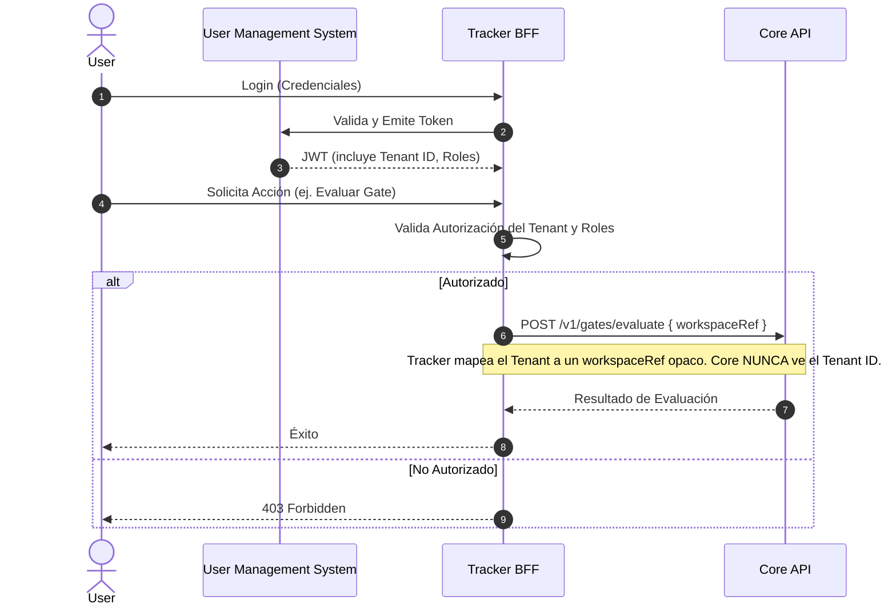

# Vista de Arquitectura: Multi-Tenancy y Autorización

> **Navegación Bilingüe:** [Ver Versión en Inglés](./view-by-tenant.md)

**Estado:** Aprobado  
**Padre:** [C4 Master Architecture](../C4-MASTER-ARCHITECTURE.es.md)

## 1. Estrategia Multi-Tenancy

Evolith sigue una estricta separación de responsabilidades con respecto a multi-tenancy. Tal como lo decreta el **ADR-0101**, el motor Core de Evolith es completamente **stateless (sin estado) y agnóstico de tenant**.

La responsabilidad del aislamiento de tenants, la autorización de usuarios y los registros de propiedad recae enteramente en **Evolith Tracker**.

## 2. Flujo de Autorización

## 3. Reglas de Límite (Boundaries)
1. **Core API** y **Agent Runtime API** utilizan API Keys (ej., `x-api-key`) para autenticación máquina-a-máquina con el Tracker.
2. **Core API** nunca interpreta un `tenantId`.
3. **Tracker** maneja la validación del JWT, el Control de Acceso Basado en Roles (RBAC), y el mapeo del tenant hacia los subconjuntos de reglas correctos.

---
[Volver a la Arquitectura Maestra](../C4-MASTER-ARCHITECTURE.es.md)
