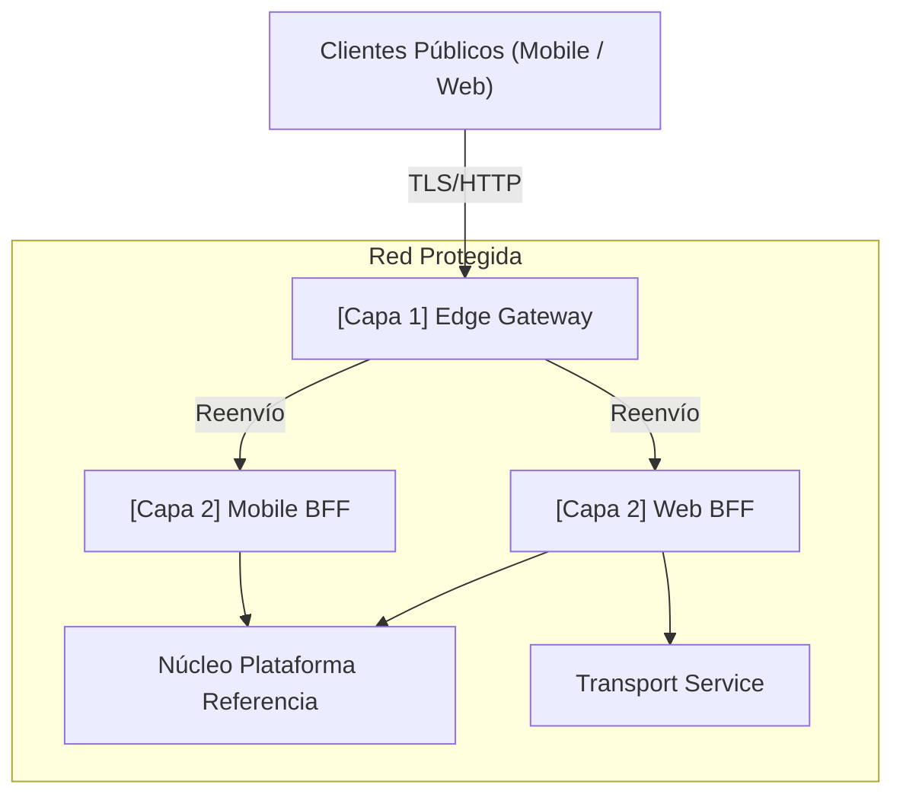

# ADR-0030: Modelo de Gateway Distribuido de Dos Capas

## Estado
Accepted

## Fecha
2026-05-10

## Contexto y Problema
Utilizar hilos de la aplicación para realizar enrutamiento de infraestructura a nivel de red puro, limitación de tasa de volumen masivo o terminación SSL genérica desperdicia bucles de eventos en sobrecarga, degradando la velocidad crítica de la aplicación. Por el contrario, empujar fusiones complejas de cargas útiles de API o agregados recursivos de bases de datos en scripts de proxy de borde en bruto crea un atasco operativo.

## Objetivo y Alcance
Formalizar una topología de gateway rígida para desacoplar correctamente las defensas del perímetro de la infraestructura de la orquestación y la lógica de presentación.

## Opciones Consideradas
- **Seleccionada:** Modelo de Gateway Distribuido de Dos Capas
- **Otras:** Gateway de Borde de una capa (rechazado por la complejidad de los scripts de proxy), Gateway de Aplicación de una capa (rechazado por el agotamiento del bucle de eventos bajo DDOS/Spam).

## Decisión y Justificación
Adoptar un **Modelo de Gateway Distribuido de Dos Capas** para separar limpiamente las responsabilidades:

1. **Capa 1 - Edge Gateway**: Barrera de alto rendimiento. Se sitúa literalmente en el perímetro del clúster público. Gestiona solo reglas transversales no funcionales: SSL, estrangulamiento de claves de API, validación de firma de origen JWT simple, reenvío de ruta y reglas WAF. *(Ejemplo: Traefik OSS, NGINX)*.
2. **Capa 2 - Gateway de Aplicación (BFF)**: Lógica de dominio personalizada desplegada de forma segura dentro de la zona de seguridad de Capa 1. Responsable de componer respuestas de datos heterogéneos, eliminar PII para formatos de UI genéricos, adaptar las cargas útiles del dispositivo y gestionar la mecánica de cookies del usuario. *(Ejemplo: Node.js BFF)*.

### Arquitectura Actualizada de Dos Capas

## Evidencias y Criterios de Evaluación
Evaluado contra el principio arquitectónico de separación de preocupaciones. Este modelo descarga el procesamiento de flujos binarios y la seguridad de red a proxies de infraestructura, reservando memoria de aplicación para la agregación lógica del dominio.

## Consecuencias, Riesgos y Trade-offs

### Positivas
- Separa las preocupaciones binarias en bruto de la agregación lógica. Las instancias de aplicación no desperdician ciclos bloqueando DDOS/Spams.
- Capacidad de escala de rendimiento extremo. Los proxies de borde devoran cómodamente volúmenes de tráfico que los runtimes de aplicación no pueden.
- Mejora el aislamiento del backend (la Capa 1 protege explícitamente a la Capa 2).

### Negativas
- Añade una variable de latencia de segundo salto (generalmente insignificante <1ms de sobrecarga si se despliega correctamente).
- Introduce el ciclo de vida del stack operativo de gestión del borde.

## Referencias
- Ninguna

## Decisiones y Estándares Relacionados
- [Node.js ADR-0075: NestJS como Gateway de Aplicación BFF](../nodejs/0075-application-gateway-bff-nestjs.es.md)
- [Node.js ADR-0008: Patrones Progresivos de BFF](../nodejs/0008-progressive-multimodule-evolution-gateway-bff.es.md)

---
[Volver al Índice](./README.es.md)

> **Agent Signature:** Architect Agent
