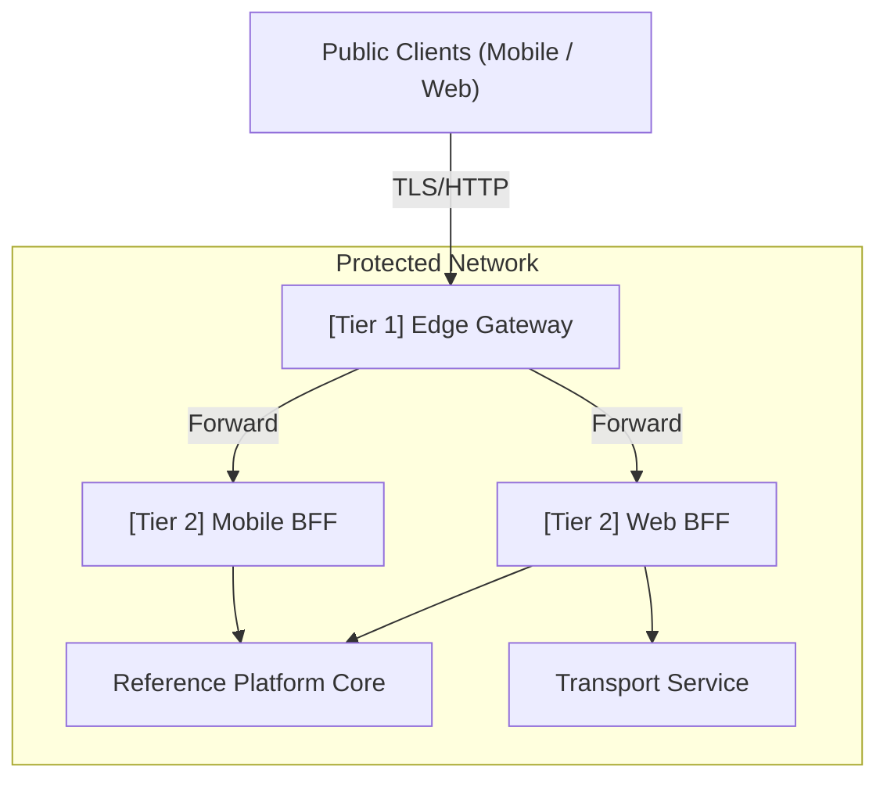

# ADR-0030: Two-Tier Distributed Gateway Model

## Status
Accepted

## Date
2026-05-10

## Context and Problem
Utilizing application threads to perform pure network-level infrastructure routing, massive volume rate-limiting, or generic SSL termination wastes single-threaded event loops on overhead, degrading critical application speed. Conversely, pushing complex API payload merges or recursive database aggregates into raw edge proxy scripts creates operational gridlock.

## Objective and Scope
Formalize a rigid gateway topology to correctly decouple infrastructure perimeter defenses from orchestration and presentation logic.

## Options Considered
- **Selected:** Two-Tier Distributed Gateway Model
- **Others:** Single-tier Edge Gateway (rejected due to proxy script complexity), Single-tier Application Gateway (rejected due to event loop exhaustion under DDOS/Spam).

## Decision and Rationale
Adopt a **Two-Tier Distributed Gateway Model** to cleanly separate concerns:

1. **Tier 1 - Edge Gateway**: High-throughput barrier. Sits on the literal public cluster perimeter. Manages only non-functional transversal rules: SSL, API key throttling, simple JWT origin signature validation, path forwarding, and WAF rules. *(Example: Traefik OSS, NGINX)*.
2. **Tier 2 - Application Gateway (BFF)**: Custom domain logic deployed safely within the Tier 1 security zone. Responsible for composing heterogeneous data responses, stripping PII for generic UI formats, tailoring device payloads, and managing user cookie mechanics. *(Example: Node.js BFF)*.

### Updated Two-Tier Architecture

## Evidence and Evaluation Criteria
Evaluated against the architectural principle of separation of concerns. This model offloads binary stream processing and network security to infrastructure proxies, reserving application memory for domain logic aggregation.

## Consequences, Risks, and Trade-offs

### Positive
- Separates raw binary concerns from logical aggregation. Application instances don't waste cycles blocking DDOS/Spams.
- Extreme throughput scale capability. Edge proxies comfortably eat traffic volumes that application runtimes cannot.
- Improves backend isolation (Tier 1 explicitly shields Tier 2).

### Negative
- Adds a second hop latency variable (typically negligible <1ms overhead if deployed correctly).
- Introduces an operational stack lifecycle for the edge infrastructure.

## References
- None

## Related Decisions and Standards
- [Node.js ADR-0075: NestJS as Application Gateway BFF](../nodejs/0075-application-gateway-bff-nestjs.md)
- [Node.js ADR-0008: Progressive BFF Patterns](../nodejs/0008-progressive-multimodule-evolution-gateway-bff.md)

---
[Back to Index](./README.md)

> **Agent Signature:** Architect Agent
