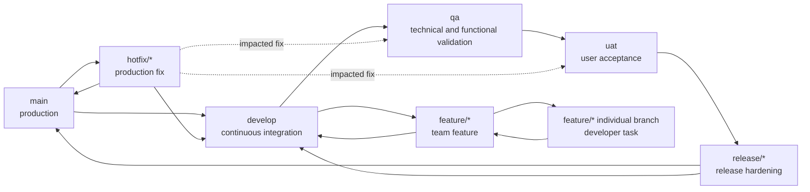

# ADR-0050: Gitflow Branching Strategy Standardization

## Status
Accepted

## Date
2026-05-15

## Context
Satellite repositories need a common branching model that keeps production stable without hiding work in long-lived local branches. The baseline must support continuous integration, technical validation, user acceptance, release preparation, and urgent production fixes while staying simple enough for small product teams.

Gitflow remains the standard, extended with explicit `qa` and `uat` promotion branches. These branches represent deployable environment states, not parallel development lanes. Feature work still integrates through `develop`; promotion to `qa`, `uat`, and `main` is gated by evidence.

This ADR aligns with [ADR-0005 CI/CD Quality CodeQL](./0005-automated-sast-quality-gates.md), [ADR-0018 Testing Pyramid Quality Gates](./0018-testing-pyramid-quality-gates.md), and the machine-readable ruleset at [`rulesets/adr/adr-0050-gitflow-branching.rules.json`](../../../../../src/rulesets/adr/adr-0050-gitflow-branching.rules.json).

## Decision
Adopt Gitflow as the mandatory branching strategy for satellite systems using this progressive architecture reference and the Evolith toolset. The required long-lived branches are `main`, `develop`, `qa`, and `uat`. Short-lived branches are `feature/*`, individual branches derived from a feature branch, `release/*`, and `hotfix/*` when applicable.

### Branch Model
| Branch | Purpose | Created From | Merged Into | Lifetime |
|---|---|---|---|---|
| `main` | Production source of truth and release history. | Repository initialization or previous production state. | None directly; only approved release and hotfix PRs. | Permanent |
| `develop` | Continuous integration for the next candidate release. | `main` at project start, then maintained continuously. | `qa`, `release/*`, or feature stabilization PRs. | Permanent |
| `qa` | Technical and functional validation candidate. | `develop` promotion PR. | `uat` after QA approval; fixes return to `develop`. | Permanent |
| `uat` | User acceptance validation candidate. | `qa` promotion PR. | `release/*` or `main` depending on release size. | Permanent |
| `feature/*` | Functional or technical increment owned by a team. | `develop`. | `develop` through PR. | Short-lived |
| Individual feature branches | Developer task branches under an active feature. | `feature/*`. | Parent `feature/*` through PR or reviewed merge. | Short-lived |
| `release/*` | Release hardening, version metadata, final regression fixes. | `uat` or `develop` for small products without separate UAT. | `main` and back to `develop`. | Days to weeks |
| `hotfix/*` | Urgent production correction. | `main` at the affected tag. | `main`, `develop`, and active `qa`/`uat`/`release/*` branches when impacted. | Hours to days |

### Gitflow Diagram


### Branch Workflow
1. Create `feature/<ticket-id>-<short-description>` from `develop`.
2. Create individual branches from the parent feature branch when several developers work on the same feature, for example `feature/UMS-123-user-onboarding-api`.
3. Merge individual branches into their parent `feature/*` through a reviewed PR or an equivalent protected repository rule.
4. Merge the completed `feature/*` into `develop` through a PR after automated checks, review, and required test evidence pass.
5. Promote `develop` to `qa` through a promotion PR. The PR must summarize scope, changed modules, migrations, feature flags, and rollback notes.
6. Promote `qa` to `uat` only after QA approves technical and functional validation.
7. Create `release/<version>` from `uat` for release hardening when the product needs a formal release branch. Small products may promote `uat` directly to `main` when the same gates are enforced.
8. Merge `release/*` into `main`, tag the release, and merge the same release branch back into `develop`.
9. Delete short-lived branches after merge. Stale unmerged branches older than 30 days must be reviewed, refreshed, or closed.

### Promotion Criteria
| Promotion | Minimum Criteria | Blockers |
|---|---|---|
| `feature/*` to `develop` | PR approved, lint/build/unit tests pass, affected docs updated, no critical security findings. | Failing CI, missing owner review, unresolved architectural decision. |
| `develop` to `qa` | Integration suite passes, dependency audit clean or accepted, migrations reviewed, feature flags documented, deploy candidate created. | Broken integration tests, unreviewed database changes, undocumented operational risk. |
| `qa` to `uat` | QA sign-off, functional regression pass, exploratory defects triaged, release notes draft available. | Open critical/high defects, incomplete acceptance scenarios, missing rollback notes. |
| `uat` to `main` | Product owner or delegated user acceptance, release owner approval, production readiness checklist complete, deployment window confirmed. | Rejected UAT, missing release tag plan, unresolved security or compliance exception. |
| `hotfix/*` to `main` | Reproduction evidence, focused fix, regression test or explicit risk acceptance, expedited approval. | Scope expansion beyond the incident, missing back-merge plan. |

### Environment Ownership
| Environment Branch | Primary Owner | Required Controls |
|---|---|---|
| `develop` | Engineering lead | CI, lint, unit tests, commit checks, dependency audit, architecture guardrails. |
| `qa` | QA lead with engineering support | Deploy from `qa`, regression suite, integration/E2E tests, defect triage, test evidence. |
| `uat` | Product owner or business delegate | Acceptance scenarios, release note review, user sign-off, rollback awareness. |
| `main` | Release manager or technical lead | Protected release PR, security gate, production deployment approval, signed tag when supported. |

### Branch Naming
Use lowercase descriptions, hyphen separators, and a traceable ticket or change identifier.

| Type | Pattern | Example |
|---|---|---|
| Feature | `feature/<ticket-id>-<short-description>` | `feature/UMS-123-user-onboarding` |
| Individual feature branch | `feature/<ticket-id>-<short-description>-<task>` | `feature/UMS-123-user-onboarding-api` |
| Bug fix before release | `bugfix/<ticket-id>-<short-description>` | `bugfix/UMS-231-fix-token-refresh` |
| Hotfix | `hotfix/<incident-id>-<short-description>` | `hotfix/PROD-789-patch-login-timeout` |
| Release | `release/<semver>` | `release/1.4.0` |
| Chore | `chore/<ticket-id>-<short-description>` | `chore/OPS-45-update-ci-cache` |

### Commit Standard
Commits must follow Conventional Commits:

```text
<type>[optional scope]: <description>

[optional body]

[optional footer(s)]
```

Accepted types are `feat`, `fix`, `docs`, `style`, `refactor`, `test`, `build`, `ci`, `chore`, `perf`, and `revert`. Use `!` or a `BREAKING CHANGE:` footer for breaking changes.

Examples:

```text
feat(auth): add passwordless enrollment flow
fix(api): handle expired refresh token
docs(adr): clarify qa promotion criteria
```

### Pull Requests, Reviews, and Merge
- All changes into `develop`, `qa`, `uat`, `main`, `release/*`, and `hotfix/*` must use Pull Requests.
- PRs must include purpose, scope, validation evidence, risk notes, linked ticket, and screenshots or API evidence when user-facing behavior changes.
- At least one approval is required for `develop`; at least two approvals are required for `qa`, `uat`, `main`, `release/*`, and `hotfix/*` unless an incident policy grants an explicit exception.
- The author cannot be the only approver. Code owners must review owned areas.
- Use squash merge for `feature/*` into `develop` unless the repository has an accepted reason to preserve commit history. Use merge commits or equivalent auditable strategy for `release/*` and `hotfix/*` so release ancestry remains visible.
- Resolve review conversations before merge. Do not merge with failing required checks.

### Versioning, Tags, and Releases
- Use Semantic Versioning for production releases: `v<major>.<minor>.<patch>`, for example `v1.4.0`.
- Tag from `main` after the release PR is merged.
- Release branches use the version without the `v` prefix: `release/1.4.0`.
- Hotfix releases increment patch version unless the release owner documents a different SemVer impact.
- Release notes must summarize features, fixes, migrations, operational changes, known issues, and rollback considerations.
- Back-merge every release and hotfix into `develop` to prevent regression in the next cycle.

### Branch Protection
Protect `main`, `develop`, `qa`, `uat`, and `release/*`. Protection must block direct pushes, require PRs, require current CI checks, require resolved conversations, prevent force pushes, and restrict deletion. `main` should additionally require release manager approval and signed commits or signed tags when the hosting platform supports them.

### Automated Controls
Every repository must enforce the controls that match its runtime profile:

- Branch name validation.
- Commit message validation with `commitlint` or equivalent.
- Linting, formatting, and static analysis.
- Unit tests and coverage threshold.
- Integration and E2E tests for promoted candidates.
- Dependency and secret scanning.
- SAST, CodeQL or equivalent security analysis.
- Container or infrastructure scanning when deployable artifacts are produced.
- Documentation link, anchor, encoding, and Mermaid validation for documentation changes.
- Coverage trend reporting so teams do not silently reduce test protection.

### Standard Tooling
Recommended baseline tooling:

| Control | Standard Tooling |
|---|---|
| Branch naming | Repository rules, GitHub Actions, GitLab CI, or pre-receive hooks. |
| Commit format | Conventional Commits, `commitlint`, Husky or native server-side checks. |
| PR quality | CODEOWNERS, protected branches, required checks, PR templates. |
| Code quality | Runtime linters, formatters, type checks, SonarQube or equivalent where adopted. |
| Security | CodeQL, dependency review, Dependabot or equivalent, secret scanning. |
| Tests and coverage | Runtime test framework, coverage reporter, E2E runner where applicable. |
| Release automation | Semantic versioning, changelog generation, signed tags where supported. |

### Incremental Adoption
Teams should adopt this standard in small steps:

1. Protect `main` and require PRs.
2. Add `develop` and enforce feature branch PRs.
3. Add branch naming and Conventional Commit validation.
4. Add `qa` and `uat` promotion branches when environments or stakeholders exist.
5. Add release branches only when stabilization work needs isolation.
6. Add hotfix automation after the first production incident exercise.
7. Tighten coverage, security, and release evidence gates as the product matures.

Do not add long-lived branches beyond `main`, `develop`, `qa`, and `uat` without an ADR exception. Prefer feature flags, short-lived branches, and promotion evidence over permanent environment-specific forks.

## Consequences
- **Pros**:
  - Clear separation between integration, validation, acceptance, and production.
  - Auditable promotion path with explicit ownership and evidence.
  - Safer releases, hotfixes, and rollback planning.
  - Compatible with small teams because `qa`, `uat`, and `release/*` gates can be adopted incrementally.
- **Cons**:
  - More process than trunk-based development.
  - Requires active branch hygiene and disciplined back-merges.
  - Poor automation can turn promotion branches into manual bottlenecks.


## Objective and Scope

Historical backfill: Address the architectural tension where satellite repositories need a common branching model that keeps production stable without hiding work in long-lived local branches, establishing a standard boundary.

## Related Decisions and Standards

None explicitly linked.

---
[Back to Index](./README.md)

> **Agent Signature:** Architect Agent
