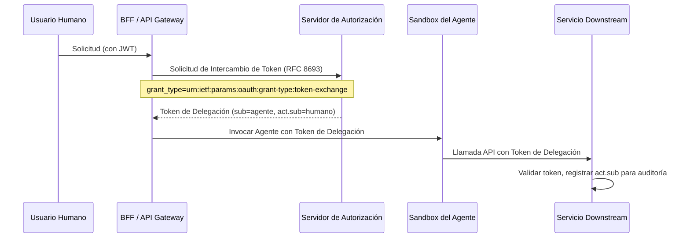

> **Bilingual Navigation:** [View English version](./0088-sovereign-identity-agentic-ai.md)

# ADR-0088: Identidad Soberana para IA Agéntica

## Estado
Accepted

> **Estado de implementacion en este repositorio: ninguna** (verificado 2026-07-28).
> Este ADR es un estandar normativo publicado *para los satelites*; esta Accepted como decision,
> no como capacidad entregada. Nada en Evolith Core lo implementa, y nada lo hace cumplir.
> `rg "act\.sub" src/` no devuelve ninguna coincidencia. Ni el claim de delegacion por Token Exchange (RFC 8693) ni el patron de identidad de carga de trabajo que este ADR estandariza estan implementados ni verificados en el codigo.
> El ruleset generado `rulesets/adr/generated/adr-0088-sovereign-identity-for-agentic-ai.rules.json` lleva una unica regla `adr-conformance` cuyo propio texto dice que los chequeos concretos estan aun "to be wired into the harness", y ningun evaluador atiende esa categoria: `rg "adr-conformance" src/` solo encuentra los propios archivos generados. Seguimiento en GT-607.

## Fecha
2026-06-20

## Contexto y Problema
El ADR-0087 (ABAC para Ejecución de Herramientas Agénticas) define *qué* tiene permitido hacer un agente. Este ADR aborda la preocupación ortogonal: **cómo se autentica un agente** ante los servicios downstream e infraestructura cuando ejecuta esas acciones permitidas.

Sin un modelo de identidad estandarizado, los agentes enfrentan dos riesgos estructurales:

1. **Problema del Diputado Confundido**: Los agentes heredan secretos compartidos de amplio alcance o claves API de larga duración, otorgando acceso más allá de lo que la operación específica requiere.
2. **Brecha de No-Repudio**: Los logs de auditoría downstream no pueden distinguir una solicitud humana directa de un agente actuando en nombre de ese humano, rompiendo la trazabilidad forense requerida por el ADR-0016 (Rastro de Auditoría Inmutable).

## Decisión
Estandarizamos **dos patrones de identidad complementarios** para la IA Agéntica, elegidos según si el agente actúa en respuesta a un disparador humano u opera de forma autónoma.

---

### Patrón A — Intercambio de Tokens (Delegación Humana)

**Cuándo usar:** El agente es invocado directamente por, o en respuesta directa a, una acción de usuario humano (ej., un desarrollador activa un agente de revisión CI).

**Mecanismo:** Intercambio de Tokens OAuth 2.0 ([RFC 8693](https://datatracker.ietf.org/doc/html/rfc8693))

El JWT del usuario humano se intercambia en el Servidor de Autorización por un **token de delegación** de corta duración y alcance restringido. El token resultante lleva ambas identidades:

| Claim JWT | Valor | Propósito |
|---|---|---|
| `sub` | ID de cuenta de servicio del agente | Identifica al agente actuante |
| `act.sub` | ID del usuario humano | Identifica al principal humano original |
| `scope` | Reducido a la operación específica | Aplica el principio de mínimo privilegio |
| `exp` | TTL corto (ej., 5 minutos) | Minimiza el radio de impacto en caso de compromiso |

**Flujo de Intercambio de Tokens:**

---

### Patrón B — Cuenta de Servicio (Identidad Autónoma)

**Cuándo usar:** El agente opera sin un disparador humano directo — tareas programadas, flujos de trabajo orientados a eventos (GT-138), o trabajos de reconciliación en segundo plano.

**Mecanismo:** **JWT de cuenta de servicio** dedicada, emitida y rotada por el proveedor de identidad de infraestructura (ej., Kubernetes Workload Identity, HashiCorp Vault, SPIFFE/SPIRE).

| Propiedad | Requisito |
|---|---|
| **Permisos** | Mínimos — con alcance al dominio y operación específicos |
| **Rotación** | Automática, TTL máximo de 24 horas |
| **Vinculación** | Vinculada a la identidad de carga de trabajo del agente (pod, contenedor o proceso) |
| **Auditoría** | Todas las llamadas registradas con el ID de cuenta de servicio, correlacionadas al ID del evento disparador |

### Criterios de Decisión

| Condición | Usar Patrón |
|---|---|
| Agente disparado por un JWT humano | A — Intercambio de Tokens |
| Agente disparado por un evento de bus de mensajes | B — Cuenta de Servicio |
| Agente disparado por un trabajo programado | B — Cuenta de Servicio |
| Agente realizando una llamada mutativa en producción | A — Intercambio de Tokens (requiere cadena `act` humana) |

## Consecuencias

### Positivas
- **Trazabilidad completa**: Cada solicitud downstream lleva una cadena de identidad verificable y no repudiable (humano `act.sub` + agente `sub`), satisfaciendo el ADR-0016.
- **Aplicación de mínimo privilegio**: Los tokens de delegación tienen alcance preciso; las cuentas de servicio están vinculadas a su carga de trabajo.
- **Higiene de credenciales**: No hay secretos compartidos de larga duración en los sandboxes de agentes; todos los tokens son de corta duración y rotados automáticamente.

### Negativas
- **Dependencia del Servidor de Autorización**: El Patrón A requiere que el BFF se integre con un AS que soporte el intercambio de tokens RFC 8693.
- **Infraestructura de identidad de carga de trabajo**: El Patrón B requiere Kubernetes Workload Identity o equivalente (SPIFFE/SPIRE) en entornos auto-alojados.

## Referencias
- [RFC 8693 — Intercambio de Tokens OAuth 2.0](https://datatracker.ietf.org/doc/html/rfc8693)
- [ADR-0016: Rastro de Auditoría de Negocio Inmutable](./0016-immutable-business-audit-trail.md)
- [ADR-0075: Estrategia de Autenticación Core API](./0075-core-api-auth-strategy.md)
- [ADR-0082: Límite de Confianza de IA Agéntica](./0082-agentic-ai-trust-boundary.md)
- [ADR-0083: Autorización de Acciones y Auditoría de IA Agéntica](./0083-agentic-ai-action-authorization-audit.md)
- [ADR-0087: ABAC para Ejecución de Herramientas Agénticas](./0087-abac-agentic-tool-execution.md)

---
[Volver al Índice de ADRs Core](./README.md)

> **Agent Signature:** Architect Agent
