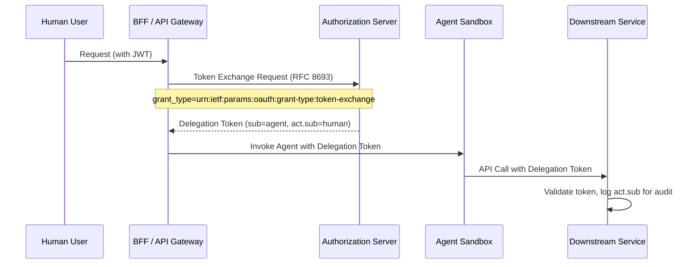

> **Bilingual Navigation:** [Ver versión en Español](./0088-sovereign-identity-agentic-ai.es.md)

# ADR-0088: Sovereign Identity for Agentic AI

## Status
Accepted

<!-- implementation-status: none -->
> **Implementation status in this repository: none** (verified 2026-07-28).
> This ADR is a normative standard published *for satellites*; it is Accepted as a decision,
> not as delivered capability. Nothing in Evolith Core implements it, and nothing enforces it.
> `rg "act\.sub" src/` returns zero matches. Neither the Token Exchange (RFC 8693) delegation claim nor the workload-identity pattern this ADR standardizes is implemented or verified anywhere in the codebase.
> The generated ruleset `rulesets/adr/generated/adr-0088-sovereign-identity-for-agentic-ai.rules.json` carries a single `adr-conformance` rule whose own text says the concrete checks are still "to be wired into the harness", and no evaluator handles that category — `rg "adr-conformance" src/` matches only the generated files themselves. Tracked by GT-607.

## Date
2026-06-20

## Context and Problem
ADR-0087 (ABAC for Agentic Tool Execution) defines *what* an agent is permitted to do. This ADR addresses the orthogonal concern: **how an agent authenticates itself** to downstream services and infrastructure when executing those permitted actions.

Without a standardized identity model, agents face two structural risks:

1. **Confused Deputy Problem**: Agents inherit broadly-scoped shared secrets or long-lived API keys, granting access beyond what the specific operation requires.
2. **Non-Repudiation Gap**: Downstream audit logs cannot distinguish a direct human request from an agent acting on behalf of that human, breaking forensic traceability required by ADR-0016 (Immutable Audit Trail).

## Decision
We standardize **two complementary identity patterns** for Agentic AI, chosen based on whether the agent is acting in response to a human trigger or operating autonomously.

---

### Pattern A — Token Exchange (Human Delegation)

**When to use:** The agent is invoked directly by, or in direct response to, a human user action (e.g., a developer triggers a CI review agent).

**Mechanism:** OAuth 2.0 Token Exchange ([RFC 8693](https://datatracker.ietf.org/doc/html/rfc8693))

The human user's JWT is exchanged at the Authorization Server for a short-lived, scope-constrained **delegation token**. The resulting token carries both identities:

| JWT Claim | Value | Purpose |
|---|---|---|
| `sub` | Agent service account ID | Identifies the acting agent |
| `act.sub` | Human user ID | Identifies the original human principal |
| `scope` | Narrowed to the specific operation | Enforces least-privilege |
| `exp` | Short TTL (e.g., 5 minutes) | Minimizes blast radius on compromise |

**Token Exchange Flow:**

---

### Pattern B — Service Account (Autonomous Identity)

**When to use:** The agent operates without a direct human trigger — scheduled tasks, event-driven workflows (GT-138), or background reconciliation jobs.

**Mechanism:** Dedicated **service account JWT** issued and rotated by the infrastructure identity provider (e.g., Kubernetes Workload Identity, HashiCorp Vault, SPIFFE/SPIRE).

| Property | Requirement |
|---|---|
| **Permissions** | Minimal — scoped to the specific domain and operation |
| **Rotation** | Automatic, maximum 24-hour TTL |
| **Binding** | Bound to the agent's workload identity (pod, container, or process) |
| **Audit** | All calls logged with the service account ID, correlated to the triggering event ID |

### Decision Criteria

| Condition | Use Pattern |
|---|---|
| Agent triggered by a human JWT | A — Token Exchange |
| Agent triggered by a message bus event | B — Service Account |
| Agent triggered by a scheduled job | B — Service Account |
| Agent making a mutative call in production | A — Token Exchange (requires human `act` chain) |

## Consequences

### Positive
- **Full traceability**: Every downstream request carries a verifiable, non-repudiable identity chain (human `act.sub` + agent `sub`), satisfying ADR-0016.
- **Least-privilege enforcement**: Delegation tokens are scoped precisely; service accounts are bound to their workload.
- **Credential hygiene**: No long-lived shared secrets in agent sandboxes; all tokens are short-lived and automatically rotated.

### Negative
- **Authorization Server dependency**: Pattern A requires the BFF to integrate with an AS that supports RFC 8693 token exchange.
- **Workload identity infrastructure**: Pattern B requires Kubernetes Workload Identity or equivalent (SPIFFE/SPIRE) in self-hosted environments.

## References
- [RFC 8693 — OAuth 2.0 Token Exchange](https://datatracker.ietf.org/doc/html/rfc8693)
- [ADR-0016: Immutable Business Audit Trail](./0016-immutable-business-audit-trail.md)
- [ADR-0075: Core API Auth Strategy](./0075-core-api-auth-strategy.md)
- [ADR-0082: Agentic AI Trust Boundary](./0082-agentic-ai-trust-boundary.md)
- [ADR-0083: Agentic AI Action Authorization and Audit](./0083-agentic-ai-action-authorization-audit.md)
- [ADR-0087: ABAC for Agentic Tool Execution](./0087-abac-agentic-tool-execution.md)

---
[Back to Core ADR Index](./README.md)

> **Agent Signature:** Architect Agent
