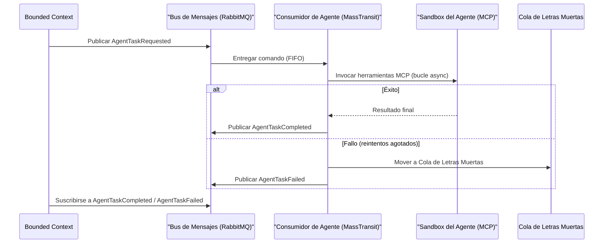

> **Bilingual Navigation:** [View English version](./0089-event-driven-agentic-workflows.md)

# ADR-0089: Patrón de Flujos de Trabajo Agénticos Orientados a Eventos

## Estado
Accepted

<!-- implementation-status: none -->
> **Estado de implementacion en este repositorio: ninguna** (verificado 2026-07-28).
> Este ADR es un estandar normativo publicado *para los satelites*; esta Accepted como decision,
> no como capacidad entregada. Nada en Evolith Core lo implementa, y nada lo hace cumplir.
> `rg "AgentTaskRequested" src/` no devuelve ninguna coincidencia. El esquema de comando/evento que este ADR exige no tiene productor, ni consumidor, ni test de contrato en el repositorio; toda invocacion agentica aqui sigue siendo sincrona.
> El ruleset generado `rulesets/adr/generated/adr-0089-event-driven-agentic-workflow-pattern.rules.json` lleva una unica regla `adr-conformance` cuyo propio texto dice que los chequeos concretos estan aun "to be wired into the harness", y ningun evaluador atiende esa categoria: `rg "adr-conformance" src/` solo encuentra los propios archivos generados. Seguimiento en GT-607.

## Fecha
2026-06-20

## Contexto y Problema
Todas las invocaciones actuales de IA Agéntica en Evolith son síncronas: el invocador (BFF, CLI o endpoint API) mantiene una conexión HTTP abierta hasta que el agente completa. Esto crea tres riesgos estructurales en producción:

1. **Fragilidad por timeout**: Los bucles de razonamiento autónomo de múltiples pasos (ReAct, Plan-and-Execute) rutinariamente exceden los límites de timeout del API Gateway y los balanceadores de carga.
2. **Acoplamiento fuerte**: El servicio invocador debe permanecer disponible y con estado durante toda la ventana de ejecución del agente, impidiendo el escalado independiente.
3. **Sin contrapresión**: Los picos de demanda se propagan directamente a la capa de API del LLM sin mecanismo de suavizado, causando fallos en cascada y derroche de costos.

## Decisión
Establecemos un **patrón asíncrono Orientado a Eventos** para todas las invocaciones de IA Agéntica que se espera duren más de 10 segundos o que requieran más de una llamada al LLM. El patrón se integra con el bus MassTransit v9 / RabbitMQ existente establecido en el ADR-0036.

---

### Esquema de Mensajes

#### Comando: `AgentTaskRequested`
Publicado por cualquier bounded context que necesite disparar un flujo de trabajo agéntico.

```json
{
  "messageId": "uuid",
  "correlationId": "uuid",
  "sessionId": "uuid",
  "requestedAt": "ISO-8601",
  "actingUserId": "string",
  "agentTaskType": "string",
  "resourceDomain": "string",
  "environment": "development | staging | production",
  "payload": {}
}
```

> `sessionId` se mapea a `evolith.agent.session_id` (telemetría ADR-0086).
> `actingUserId` se mapea a la cadena de identidad `act.sub` (ADR-0088).

#### Evento: `AgentTaskCompleted`
Publicado por el Consumidor del Agente al completar exitosamente.

```json
{
  "messageId": "uuid",
  "correlationId": "uuid",
  "sessionId": "uuid",
  "completedAt": "ISO-8601",
  "durationMs": "number",
  "promptTokensUsed": "number",
  "completionTokensUsed": "number",
  "totalCostUsd": "number",
  "result": {}
}
```

#### Evento: `AgentTaskFailed`
Publicado por el Consumidor del Agente ante un fallo irrecuperable o al agotar los reintentos DLQ.

```json
{
  "messageId": "uuid",
  "correlationId": "uuid",
  "sessionId": "uuid",
  "failedAt": "ISO-8601",
  "errorCode": "string",
  "errorMessage": "string",
  "retryCount": "number"
}
```

---

### Flujo Asíncrono



---

### Política de DLQ y Reintentos
Según el ADR-0036 (Estrategia de Entrega del Bus de Mensajes):
- **Reintentos**: 3 intentos con backoff exponencial (1s, 4s, 16s).
- **DLQ**: Después de 3 fallos, el mensaje se enruta a `agent-tasks.dlq` para inspección forense.
- **Monitoreo DLQ**: Se dispara una alerta cuando la profundidad de la DLQ supera 5 mensajes, correlacionando al `evolith.agent.session_id` para el análisis de causa raíz.

### Criterios de Decisión: Síncrono vs. Asíncrono
| Condición | Patrón |
|---|---|
| Una sola llamada LLM, resultado ≤ 3s | Síncrono (HTTP directo) |
| Bucle de agente de múltiples pasos (ReAct) | **Asíncrono Orientado a Eventos (este ADR)** |
| Iniciado por humano con UX en tiempo real | Síncrono + streaming (SSE/WebSocket) |
| Programado / disparado por evento | **Asíncrono Orientado a Eventos (este ADR)** |

## Consecuencias

### Positivas
- **Desacoplamiento de timeouts**: Los bucles de agentes se ejecutan hasta completar, independientemente de los timeouts del gateway.
- **Escalado independiente**: Los pods del Consumidor de Agente escalan independientemente de las capas BFF/API.
- **Contrapresión**: La profundidad de la cola de RabbitMQ regula naturalmente la tasa de invocación de agentes, protegiendo las cuotas de la API del LLM.
- **Observabilidad**: La telemetría completa según el ADR-0086 está integrada en `AgentTaskCompleted` — el uso de tokens y el costo son campos de primera clase.

### Negativas
- **Latencia en resultados**: Los invocadores deben implementar polling o callbacks webhook para recuperar resultados, añadiendo complejidad a la UI.
- **Sobrecarga operacional**: El monitoreo de DLQ y el versionado del esquema de mensajes requieren runbooks operacionales dedicados.

## Referencias
- [ADR-0015: Arquitectura Orientada a Eventos — Intra-Dominio](./0015-event-driven-architecture-intra-domain.md)
- [ADR-0036: Estrategia de Entrega del Bus de Mensajes — FIFO y DLQ](./0036-message-bus-delivery-strategy-fifo-dlq.md)
- [ADR-0077: Pivote Comercial de MassTransit v9](./0077-masstransit-v9-commercial-pivot.md)
- [ADR-0086: Telemetría y Control de Costos de IA Agéntica](./0086-agentic-ai-telemetry-cost-control.md)
- [ADR-0087: ABAC para Ejecución de Herramientas Agénticas](./0087-abac-agentic-tool-execution.md)
- [ADR-0088: Identidad Soberana para IA Agéntica](./0088-sovereign-identity-agentic-ai.md)

---
[Volver al Índice de ADRs Core](./README.md)

> **Agent Signature:** Architect Agent
