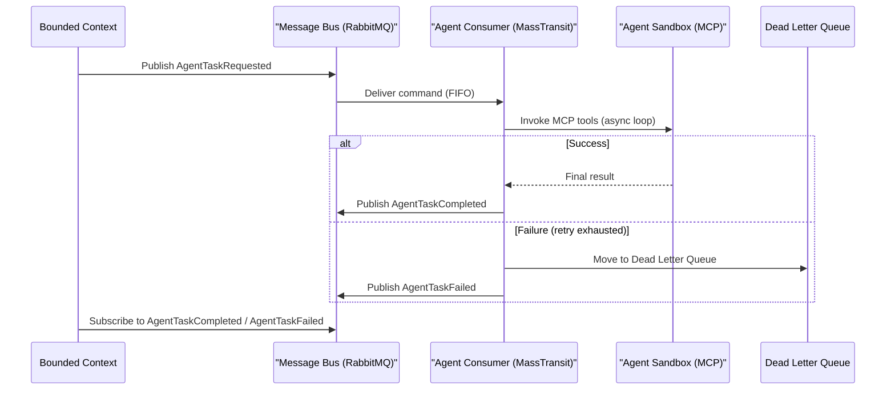

> **Bilingual Navigation:** [Ver versión en Español](./0089-event-driven-agentic-workflows.es.md)

# ADR-0089: Event-Driven Agentic Workflow Pattern

## Status
Accepted

> **Implementation status in this repository: none** (verified 2026-07-28).
> This ADR is a normative standard published *for satellites*; it is Accepted as a decision,
> not as delivered capability. Nothing in Evolith Core implements it, and nothing enforces it.
> `rg "AgentTaskRequested" src/` returns zero matches. The command/event schema this ADR mandates has no producer, no consumer and no contract test in the repository; every agentic invocation here is still synchronous.
> The generated ruleset `rulesets/adr/generated/adr-0089-event-driven-agentic-workflow-pattern.rules.json` carries a single `adr-conformance` rule whose own text says the concrete checks are still "to be wired into the harness", and no evaluator handles that category — `rg "adr-conformance" src/` matches only the generated files themselves. Tracked by GT-607.

## Date
2026-06-20

## Context and Problem
All current Agentic AI invocations in Evolith are synchronous: the caller (BFF, CLI, or API endpoint) maintains an open HTTP connection until the agent completes. This creates three structural production risks:

1. **Timeout fragility**: Multi-step autonomous reasoning loops (ReAct, Plan-and-Execute) routinely exceed API Gateway and load balancer timeout limits.
2. **Tight coupling**: The invoking service must remain available and stateful throughout the entire agent execution window, preventing independent scaling.
3. **No backpressure**: Demand spikes propagate directly to the LLM API layer with no smoothing mechanism, causing cascading failures and cost overruns.

## Decision
We mandate an **asynchronous Event-Driven pattern** for all Agentic AI invocations that are expected to run longer than 10 seconds or that require more than one LLM call. The pattern integrates with the existing MassTransit v9 / RabbitMQ bus established in ADR-0036.

---

### Message Schema

#### Command: `AgentTaskRequested`
Published by any bounded context that needs to trigger an agent workflow.

```json
{
  "messageId": "uuid",
  "correlationId": "uuid",
  "sessionId": "uuid",
  "requestedAt": "ISO-8601",
  "actingUserId": "string",
  "agentTaskType": "string",
  "resourceDomain": "string",
  "environment": "development | staging | production",
  "payload": {}
}
```

> `sessionId` maps to `evolith.agent.session_id` (ADR-0086 telemetry).
> `actingUserId` maps to the `act.sub` identity chain (ADR-0088).

#### Event: `AgentTaskCompleted`
Published by the Agent Consumer on successful completion.

```json
{
  "messageId": "uuid",
  "correlationId": "uuid",
  "sessionId": "uuid",
  "completedAt": "ISO-8601",
  "durationMs": "number",
  "promptTokensUsed": "number",
  "completionTokensUsed": "number",
  "totalCostUsd": "number",
  "result": {}
}
```

#### Event: `AgentTaskFailed`
Published by the Agent Consumer on unrecoverable failure or DLQ exhaustion.

```json
{
  "messageId": "uuid",
  "correlationId": "uuid",
  "sessionId": "uuid",
  "failedAt": "ISO-8601",
  "errorCode": "string",
  "errorMessage": "string",
  "retryCount": "number"
}
```

---

### Async Flow



---

### DLQ and Retry Policy
Per ADR-0036 (Message Bus Delivery Strategy):
- **Retry**: 3 attempts with exponential back-off (1s, 4s, 16s).
- **DLQ**: After 3 failures, the message is routed to `agent-tasks.dlq` for forensic inspection.
- **DLQ Monitoring**: An alert fires when the DLQ depth exceeds 5 messages, correlating to the `evolith.agent.session_id` for root cause analysis.

### Decision Criteria: Sync vs. Async
| Condition | Pattern |
|---|---|
| Single LLM call, result ≤ 3s | Synchronous (direct HTTP) |
| Multi-step agent loop (ReAct) | **Async Event-Driven (this ADR)** |
| Human-initiated with real-time UX | Synchronous + streaming (SSE/WebSocket) |
| Scheduled / event-triggered | **Async Event-Driven (this ADR)** |

## Consequences

### Positive
- **Timeout decoupling**: Agent loops run to completion regardless of gateway timeouts.
- **Independent scaling**: Agent Consumer pods scale independently from BFF/API layers.
- **Backpressure**: RabbitMQ queue depth naturally throttles agent invocation rate, protecting LLM API quotas.
- **Observability**: Full telemetry per ADR-0086 is embedded in `AgentTaskCompleted` — token usage and cost are first-class fields.

### Negative
- **Result latency**: Callers must implement polling or webhook callbacks to retrieve results, adding UI complexity.
- **Operational overhead**: DLQ monitoring and message schema versioning require dedicated operational runbooks.

## References
- [ADR-0015: Event-Driven Architecture — Intra-Domain](./0015-event-driven-architecture-intra-domain.md)
- [ADR-0036: Message Bus Delivery Strategy — FIFO & DLQ](./0036-message-bus-delivery-strategy-fifo-dlq.md)
- [ADR-0077: MassTransit v9 Commercial Pivot](./0077-masstransit-v9-commercial-pivot.md)
- [ADR-0086: Agentic AI Telemetry & Cost Control](./0086-agentic-ai-telemetry-cost-control.md)
- [ADR-0087: ABAC for Agentic Tool Execution](./0087-abac-agentic-tool-execution.md)
- [ADR-0088: Sovereign Identity for Agentic AI](./0088-sovereign-identity-agentic-ai.md)

---
[Back to Core ADR Index](./README.md)

> **Agent Signature:** Architect Agent
