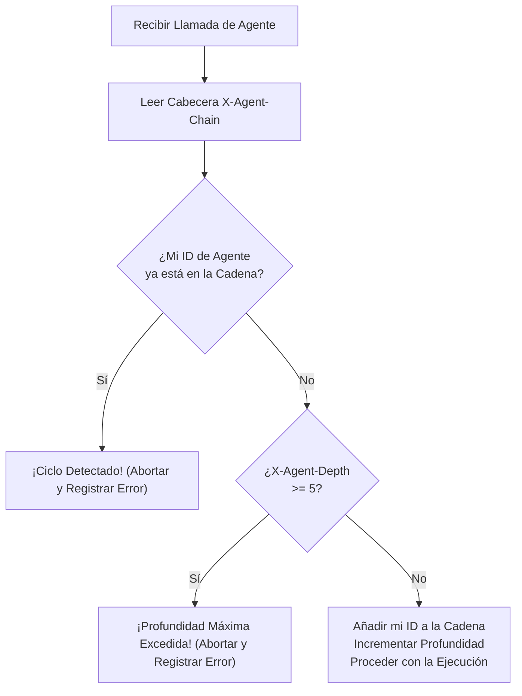

> **Navegación Bilingüe:** [View English version](./0092-agent-infinite-loop-prevention.md)

# ADR-0092: Prevención de Bucles Infinitos de Agentes y Reglas de Circuit Breaker

## Estado
Accepted

<!-- implementation-status: none -->
> **Estado de implementacion en este repositorio: ninguna** (verificado 2026-07-28).
> Este ADR es un estandar normativo publicado *para los satelites*; esta Accepted como decision,
> no como capacidad entregada. Nada en Evolith Core lo implementa, y nada lo hace cumplir.
> `rg "X-Agent-Depth" src/` no devuelve ninguna coincidencia. Ni la cabecera de profundidad de ejecucion, ni la cabecera `X-Agent-Chain` de deteccion de ciclos, ni ningun circuit breaker derivado de ellas existen en el codigo.
> El ruleset generado `rulesets/adr/generated/adr-0092-agent-infinite-loop-prevention-and-circuit-breaker-rules.rules.json` lleva una unica regla `adr-conformance` cuyo propio texto dice que los chequeos concretos estan aun "to be wired into the harness", y ningun evaluador atiende esa categoria: `rg "adr-conformance" src/` solo encuentra los propios archivos generados. Seguimiento en GT-607.

## Fecha
2026-06-20

## Contexto y Problema
A medida que las topologías de agentes autónomos maduran, los sistemas satélite despliegan múltiples agentes especializados que interactúan dinámicamente a través de herramientas Model Context Protocol (MCP) y buses de mensajes de eventos. Un riesgo importante en tales arquitecturas multi-agente es el surgimiento de **bucles de recursión infinitos** (ej., el Agente A activa la Herramienta B, la cual publica un evento de dominio que activa de nuevo al Agente A).

Sin estándares de prevención de bucles, la ejecución recursiva de agentes puede:
1. Agotar los presupuestos de API en la nube y las cuotas de tokens en minutos.
2. Congelar los brokers de mensajería o inundar las colas de eventos, provocando una Denegación de Servicio Distribuida (DDoS) en los sistemas internos.
3. Ofuscar los registros de telemetría con miles de solicitudes circulares idénticas.

Este ADR define los estándares arquitectónicos, las convenciones de metadatos y los patrones de circuit breaker para prevenir bucles y detectar ciclos, manteniendo el sistema central simple y libre de credenciales.

## Decisión
Establecemos tres directrices principales que todos los servicios satélite deben implementar para detectar y romper bucles recursivos de llamadas de agentes.

---

### 1. El Contrato de Profundidad de Ejecución

Todas las cargas útiles (payloads) de agente a agente y de agente a herramienta DEBEN propagar un contador de profundidad de ejecución a través de cabeceras estándar.

- **Nombre de la Cabecera**: `X-Agent-Depth`
- **Clave de Trace State**: `evolith.agent.depth`

| Regla | Requisito |
|---|---|
| **Instanciación** | La solicitud inicial del agente (activada directamente por un humano o un cron programado) comienza con `X-Agent-Depth: 1`. |
| **Propagación** | Cada vez que un agente llama a otro agente, o invoca una herramienta que actúa como disparador de un agente, DEBE incrementar el contador (`X-Agent-Depth = profundidad_anterior + 1`). |
| **Límite de Ejecución** | La profundidad máxima por defecto es **5**. Cualquier llamada que exceda `X-Agent-Depth: 5` debe ser abortada. |

---

### 2. Contexto de Trazabilidad y Detección de Ciclos

Para capturar bucles que podrían no exceder el límite de profundidad pero que muestran un comportamiento cíclico, los agentes deben propagar una cabecera con la **Cadena de Llamadas del Agente**.

- **Nombre de la Cabecera**: `X-Agent-Chain`
- **Formato del Valor**: Una lista separada por comas de identificadores de agentes (ej., `agent-sast,agent-mcp-reviewer,agent-sast`).

#### Lógica de Detección de Ciclos:
Antes de ejecutar una herramienta o despachar un evento, el orquestador/agente:
1. Lee `X-Agent-Chain`.
2. Verifica si su propio **ID de Agente** ya está presente en la cadena.
3. Si se encuentra el ID de Agente (ej., el propio es `agent-sast` y la cadena contiene `agent-sast`), se **detecta un ciclo**.
4. La ejecución DEBE abortarse inmediatamente y se debe enviar una alerta de alta severidad a OpenTelemetry.



---

### 3. Contrato del Circuit Breaker Agéntico

Los servicios satélite que exponen herramientas o consumen colas de mensajes DEBEN implementar un **Circuit Breaker Agéntico** en sus puntos de entrada.

- **Condición de Disparo**: Cuando `X-Agent-Depth > 5` o se detecta un ciclo a través de `X-Agent-Chain`.
- **Contrato de Respuesta**: El servicio debe abortar la ejecución y devolver un sobre de error estandarizado:

```json
{
  "success": false,
  "error": {
    "code": "AGENT_LOOP_BREAKER",
    "message": "Ejecución detenida: recursión infinita o condición de bucle detectada.",
    "meta": {
      "depth": 6,
      "chain": ["agent-reviewer", "agent-auto-fixer", "agent-reviewer"],
      "correlation_id": "tx-88392-ab"
    }
  }
}
```

## Consecuencias

### Positivas
- **Protección de costos**: Evita el gasto descontrolado de tokens o facturas de API causadas por la recursión infinita.
- **Confiabilidad de recursos**: Evita la inundación de colas y la saturación de brokers de mensajería en topologías orientadas a eventos.
- **Validación desacoplada**: Los satélites aplican las reglas de bucle localmente en las cabeceras sin requerir un coordinador centralizado en Evolith Core.

### Negativas
- **Requisito de instrumentación**: Todos los agentes satélite deben actualizarse para leer, incrementar y reenviar las cabeceras de prevención de bucles.

## Referencias
- [ADR-0087: Control de Acceso ABAC para Ejecución de HerramientasMCP](./0087-abac-agentic-tool-execution.es.md)
- [ADR-0089: Flujos de Trabajo Agénticos Orientados a Eventos](./0089-event-driven-agentic-workflows.es.md)
- [ADR-0086: Telemetría y Control de Costos de IA Agéntica](./0086-agentic-ai-telemetry-cost-control.es.md)

---
[Volver al Índice de ADRs Core](./README.md)

> **Agent Signature:** Architect Agent
