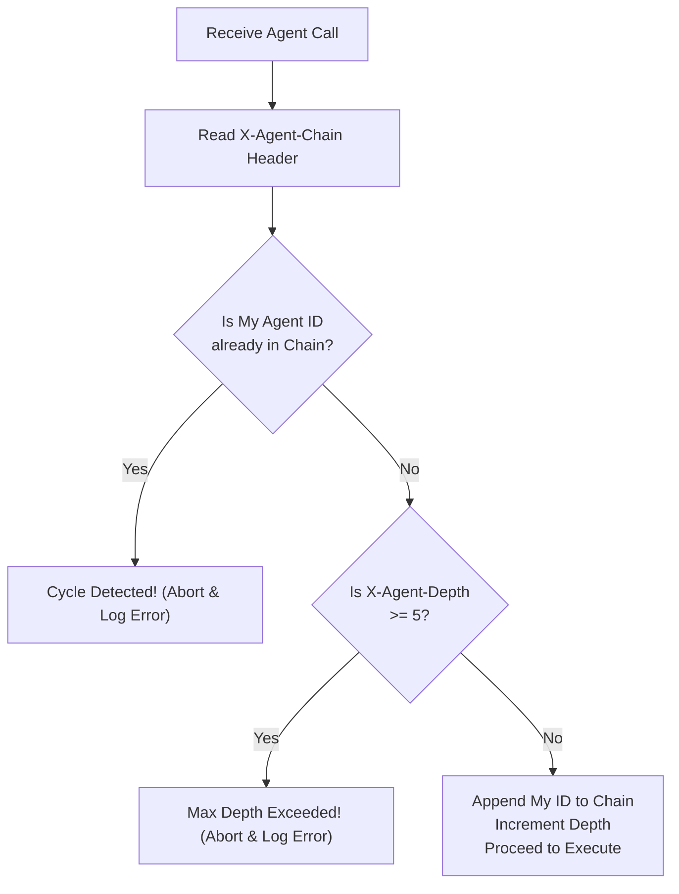

> **Bilingual Navigation:** [Ver versión en Español](./0092-agent-infinite-loop-prevention.es.md)

# ADR-0092: Agent Infinite Loop Prevention and Circuit Breaker Rules

## Status
Accepted

<!-- implementation-status: none -->
> **Implementation status in this repository: none** (verified 2026-07-28).
> This ADR is a normative standard published *for satellites*; it is Accepted as a decision,
> not as delivered capability. Nothing in Evolith Core implements it, and nothing enforces it.
> `rg "X-Agent-Depth" src/` returns zero matches. Neither the execution-depth header, the `X-Agent-Chain` cycle-detection header, nor any circuit breaker derived from them exists in the codebase.
> The generated ruleset `rulesets/adr/generated/adr-0092-agent-infinite-loop-prevention-and-circuit-breaker-rules.rules.json` carries a single `adr-conformance` rule whose own text says the concrete checks are still "to be wired into the harness", and no evaluator handles that category — `rg "adr-conformance" src/` matches only the generated files themselves. Tracked by GT-607.

## Date
2026-06-20

## Context and Problem
As autonomous agent topologies mature, satellite systems deploy multiple specialized agents interacting dynamically via Model Context Protocol (MCP) tools and event message buses. A major risk in such multi-agent architectures is the emergence of **infinite recursion loops** (e.g., Agent A triggers Tool B, which posts a domain event that triggers Agent A again). 

Without loop-prevention standards, recursive agent execution can:
1. Exhaust cloud API budgets and token quotas in minutes.
2. Freeze message brokers or flood event queues, leading to a Distributed Denial of Service (DDoS) on internal systems.
3. Obfuscate telemetry logs with thousands of identical, circular requests.

This ADR defines the architectural standards, metadata conventions, and circuit breaker patterns to prevent loops and detect cycles, keeping the core system simple and credential-free.

## Decision
We establish three primary guidelines that all satellite services must implement to detect and break recursive agent call loops.

---

### 1. The Execution Depth Contract

All agent-to-agent and agent-to-tool payloads MUST propagate an execution depth counter via standard headers.

- **Header Name**: `X-Agent-Depth`
- **Trace State Key**: `evolith.agent.depth`

| Rule | Requirement |
|---|---|
| **Instantiation** | The initial agent request (triggered directly by a human or scheduled cron) starts with `X-Agent-Depth: 1`. |
| **Propagation** | Every time an agent calls another agent, or invokes a tool that acts as an agent trigger, it MUST increment the counter (`X-Agent-Depth = previous_depth + 1`). |
| **Enforcement Limit** | The maximum default depth is **5**. Any call exceeding `X-Agent-Depth: 5` must be aborted. |

---

### 2. Trace Context & Cycle Detection

To catch loops that might not exceed the depth limit but exhibit cyclical behavior, agents must propagate an **Agent Call Chain** header.

- **Header Name**: `X-Agent-Chain`
- **Value Format**: A comma-separated list of agent identifiers (e.g., `agent-sast,agent-mcp-reviewer,agent-sast`).

#### Cycle Detection Logic:
Before executing a tool or dispatching an event, the orchestrator/agent:
1. Reads `X-Agent-Chain`.
2. Checks if its own **Agent ID** is already present in the chain.
3. If the Agent ID is found (e.g. self is `agent-sast` and chain contains `agent-sast`), a **cycle is detected**.
4. The execution MUST be aborted immediately, and a high-severity alert must be dispatched to OpenTelemetry.



---

### 3. Agentic Circuit Breaker Contract

Satellite services exposing tools or consuming message queues MUST implement an **Agentic Circuit Breaker** at their entry points.

- **Trigger Condition**: When `X-Agent-Depth > 5` or a cycle is detected via `X-Agent-Chain`.
- **Response Contract**: The service must abort execution and return a standardized error envelope:

```json
{
  "success": false,
  "error": {
    "code": "AGENT_LOOP_BREAKER",
    "message": "Execution halted: infinite recursion or loop condition detected.",
    "meta": {
      "depth": 6,
      "chain": ["agent-reviewer", "agent-auto-fixer", "agent-reviewer"],
      "correlation_id": "tx-88392-ab"
    }
  }
}
```

## Consequences

### Positive
- **Cost protection**: Prevents runaway token spending or API bills caused by infinite recursion.
- **Resource reliability**: Avoids queue flooding and message broker saturation in event-driven topologies.
- **Decoupled validation**: Satellites enforce loop rules locally in headers without requiring a centralized, stateful coordinator in Evolith Core.

### Negative
- **Instrumentation requirement**: All satellite agents must be updated to read, increment, and forward the loop-prevention headers.

## References
- [ADR-0087: ABAC for Agentic Tool Execution](./0087-abac-agentic-tool-execution.md)
- [ADR-0089: Event-Driven Agentic Workflows](./0089-event-driven-agentic-workflows.md)
- [ADR-0086: Agentic AI Telemetry & Cost Control](./0086-agentic-ai-telemetry-cost-control.md)

---
[Back to Core ADR Index](./README.md)

> **Agent Signature:** Architect Agent
