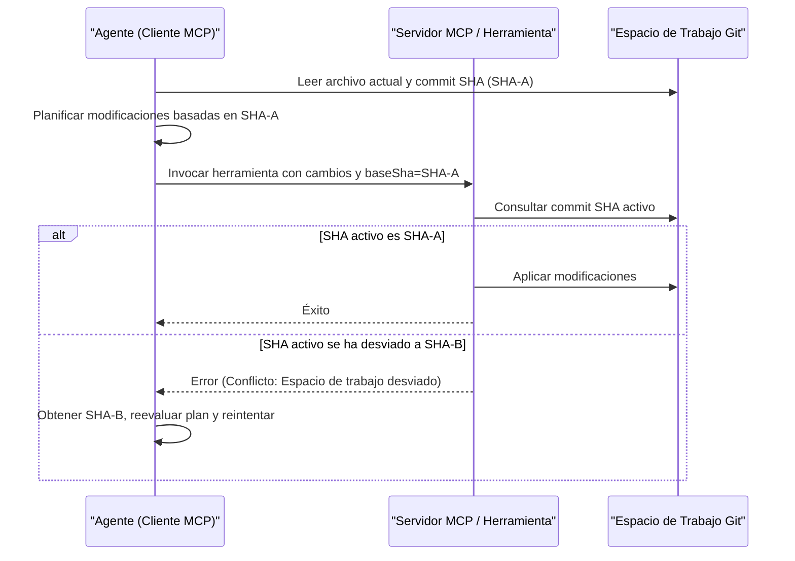

> **Navegación Bilingüe:** [View English version](./0093-mcp-concurrency-locking.md)

# ADR-0093: Estándar de Control de Concurrencia y Bloqueo de Recursos para Herramientas MCP

## Estado
Accepted

## Fecha
2026-06-20

## Contexto y Problema
Los servidores de Model Context Protocol (MCP) exponen herramientas que permiten a los agentes autónomos leer y modificar sistemas locales (tales como escribir archivos, refactorizar código o mutar registros de bases de datos). Cuando múltiples agentes operan en paralelo, o un único flujo de trabajo complejo genera subagentes concurrentes, estos pueden intentar escribir en los mismos archivos o registros de bases de datos simultáneamente.

Sin reglas de control de concurrencia y bloqueo de recursos, los servicios satélite enfrentan tres riesgos críticos:
1. **Escrituras Sucias / Actualizaciones Perdidas**: El Agente B sobrescribe los cambios realizados por el Agente A, lo que provoca una regresión silenciosa del código o la corrupción del estado.
2. **Condiciones de Carrera**: Dos agentes que intentan editar un archivo de forma concurrente crean fusiones (merges) parciales, sintácticamente rotas o malformadas.
3. **Desviación del Espacio de Trabajo (Workspace Drift)**: Un agente planifica cambios basados en el estado de un archivo que ya se ha desviado debido a la ejecución de otro agente.

Este ADR define patrones arquitectónicos estándar para el bloqueo optimista y pesimista que las herramientas MCP satélites deben implementar para evitar anomalías de escritura concurrente, manteniendo Evolith Core libre de credenciales.

## Decisión
Estandarizamos dos estrategias de concurrencia para las herramientas MCP satélite: **Verificación de Estado Optimista** para archivos de repositorio y **Bloqueo de Recursos Pesimista** para operaciones exclusivas.

---

### 1. Verificación de Estado Optimista (Validación Git-First)

Las herramientas MCP que mutan archivos de repositorio DEBEN implementar un bloqueo optimista utilizando el estado de la versión del repositorio de origen.

- **Parámetro Requerido**: Las herramientas mutativas (ej., `evolith-apply-patch`, `evolith-write-file`) deben declarar un parámetro de tipo string llamado `baseSha`.
- **Regla de Verificación**: Antes de ejecutar la operación de escritura, la herramienta debe verificar que el commit SHA local de Git actual coincida con el `baseSha` provisto.
- **Manejo de Conflictos**: Si el SHA de HEAD del repositorio local difiere del `baseSha`, la herramienta debe rechazar la escritura y devolver un error de conflicto. Esto obliga al agente a obtener el estado actualizado, reevaluar su plan e intentarlo de nuevo.



---

### 2. Bloqueo de Recursos Pesimista

Para operaciones de bases de datos que no son de git o tareas exclusivas de larga duración, las herramientas satélite deben usar un bloqueo pesimista temporal.

- **Alcance del Bloqueo**: Operaciones de escritura exclusivas en un recurso (ej., ID de entidad de base de datos, cadena de ruta).
- **Mecanismo**:
  1. Se genera un identificador de bloqueo único y transitorio (ej., escribiendo un archivo `.lock` en el directorio de trabajo o utilizando un proveedor de bloqueo distribuido como Redis o Consul).
  2. El bloqueo contiene metadatos: `lockedBy` (ID de Agente), `expiresAt` (timestamp, TTL máximo de 2 minutos para evitar deadlocks) y `correlationId`.
  3. Si otro agente llama a la misma herramienta sobre ese recurso antes de que el bloqueo expire o sea liberado, la herramienta rechaza la llamada inmediatamente.

---

### 3. Contratos de Error de Concurrencia

Cuando una operación de escritura es rechazada debido a un conflicto de bloqueo o discrepancia de SHA, la herramienta MCP DEBE devolver una respuesta de error estandarizada:

```json
{
  "success": false,
  "error": {
    "code": "CONCURRENCY_CONFLICT",
    "message": "El recurso está bloqueado o el estado base se ha desviado.",
    "meta": {
      "conflict_type": "git_sha_mismatch",
      "expected_sha": "f12f060ebb72",
      "actual_sha": "a3f9256612df",
      "locked_by": "agent-reviewer-01"
    }
  }
}
```

## Consecuencias

### Positivas
- **Protección de la integridad**: Elimina las actualizaciones perdidas y las fusiones de sintaxis rotas causadas por escrituras paralelas de agentes.
- **Core sin estado**: La lógica de verificación de concurrencia se procesa dentro de las herramientas individuales utilizando métricas locales de git o bloqueos locales, manteniendo Evolith Core sin estado.
- **Bucle de fallo rápido (Fail-fast)**: Los agentes descubren las desviaciones del espacio de trabajo inmediatamente y pueden autocorregirse dinámicamente.

### Negativas
- **Complejidad del agente**: Los agentes deben estar diseñados para manejar fallos de transacción, obtener el contexto actualizado y reintentar.

## Estado de Implementación

Registrado para que el mismo grep que encuentra este ADR encuentre lo que lo respalda (GT-606).

| Sección | Estado | Dónde |
| --- | --- | --- |
| §1 Verificación Optimista de Estado | **Implementada** | `src/packages/mcp-server/src/mcp/workspace-concurrency.ts`, aplicada en `mcp-tool-dispatch.ts` |
| §3 Contrato de Error de Concurrencia | **Implementado** | `CONCURRENCY_CONFLICT` en `src/packages/mcp-server/src/common/errors.ts`; payload del conflicto en `error.details` del sobre |
| §2 Bloqueo Pesimista de Recursos | **No implementado** | — |

Notas sobre §1 tal como se construyó:

- `baseSha` se deriva al esquema publicado de toda herramienta mutativa en
  `ToolRegistryService.describe`, y lo verifica el dispatch único a partir de
  `tool.mutative` — la misma llave que usa la compuerta HITL de aprobación. El
  conjunto protegido es, por construcción, el conjunto mutativo, y una
  herramienta añadida después no puede llegar desprotegida.
  `mutative-base-sha-coverage.spec.ts` enumera ese conjunto desde el registro
  vivo y falla si algún miembro queda sin guarda.
- `baseSha` es **opcional** por defecto, con semántica `If-Match`: quien declara
  el estado sobre el que planificó queda protegido; quien no declara nada, no.
  Exigirlo sin más rompería a todos los llamantes existentes y dejaría
  inutilizables las herramientas que legítimamente apuntan a un directorio aún
  no inicializado (`evolith-scaffold`, `evolith-init-batch`). Un despliegue que
  quiera la lectura estricta define `EVOLITH_MCP_REQUIRE_BASE_SHA=1`.
- La verificación **falla cerrada**: si se envía `baseSha` y HEAD no se puede
  resolver, la escritura se rechaza en lugar de dejarse pasar.
- El payload de §3 viaja en `error.details` y no en `error.meta` como se esboza
  arriba, porque ADR-0073 reserva `meta` para los metadatos de ejecución del
  sobre. El código, los nombres de campo y la semántica no cambian.

§2 queda diferida, no adoptada-e-ignorada: ninguna herramienta MCP actual
retiene un recurso exclusivo no-git el tiempo suficiente para que un lease de
dos minutos sea el mecanismo correcto, y el efecto de toda herramienta mutativa
ya queda cubierto por la verificación de estado git de §1. Si aparece una
herramienta que mute un registro de base de datos o sostenga una tarea
exclusiva larga, §2 pasa a ser exigible y esta tabla es el registro de que sigue
pendiente.

## Referencias
- [ADR-0073: Contrato Unificado de Salida de CLI](./0073-unified-cli-output-contract.es.md)
- [ADR-0087: Control de Acceso ABAC para Ejecución de HerramientasMCP](./0087-abac-agentic-tool-execution.es.md)
- [ADR-0089: Flujos de Trabajo Agénticos Orientados a Eventos](./0089-event-driven-agentic-workflows.es.md)

---
[Volver al Índice de ADRs Core](./README.md)

> **Agent Signature:** Architect Agent
