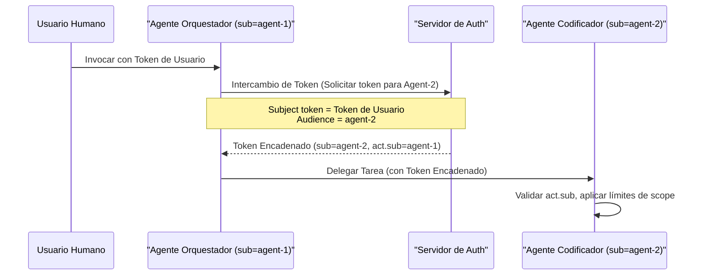

> **Navegación Bilingüe:** [View English version](./0094-multi-agent-handoff.md)

# ADR-0094: Estándares de Handoff Multi-Agente y Delegación de Tareas

## Estado
Accepted

## Fecha
2026-06-20

## Contexto y Problema
A medida que las topologías de agentes autónomos se expanden, los flujos de trabajo complejos requieren que múltiples agentes especializados se deleguen subtareas entre sí. Por ejemplo, un agente de orquestación de alto nivel recibe una solicitud del sistema, delega las modificaciones de código a un agente codificador, el cual posteriormente delega el análisis de seguridad a un agente escáner.

Sin estándares formales para el traspaso (handoff) y la delegación de agentes, los servicios satélite enfrentan tres riesgos críticos:
1. **Fragmentación de la Correlación**: El contexto de telemetría se pierde entre los límites de las llamadas, lo que impide a los desarrolladores rastrear un flujo de trabajo multi-agente completo en OpenTelemetry.
2. **Escalada o Fuga de Privilegios**: Un agente subordinado se ejecuta con los permisos amplios del orquestador llamador, o por el contrario, se bloquea debido a la falta de tokens de delegación.
3. **Serialización Inconsistente de Tareas**: Los agentes intercambian datos de tareas en payloads ad-hoc y propietarios, lo que provoca errores de análisis en tiempo de ejecución y un alto acoplamiento.

Este ADR define esquemas de metadatos estándar, contratos de reenvío de tokens y reglas de propagación de contexto para la delegación multi-agente, manteniendo el código base central libre de credenciales.

## Decisión
Estandarizamos el **Sobre de Delegación de Tareas Multi-Agente (Task Delegation Envelope)**, el **Contrato de Encadenamiento de Tokens (Token Chaining Contract)** y el **Protocolo de Propagación de Contexto (Context Propagation Protocol)** para todas las implementaciones satélite.

---

### 1. El Esquema del Sobre de Delegación de Tareas

Todas las invocaciones de tareas de agente a agente DEBEN envolver sus cargas útiles en un sobre de delegación JSON estandarizado:

```json
{
  "task_id": "job-88392-1a",
  "session_id": "session-90021-z",
  "delegation_metadata": {
    "delegated_by": "agent-orchestrator-prod-01",
    "delegated_to": "agent-security-scanner-02",
    "timestamp": "2026-06-20T18:10:00Z",
    "scopes": ["read:repository", "scan:security"]
  },
  "context": {
    "traceparent": "00-4bf92f3577b34da6a3ce929d0e0e4736-00f067aa0ba902b7-01",
    "tracestate": "evolith.agent.depth=2"
  },
  "payload": {
    "repository_url": "https://github.com/beyondnet/some-repo",
    "target_commit": "8c238ec7"
  }
}
```

---

### 2. Contrato de Encadenamiento de Tokens (Autorización Delegada)

Para hacer cumplir el privilegio mínimo durante los handoffs sin utilizar secretos estáticos, los agentes deben aprovechar los **Tokens de Delegación Encadenados**.

1. **Requisito de Intercambio**: El agente llamador nunca debe compartir su propia clave de identidad de workload cruda con el agente subordinado.
2. **Encadenamiento de Claims Act en OAuth 2.0**: El agente llamador intercambia su token actual por un nuevo token destinado a la audiencia del agente subordinado, agregándose a sí mismo en el claim `act`:
   - `sub`: ID del agente subordinado.
   - `act.sub`: ID del agente llamador.
   - `act.act.sub`: ID del usuario humano original (si aplica).
3. **Contracción de Alcance (Scope Contraction)**: Los alcances del nuevo token deben ser un subconjunto estricto de los alcances activos del agente llamador.



---

### 3. Protocolo de Propagación de Contexto de Trazabilidad

Para preservar la correlación de trazas de extremo a extremo a través de colas (RabbitMQ/MassTransit) y endpoints HTTP:

- **Conformidad con OpenTelemetry**: Los satélites deben inyectar y extraer el contexto de traza utilizando la especificación W3C Trace Context (`traceparent`, `tracestate`).
- **Correlación de Logs**: Los agentes subordinados deben registrar todas las acciones con el `session_id` y `task_id` activos analizados desde el sobre de delegación, garantizando la auditabilidad bajo el ADR-0016.

## Consecuencias

### Positivas
- **Auditabilidad de extremo a extremo**: Los desarrolladores pueden rastrear una solicitud desde el humano disparador a través de todos los saltos de agentes subordinados en una sola sesión de OpenTelemetry.
- **Control de alcance**: Los agentes subordinados están restringidos al subconjunto de permisos explícitamente delegados por el llamador.
- **Estandarización sin estado**: El Core permanece desacoplado de la ejecución en tiempo de ejecución; los formatos estándar son analizados localmente por los endpoints satélite.

### Negativas
- **Complejidad de integración**: Los agentes satélite requieren configurar middleware de OTel y lógica de intercambio de tokens en sus plataformas de despliegue.

## Referencias
- [ADR-0088: Identidad Soberana para IA Agéntica](./0088-sovereign-identity-agentic-ai.md)
- [ADR-0089: Flujos de Trabajo Agénticos Orientados a Eventos](./0089-event-driven-agentic-workflows.es.md)
- [ADR-0016: Registro de Auditoría de Negocio Inmutable](./0016-immutable-business-audit-trail.es.md)

---
[Volver al Índice de ADRs Core](./README.md)

> **Agent Signature:** Architect Agent
