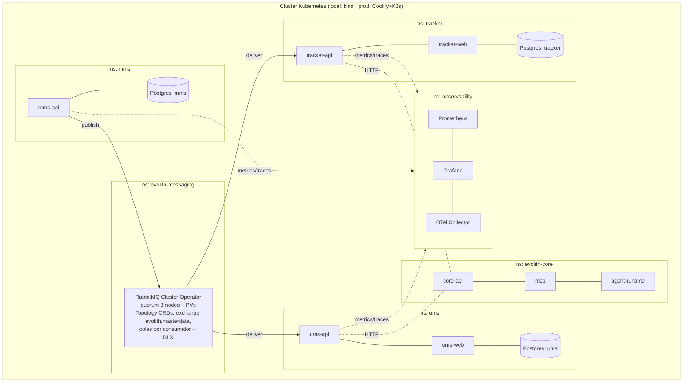

> **Navegación bilingüe:** [View English version](./0107-single-cluster-kubernetes-deployment-topology.md)

# ADR-0107: Topología de Despliegue Kubernetes de Cluster Único para la Suite Evolith

> **Firma del Agente:** Architect Agent (Winston)

## Estado
Aprobado

## Fecha
2026-07-09

## Contexto y Problema
La suite Evolith se compone de **Evolith Core** (core-api, MCP, agent-runtime) y los productos
satélite **MMS** (Master Data Management), **UMS** y **Evolith Tracker**. Estos productos deben
interoperar — en particular el flujo de **proyección de Tenant** de datos maestros (ADR-0106),
donde MMS publica eventos CRUD que UMS y Tracker consumen vía un broker de mensajería.

El despliegue está fragmentado: UMS trae un Helm chart (`infra/ums-helm`), Core tiene un
`docker-compose.evolith.yml` + hints de Coolify, y Tracker **no tiene infra de despliegue alguna**.
No hay sustrato compartido para el broker cross-producto (RabbitMQ), ni paridad local↔producción,
ni un único lugar para razonar sobre red, secretos, observabilidad y aislamiento de recursos.

Docker y Kubernetes son el **destino de despliegue final tanto local como en producción**
(producción en una VPS vía Coolify + Kubernetes, según los milestones GT-447/GT-448).

## Objetivo y Alcance
Establecer un **cluster Kubernetes único** como sustrato canónico de runtime para toda la suite
Evolith (local y producción), con **aislamiento por namespace por producto**, un **broker de
mensajería compartido y HA en el cluster (RabbitMQ)**, **base de datos por producto** y
**desplegabilidad independiente** — para que el desacoplamiento event-driven se preserve también
en el eje de despliegue/release, no solo en el código.

**En alcance:** topología cluster/namespace, plataforma RabbitMQ compartida, DB-por-producto,
aislamiento de red/recursos, secretos, observabilidad y paridad local↔prod.
**Fuera de alcance:** el contrato del evento Tenant y la lógica de consumidores (ADR-0106 +
`tenant-master-data-projection.md`); mecánica de CI/CD (GT-324/GT-437).

## Opciones Consideradas

### Opción 1: Clusters separados por producto
- **Pros:** máximo aislamiento del blast radius.
- **Contras:** costo operativo N×; el broker cross-producto debe exponerse entre clusters
  (complejidad ingress/mesh, latencia, superficie de seguridad); excesivo para la escala actual.

### Opción 2: Un cluster, un namespace, todo compartido
- **Pros:** lo más simple de levantar.
- **Contras:** **destruye el desacoplamiento** — una BD compartida y releases acoplados
  reintroducen el acoplamiento monolítico que el diseño event-driven existe para eliminar; sin
  aislamiento de blast radius; contención de recursos por "vecino ruidoso".

### Opción 3: Un cluster, namespace-por-producto, servicios de plataforma compartidos (Elegida)
Un único cluster hospeda cada producto en su **propio namespace**, con **namespaces de plataforma
compartidos** para el broker y la observabilidad, y una **base de datos por producto**.
- **Pros:** un solo sustrato operativo; broker y observabilidad compartidos (como debe ser);
  productos aislados (namespace, DB, release, escalado); paridad local↔prod con los mismos Helm
  charts; encaja con la escala actual y el objetivo de producción Coolify+K8s.
- **Contras:** cluster y broker se vuelven dependencias críticas compartidas (mitigado con HA + el
  outbox del productor + DLQ + resource quotas + network policies).

## Decisión y Justificación
Adoptamos la **Opción 3: un cluster Kubernetes único con namespace-por-producto y servicios de
plataforma compartidos**, tanto para local (kind/minikube) como para producción (Coolify +
Kubernetes en la VPS).

### 1. Topología de namespaces

### 2. Compartido vs aislado (la regla central)
| Compartido entre productos | Aislado por producto |
|---|---|
| Cluster | Namespace |
| RabbitMQ (HA, `evolith-messaging`) | Base de datos (DB-por-producto) |
| Observabilidad (Prometheus/Grafana/OTel) | Despliegue / cadencia de release |
| Red del cluster (con NetworkPolicies) | Escalado horizontal |

El desacoplamiento event-driven (ADR-0106) **debe extenderse al eje de despliegue**: un cluster
compartido no es una aplicación compartida. Sin BD compartida; sin releases acoplados.

### 3. Broker de mensajería compartido
RabbitMQ corre en `evolith-messaging` vía el **RabbitMQ Cluster Operator** (quorum 3 nodos, PVs) y
el **Messaging Topology Operator** declara el exchange `evolith.masterdata` (`x-consistent-hash`
por `tenantId`), las colas por consumidor y el DLX como CRDs (infra-as-code). Es el sustrato del
flujo de proyección de Tenant de ADR-0106.

### 4. Aislamiento y seguridad
- **NetworkPolicies:** solo los pods permitidos alcanzan el broker y cada BD.
- **ResourceQuotas + LimitRanges** por namespace (sin inanición por vecino ruidoso).
- **Secretos:** credenciales del broker y connection strings vía Kubernetes Secrets / vault de
  Coolify (OpenBao, GT-112) — nunca en manifests.

### 5. Paridad local ↔ producción
Los **mismos Helm charts** despliegan en local (kind/minikube, umbrella chart de un comando para
E2E) y en producción (Coolify + Kubernetes), parametrizados por `values`. Cada producto tiene su
chart (replicando `infra/ums-helm`); un umbrella chart local compone todos los productos + broker
+ observabilidad para validación end-to-end.

### 6. Desplegabilidad independiente
Cada producto es un **release independiente** en producción (su propio chart/pipeline). El umbrella
chart es una **conveniencia local/dev** para bring-up de un comando y E2E — no debe convertirse en
la unidad de release de producción.

## Evidencia y Criterios de Evaluación
- **Desacoplamiento preservado:** sin BD compartida; productos desplegables y escalables de forma
  independiente.
- **Broker HA:** las quorum queues sobreviven la pérdida de un nodo; el outbox del productor
  (ADR-0033) sobrevive la caída del broker; los mensajes veneno van a DLQ.
- **Paridad:** los mismos charts corren en local (kind) y en producción; el E2E de proyección de
  Tenant (`tenant-projection-test-matrix.md`) pasa en el cluster local.

## Consecuencias, Riesgos y Trade-offs

### Positivas
- Un solo sustrato operativo; local↔prod consistente; broker/observabilidad compartidos como se
  pretende.
- Aislamiento de producto (blast radius, escalado, release) preservado.

### Negativas / Riesgos
- **Cluster y broker son dependencias críticas compartidas.** *Mitigación:* broker HA (operator +
  quorum + PVs), outbox del productor, DLQ, resource quotas, network policies, monitoreo/alertas.
- **Blast radius de cluster único** vs Opción 1. *Mitigación:* aislamiento por namespace, quotas,
  PDBs; un futuro producto de alta escala puede graduarse a su propio cluster tras los mismos
  contratos.

## Referencias
- [Canónico: Diseño de Proyección de Tenant (Master Data)](../../../../../../mms/docs/architecture/tenant-master-data-projection.md)
- [Evolith Governed Composition Target Design](../../../../product/suite/architecture/evolith-governed-composition-target-design.md)

## Decisiones y Estándares Relacionados
- [ADR-0106: Master Tenant y Proyecciones de Contexto](./0106-master-tenant-context-projections.es.md)
- [ADR-0033: Patrón Transactional Outbox](./0033-transactional-outbox-pattern.es.md)
- [ADR-0013: Topología de Infraestructura Cloud y DR](./0013-cloud-infrastructure-topology-dr.es.md)
- [ADR-0028: Infraestructura Híbrida Self-Hosted (On-Premise)](./0028-self-hosted-hybrid-infrastructure-on-premise.es.md)
- [ADR-0039: Switcher de Abstracción de Topología de Despliegue](./0039-deployment-topology-abstraction-switcher.es.md)

---

[Volver al Registro de ADR](../README.es.md)
