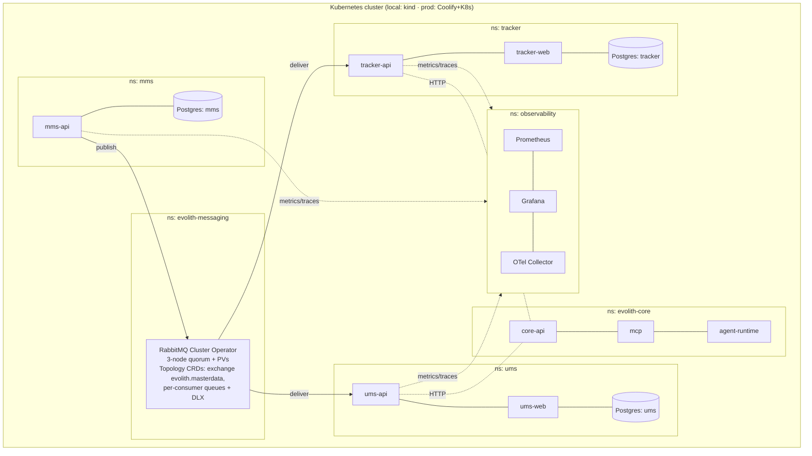

> **Bilingual Navigation:** [Ver versión en Español](./0107-single-cluster-kubernetes-deployment-topology.es.md)

# ADR-0107: Single-Cluster Kubernetes Deployment Topology for the Evolith Suite

> **Agent Signature:** Architect Agent (Winston)

## Status
Accepted

## Date
2026-07-09

## Context and Problem
The Evolith suite is composed of **Evolith Core** (core-api, MCP, agent-runtime), and the
satellite products **MMS** (Master Data Management), **UMS**, and **Evolith Tracker**. These
products must interoperate — notably the master-data **Tenant projection** flow (ADR-0106),
where MMS publishes CRUD events that UMS and Tracker consume over a message broker.

Deployment has been fragmented: UMS ships a Helm chart (`infra/ums-helm`), Core has a
`docker-compose.evolith.yml` plus Coolify hints, and Tracker has **no deployment infra at all**.
There is no shared substrate for the cross-product message broker (RabbitMQ), no consistent
local↔production parity, and no single place to reason about network, secrets, observability,
and resource isolation across products.

Docker and Kubernetes are the **final deployment target for both local and production**
(production on a VPS via Coolify + Kubernetes, per the road-to-production milestones GT-447/GT-448).

## Objective and Scope
Establish a **single Kubernetes cluster** as the canonical runtime substrate for the entire
Evolith suite (local and production), with **namespace isolation per product**, a **shared,
HA in-cluster message broker (RabbitMQ)**, **database-per-product**, and **independent
deployability** — so the event-driven decoupling of the products is preserved at the
deployment/release axis, not just in code.

**In scope:** cluster/namespace topology, the shared RabbitMQ platform, DB-per-product,
network/resource isolation, secrets, observability, and local↔prod parity.
**Out of scope:** the tenant event contract and consumer logic (ADR-0106 + the canonical
`tenant-master-data-projection.md`); CI/CD pipeline mechanics (GT-324/GT-437).

## Options Considered

### Option 1: Separate clusters per product
Each product runs in its own cluster.
- **Pros:** maximum blast-radius isolation.
- **Cons:** N× operational cost; the cross-product broker must be exposed across clusters
  (ingress/mesh complexity, latency, security surface); overkill for the current scale.

### Option 2: One cluster, one namespace, one shared everything
All products + a shared DB in a single namespace.
- **Pros:** simplest to stand up.
- **Cons:** **destroys the decoupling** — a shared DB and coupled releases reintroduce the exact
  monolithic coupling the event-driven design exists to remove; no blast-radius isolation; noisy-
  neighbour resource contention.

### Option 3: One cluster, namespace-per-product, shared platform services (Chosen)
A single cluster hosts every product in its **own namespace**, with **shared platform namespaces**
for the message broker and observability, and a **database per product**.
- **Pros:** one operational substrate; the broker and observability are shared (as they should be);
  products stay isolated (namespace, DB, release, scaling); local↔prod parity via the same Helm
  charts; matches the current scale and the Coolify+K8s production target.
- **Cons:** the cluster and the broker become shared critical dependencies (mitigated by HA + the
  producer outbox + DLQ + resource quotas + network policies).

## Decision and Rationale
We adopt **Option 3: a single Kubernetes cluster with namespace-per-product and shared platform
services**, for both local (kind/minikube) and production (Coolify + Kubernetes on the VPS).

### 1. Namespace topology

### 2. Shared vs isolated (the core rule)
| Shared across products | Isolated per product |
|---|---|
| Cluster | Namespace |
| RabbitMQ (HA, `evolith-messaging`) | Database (DB-per-product) |
| Observability (Prometheus/Grafana/OTel) | Deployment / release cadence |
| Cluster network (with NetworkPolicies) | Horizontal scaling |

The event-driven decoupling (ADR-0106) **must extend to the deployment axis**: a shared cluster
is not a shared application. No shared database; no coupled releases.

### 3. Shared message broker
RabbitMQ runs in `evolith-messaging` via the **RabbitMQ Cluster Operator** (3-node quorum,
persistent volumes) and the **Messaging Topology Operator** declares the `evolith.masterdata`
exchange (`x-consistent-hash` by `tenantId`), the per-consumer queues, and the DLX as CRDs
(infrastructure-as-code). This is the substrate for the ADR-0106 Tenant projection flow.

### 4. Isolation & safety
- **NetworkPolicies:** only permitted pods reach the broker and each DB.
- **ResourceQuotas + LimitRanges** per namespace (no noisy-neighbour starvation).
- **Secrets:** broker credentials and connection strings via Kubernetes Secrets / the Coolify
  vault (OpenBao, ADR/GT-112) — never in manifests.

### 5. Local ↔ production parity
The **same Helm charts** deploy to local (kind/minikube, one-command umbrella chart for E2E) and
production (Coolify + Kubernetes), parameterized by `values`. Each product owns a chart
(replicating `infra/ums-helm`); a local umbrella chart composes all products + broker +
observability for end-to-end validation.

### 6. Independent deployability
Each product is an **independent release** in production (its own chart/pipeline). The umbrella
chart is a **local/dev convenience** for one-command bring-up and E2E — it must not become the
production release unit.

## Evidence and Evaluation Criteria
- **Decoupling preserved:** no shared DB; products deployable and scalable independently.
- **Broker HA:** quorum queues survive a node loss; the producer outbox (ADR-0033) survives a
  broker outage; poison messages land in DLQ.
- **Parity:** the same charts run locally (kind) and in production; the Tenant projection E2E
  (`tenant-projection-test-matrix.md`) passes on the local cluster.

## Consequences, Risks, and Trade-offs

### Positive
- One operational substrate; consistent local↔prod; shared broker/observability as intended.
- Product isolation (blast radius, scaling, release) preserved.

### Negative / Risks
- **Cluster and broker are shared critical dependencies.** *Mitigation:* HA broker (operator +
  quorum + PVs), producer outbox, DLQ, resource quotas, network policies, monitoring/alerts.
- **Single-cluster blast radius** vs Option 1. *Mitigation:* namespace isolation, quotas, PDBs; a
  future high-scale product can graduate to its own cluster behind the same contracts.

## References
- Canonical: Tenant Master-Data Projection design — `mms/docs/architecture/tenant-master-data-projection.md` (external `mms` repository).
- [Evolith Governed Composition Target Design](../../../../../product/suite/architecture/evolith-governed-composition-target-design.md)

## Related Decisions and Standards
- [ADR-0106: Master Tenant and Context Projections](./0106-master-tenant-context-projections.md)
- [ADR-0033: Transactional Outbox Pattern](./0033-transactional-outbox-pattern.md)
- [ADR-0013: Cloud Infrastructure Topology and DR](./0013-cloud-infrastructure-topology-dr.md)
- [ADR-0028: Self-Hosted Hybrid Infrastructure (On-Premise)](./0028-self-hosted-hybrid-infrastructure-on-premise.md)
- [ADR-0039: Deployment Topology Abstraction Switcher](./0039-deployment-topology-abstraction-switcher.md)

---

[Back to ADR Registry](../README.md)
