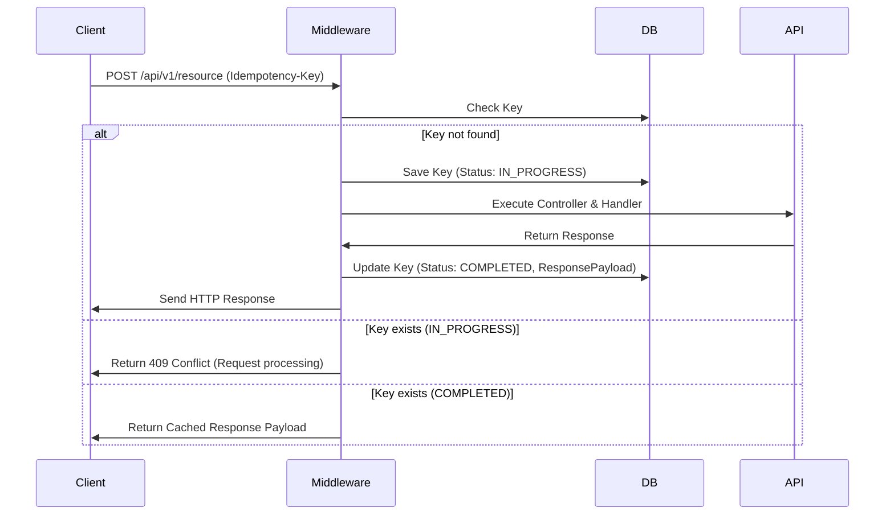

# [ADR 0063](0063-dotnet-b2b-idempotency-middleware.md): B2B Request Idempotency Middleware in ASP.NET Core

## 1. Status
**Status**: Accepted
**Ratified**: 2026-07-19 by repository owner, formalizing enforcement already active via the generated ruleset `adr-dotnet-0063-b2b-request-idempotency-middleware-in-asp-net-core.rules.json`.
**Date**: 2026-05-23
**Scope**: Technology Stack - .NET API Integration & Reliability

---

## 2. Context
In enterprise B2B APIs, client requests often route through shared corporate NATs or gateways, exposing network transactions to transient timeouts. If a client retries a write or creation call (e.g. `POST`) due to a drop in the response connection, the server may process the request twice, leading to duplicate database records or race conditions. To prevent these failures, we need an ASP.NET Core middleware that detects, tracks, and returns cached responses for identical requests.

---

## 3. Decision
We implement a unified **Idempotency Interceptor Middleware** in the ASP.NET Core pipeline:

### A. Implementation Rules
1. **Header Identification**: Intercept endpoints decorated with idempotency metadata using the `Idempotency-Key` HTTP header.
2. **Transaction Database Check**: Cache request hashes (`IdempotencyKey` + `UserId` + `RequestPath`) inside a persistent `IdempotencyRequests` table.
3. **Response Buffering**:
   - If key is new: Mark request as *In-Flight* and proceed. Once complete, save the HTTP status code and response payload.
   - If key is currently processing: Return HTTP 409 Conflict to block concurrent races.
   - If key exists and is completed: Bypass execution and immediately return the cached response payload and status.

### B. Lifecycle Pattern

---

## 4. Consequences

### Positive
- **API Safety**: Prevents duplicate resource initialization and race conditions from automated retries.
- **Client Transparency**: The client receives a correct, consistent response even during network drops.

### Negative
- **Storage Backing**: Requires cache sweep workers to periodically purge expired keys from the idempotency log.

---

## 5. Review
Assess idempotency cache hit rates and sweep cleanups in the Q3 operations review.

## Objective and Scope

Historical backfill: Address the architectural tension where context is unavailable, establishing a standard boundary.

## Options Considered

- **Selected:** B2B Request Idempotency Middleware in ASP.NET Core
- **Others:** Unknown (historical record does not explicitly enumerate rejected alternatives).

## Evidence and Evaluation Criteria

Unknown (historical record; evaluated against general architectural principles of maintainability and reliability).

## Related Decisions and Standards

None explicitly linked.

## Technology Watch (Trends, Maturity, Adoption, Support)

Idempotency middleware for B2B integrations in ASP.NET Core is a mature pattern following well-established REST API design principles. ASP.NET Core's middleware pipeline provides first-class support for cross-cutting concerns like idempotency. The pattern is widely adopted in financial and transactional systems. Expected vigencia: 5+ years for the idempotency pattern; specific middleware implementation evolves with ASP.NET Core versions.

## Current Sources

- ASP.NET Core middleware documentation — https://learn.microsoft.com/en-us/aspnet/core/fundamentals/middleware, consulted 2026-06-20.
- REST API idempotency patterns — https://learn.microsoft.com/en-us/azure/architecture/best-practices/api-design, consulted 2026-06-20.

---
[Back to Index](./README.md)
