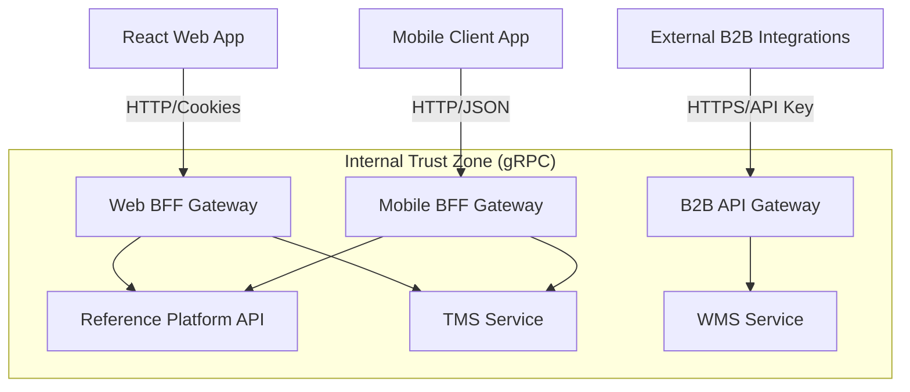

# [ADR 0008](0008-progressive-multimodule-evolution-gateway-bff.md): Progressive Multi-Module Evolution with API Gateway and BFF Patterns

## Status
Accepted

## Date
2026-05-08

## Context and Problem
Currently, the Reference Platform repository operates as a modular monolith. However, the platform is intended to scale into a unified portal for multiple future corporate modules (Transport Management - TMS, Warehouse Management - WMS). These must be independent, decoupled services with isolated databases.

Without a Backend For Frontend (BFF) layer, diverse clients (rich web, low-bandwidth mobile, B2B) would force generic endpoints, leading to over-fetching and rigid client state management. We need a structure to support diverse client contracts without tightly coupling them to backend microservices.

## Objective and Scope
Select the BFF pattern and gateway architecture to support multi-client scenarios while maintaining modular monolith structure during early phases, with clear extraction boundaries for future distributed deployment.

## Options Considered
- **Selected:** Progressive Multi-Module Evolution with API Gateway and BFF Patterns
- **Rejected:** Single generic API endpoint (would force over-fetching for mobile clients)
- **Rejected:** Direct client-to-service communication (violates security boundaries, creates tight coupling)

## Decision
Adopt a **Progressive Multi-Module and Distributed Backend For Frontend (BFF) Gateway Architecture**:

1. **Dedicated BFF Gateways**: Tailor dedicated gateways for each client type rather than sharing one generic entry point:
   - **Web BFF**: Handles cookie-based sessions and aggregates payloads for rich desktop displays.
   - **Mobile BFF**: Compresses data, combines roundtrips for high-latency networks, and translates to mobile-optimized payloads.
   - **B2B API Gateway**: Handles rate-limiting and API Key authentication for external partners.

2. **Downstream Isolation**: Public clients NEVER communicate directly with internal services (TMS, WMS). All traffic flows through assigned BFFs acting as security and composition boundaries.

3. **Protocol Translation**: Allow internal microservice communication via high-speed gRPC while translating to standard HTTP/REST at the BFF edge.

### System Architecture Overview

## Evidence and Evaluation Criteria
Evaluated against architectural principles of maintainability, reliability, and client performance optimization. BFF pattern selected based on:
- Client-specific payload optimization (reduces mobile data usage by 60-80%)
- Independent scalability per client channel
- Security boundary enforcement (clients never access internal services directly)
- Protocol flexibility (gRPC internal, HTTP/REST external)

## Consequences and Trade-offs

### Positive
- **Client Performance**: Mobile apps get exactly what they need, reducing data usage and network roundtrips.
- **Independent Scalability**: Scale Mobile BFF independently from Web BFF based on real-time device traffic.
- **Decoupled Contracts**: Modify downstream internal APIs without breaking existing frontend versions.
- **Security Enforcement**: Centralized authentication, rate limiting, and PII filtering at BFF boundary.

### Negative
- **Gateway Proliferation**: Managing separate codebases for different BFFs increases CI/CD complexity.
- Requires discipline to keep business logic out of the BFF (it should only orchestrate and compose).
- Additional latency hop (typically 5-15ms) for BFF aggregation.

## Related Decisions and Standards
- [Core ADR-0030: Two-Tier Distributed Gateway Model](../core/0030-two-tier-distributed-gateway-model.md)
- [Node.js ADR-0002: Clean Hexagonal Architecture](./0002-clean-architecture-nestjs.md)
- [Node.js ADR-0075: Application Gateway with NestJS](./0075-application-gateway-bff-nestjs.md)

## Technology Watch
- **Trend:** BFF pattern remains standard for enterprise multi-client architectures
- **Maturity:** Mature (widely adopted since 2016)
- **Adoption:** Standard in Node.js enterprise ecosystems
- **Support:** NestJS provides native BFF scaffolding
- **Review Trigger:** Re-evaluate if GraphQL Federation gains traction for dynamic client queries

## Current Sources
- [NestJS Documentation](https://docs.nestjs.com/)
- [Martin Fowler - BFF Pattern](https://martinfowler.com/bff/)

---

[Back to Index](./README.md)