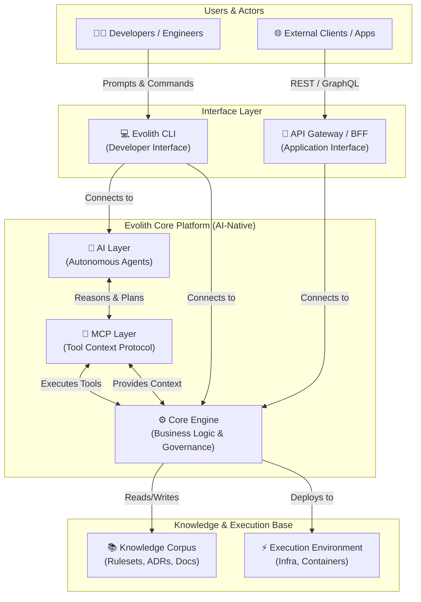
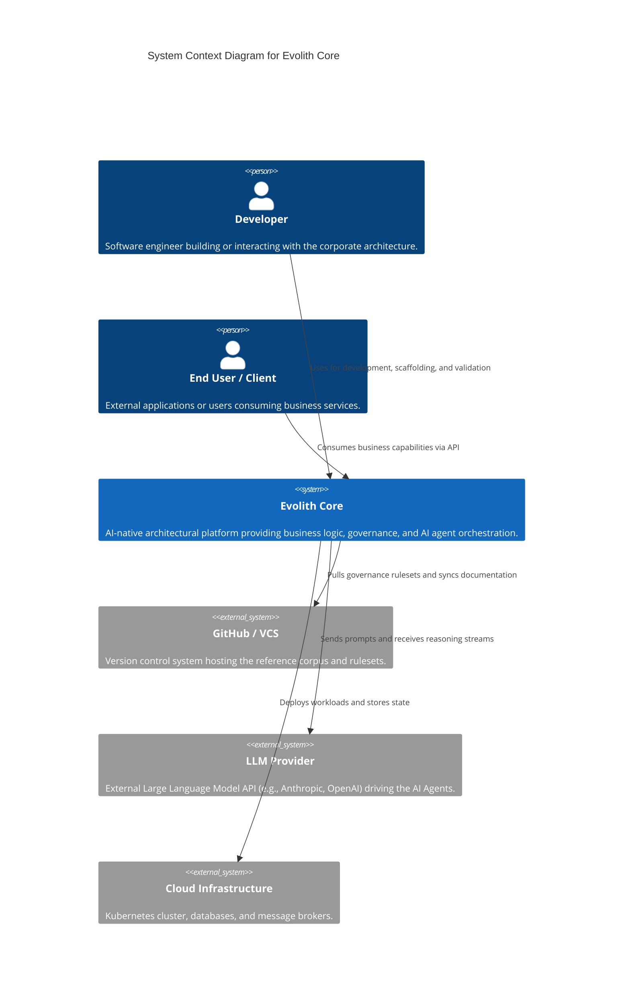
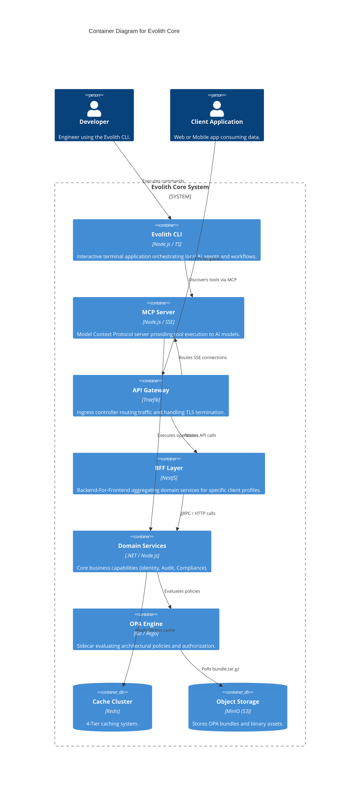
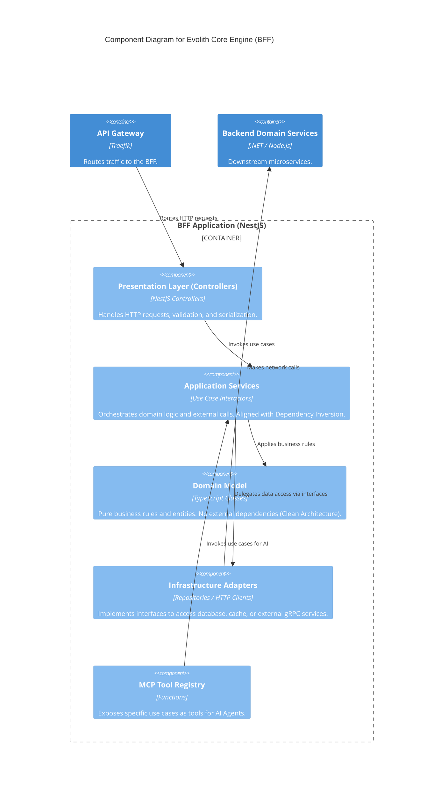
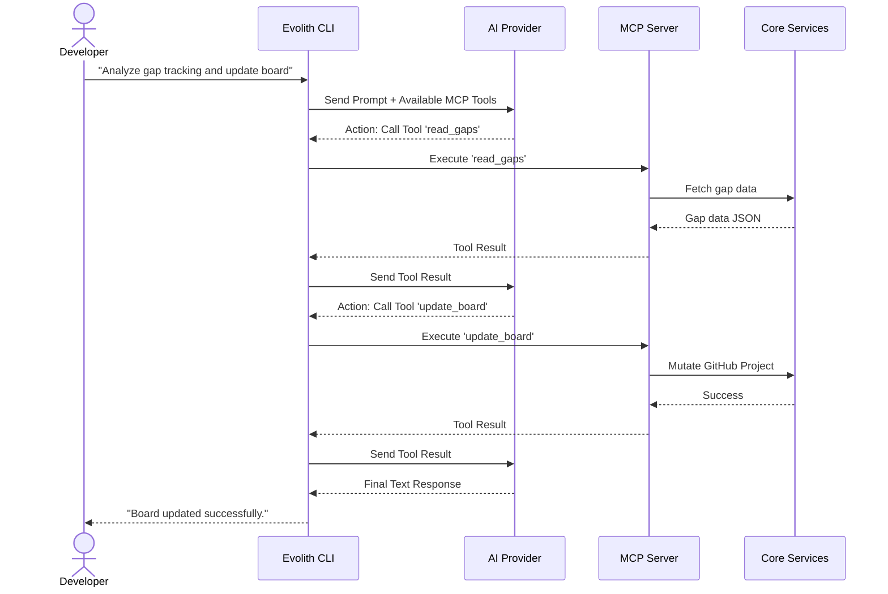
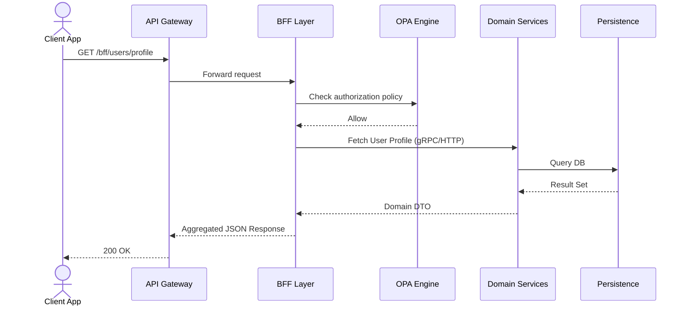

# Product Zone: Evolith Core Architecture

## 1. Architectural Vision

Evolith Core is an AI-native reference architecture designed to start simple, mature into a modular monolith, and evolve into distributed services only when justified by product and scale. It serves as both the corporate architectural baseline and a foundational executable product.

### Conceptual Platform Vision

The following diagram illustrates the high-level conceptual flow of how users interact with the platform, and how Artificial Intelligence and the Model Context Protocol (MCP) amplify the core capabilities.

## 2. C4 Architecture Models

The following diagrams follow the [C4 Model](https://c4model.com/) framework to decompose the Evolith Core ecosystem from a high-level system context down to internal components.

### Level 1: System Context Diagram

Provides a macroscopic view of Evolith Core, its users, and its external dependencies.

### Level 2: Container Diagram

Decomposes the "Evolith Core" system into its major executing containers.

### Level 3: Component Diagram

Zooming inside the **BFF Layer / Core Engine** to demonstrate internal Clean Architecture and DDD alignment.

## 3. Interaction Flows

Sequence diagrams illustrating key operational scenarios within the platform.

### Case 1: Developer Using Evolith CLI

Demonstrates the AI-native workflow where a developer asks the CLI to perform a task, which is delegated to an LLM that uses MCP tools.

### Case 2: Client Consuming BFF

Demonstrates a standard application request flowing through the infrastructure.

## 4. Component Catalog

| Component | Purpose & Responsibility | Key Dependencies | Input / Output | Future Evolution |
| :--- | :--- | :--- | :--- | :--- |
| **Evolith CLI** | Developer interface for managing architecture, generating code, and executing AI-assisted workflows. | Node.js, LLM APIs, Local File System | **In:** User commands/prompts. **Out:** Code changes, terminal output. | Transition to a fully autonomous background agent daemon. |
| **MCP Server** | Exposes repository and architectural capabilities as standardized tools for any MCP-compliant AI client. | SSE Transport, Evolith SDK | **In:** Tool execution requests. **Out:** Tool results (JSON). | Expand toolset to include dynamic cloud infrastructure provisioning. |
| **BFF Layer** | Aggregates and tailors backend data for specific frontend profiles (Web, Mobile, B2B). | Traefik, Domain Services, OPA | **In:** Client HTTP requests. **Out:** Tailored JSON payloads. | GraphQL Federation adoption for highly dynamic client queries. |
| **Domain Services** | The core business capabilities (Identity, Audit, etc.) implemented as independent modules. | Persistence, Event Bus | **In:** BFF or MCP requests. **Out:** Domain responses / Events. | Scale out from Modular Monolith to distributed Microservices based on load. |
| **OPA Engine** | Centralized policy decision point for dual-engine architectural governance and authorization. | MinIO (S3 Bundle Distribution) | **In:** Contextual evaluation requests. **Out:** Allow/Deny decisions. | Integration with WASM-based execution closer to the application edge. |

## 5. Architectural Roadmap

Evolith Core is designed for progressive enhancement. The current architecture represents **Phase 2 (Modular Architecture with AI Tooling)**.

- **Phase 1:** Simple Monolithic Structure (Completed).
- **Phase 2:** Modular Monolith + BFF + MCP Integration (Current).
- **Phase 3:** Autonomous Multi-Agent Orchestration (Planned). AI Agents will autonomously monitor the execution environment and propose architectural drift corrections.
- **Phase 4:** Event-Driven Microservices (Planned as needed). Splitting high-load domain services into standalone containers communicating via RabbitMQ/Dapr.
