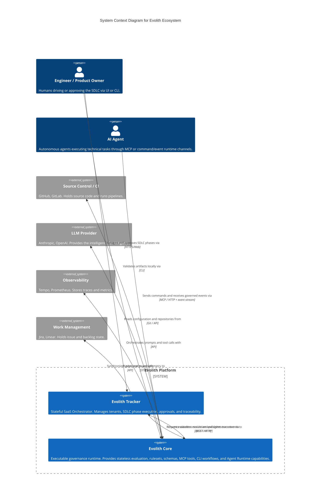

# C4 Level 1: System Context

> **Bilingual Navigation:** [Versión en Español](./level-1-system-context.es.md)

**Status:** Approved  
**Level:** 1 - System Context  
**Parent:** [C4 Master Architecture](./C4-MASTER-ARCHITECTURE.md)

## 1. System Overview

Evolith is designed to act as the authoritative governance engine for the SDLC reference corpus and its executable governance surfaces. At the highest level, it interacts with humans, AI agents, CI/CD, and external SaaS platforms.

The system is fundamentally composed of **Evolith Tracker** (the external stateful SaaS product that owns tenants, product state, approvals, and UI) and **Evolith Core** (the implementation in this repository: Core API, MCP Server, Agent Runtime, Evolith CLI, rulesets, schemas, and packages).

Evolith Core is stateless for canonical product decisions: it may receive tenant/product/initiative identifiers as opaque evaluation context, but it does not authorize end users, persist tenant ownership, or issue binding gate decisions. The current Core API includes a small in-memory satellite registry surface for reference and compatibility workflows; it is not the long-term tenant or product state authority.

## 2. Context Diagram

## 3. Key Interactions

1. **Tracker to Core:** Tracker is a client of Core. It asks Core to evaluate canonical `EvaluationContext` payloads, or asks Agent Runtime to execute a governed task.
2. **Agents to Core:** Agents interact with Core through MCP or the Agent Runtime command/event pattern. Commands are explicit MCP/HTTP requests; progress, tool results, violations, and final output may be delivered on an event stream such as SSE. Agents do *not* connect to Tracker directly.
3. **Core to External:** Core connects to LLMs for intelligence, and Git for retrieving the corporate rulesets (the reference corpus).
4. **Core state boundary:** Core can reflect opaque context and keep local runtime memory/cache, but Tracker remains the canonical owner of tenant/product/initiative state and binding gate decisions.

## 4. Zoom In

Next, we look inside the **Evolith Core** system to see its major containers.
**[Go to Level 2: Containers](./level-2-containers.md)**

---
[Back to Master Architecture](./C4-MASTER-ARCHITECTURE.md)
