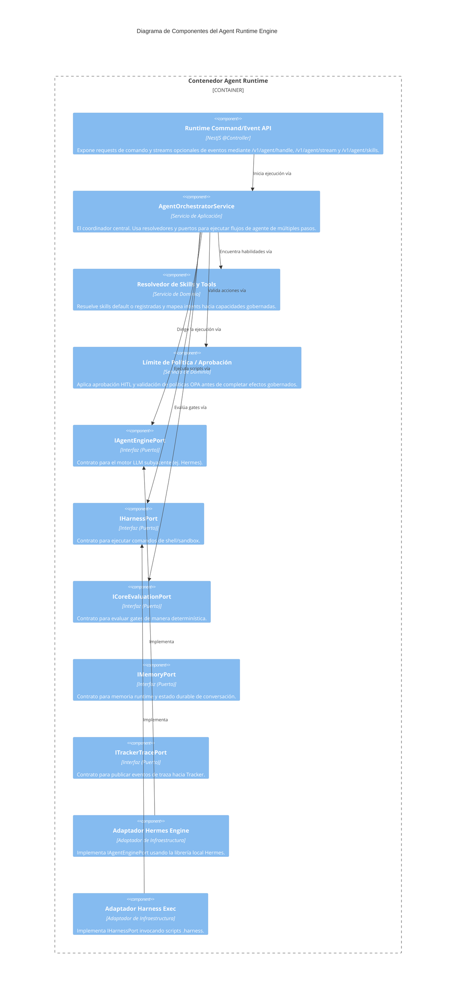

# C4 Nivel 3: Componentes del Agent Runtime

> **Navegación Bilingüe:** [Ver Versión en Inglés](./agent-runtime-components.md)

**Estado:** Aprobado  
**Nivel:** 3 - Componentes  
**Padre:** [C4 Nivel 3: Hub de Componentes](./README.es.md)

## 1. Contexto del Contenedor

El **Agent Runtime Engine** orquesta ejecuciones gobernadas de agentes de IA. Recibe tareas desde Tracker, MCP, CLI o clientes HTTP, resuelve skills, aplica límites de aprobación y política, invoca capacidades a través de puertos abstraídos y publica eventos de traza/memoria.

Utiliza la **Arquitectura Hexagonal (Puertos y Adaptadores)**.

## 2. Diagrama de Componentes

## 3. Desglose de Componentes Clave

| Componente | Responsabilidad |
|------------|-----------------|
| **Runtime Command/Event API** | Recibe un `AgentRuntimeRequest` mediante comandos HTTP explícitos. `POST /v1/agent/handle` retorna un envelope de resultado; `POST /v1/agent/stream` inicia el comando y mantiene abierto un stream de eventos para progreso/resultados de tool/violaciones/finalización. `GET /v1/agent/skills` expone descubrimiento. |
| **AgentOrchestratorService** | Coordina el ciclo completo del agente. Recupera la tarea, pregunta al motor LLM por la siguiente acción, ejecuta la acción si está permitida, y repite hasta completar. |
| **Resolvedor de Skills y Tools** | Resuelve capacidades default o registradas como validación de gates, chequeo de artefactos, auditorías OPA, validación ADR, recomendaciones de desbloqueo y publicación de trazas. |
| **Puertos (IAgentEnginePort, etc)** | Definen contratos estrictos para planificación LLM, ejecución harness, evaluación Core, validación de políticas, publicación de trazas Tracker, memoria, aprobación y scheduling. |
| **Adaptadores** | Los adaptadores de producción incluyen evaluación Core HTTP, validación OPA CLI, ejecución harness por proceso, publicación HTTP a Tracker y memoria en archivo. Los stubs seguros siguen disponibles para bootstrap local y tests. |

---
[Volver al Nivel 3: Hub de Componentes](./README.es.md)
