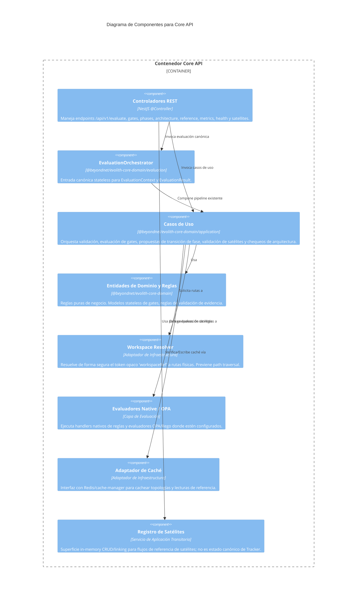

# C4 Nivel 3: Componentes del Core API

> **Navegación Bilingüe:** [Ver Versión en Inglés](./core-api-components.md)

**Estado:** Aprobado  
**Nivel:** 3 - Componentes  
**Padre:** [C4 Nivel 3: Hub de Componentes](./README.es.md)

## 1. Contexto del Contenedor

El **Core API** es la superficie de evaluación stateless de Evolith. Recibe peticiones HTTP REST, resuelve referencias de workspace hacia una ubicación segura del filesystem, evalúa payloads canónicos `EvaluationContext` mediante `@beyondnet/evolith-core-domain`, sirve lecturas de referencia/rulesets y retorna resultados técnicos de evaluación.

Se adhiere a **Clean Architecture** para los flujos de evaluación y validación. La implementación actual también expone un registro in-memory transitorio de satélites para flujos de compatibilidad y referencia; ese registro no es la fuente de verdad tenant/product de largo plazo.

## 2. Diagrama de Componentes

## 3. Desglose de Componentes Clave

| Componente | Responsabilidad |
|------------|-----------------|
| **Controladores REST** | Exponen rutas reales como `POST /api/v1/evaluate`, `POST /api/v1/gates/:gateId/evaluate`, `POST /api/v1/phases/transition`, `GET /api/v1/rulesets`, `/metrics` y `/health`. |
| **EvaluationOrchestrator** | Entrada canónica de evaluación stateless. Resuelve `workspaceRef`, mapea el pipeline existente a `EvaluationResult` y despacha evaluadores de architecture/checkpoint/topology/blueprint/deployment. |
| **Casos de Uso** | Coordinan validación, chequeos de gate, propuestas de transición de fase, validación de satélites y chequeos de drift arquitectónico. |
| **@beyondnet/evolith-core-domain** | Lógica central de negocio y contratos, desacoplada de NestJS. Define contextos/resultados de evaluación, gates, evidencia, transiciones de fase, eventos, providers y validators. |
| **Workspace Resolver** | Límite de seguridad. Traduce un `workspaceRef` opaco en una ruta absoluta segura bajo `WORKSPACE_ROOT`. |
| **Evaluadores Native / OPA** | Ejecutan handlers TypeScript de reglas y evaluadores OPA/Rego según el engine y ruleset seleccionados. |
| **Registro de Satélites** | Superficie actual de compatibilidad in-memory bajo `/api/v1/satellites`. No debe tratarse como store canónico de estado Tracker. |

---
[Volver al Nivel 3: Hub de Componentes](./README.es.md)
