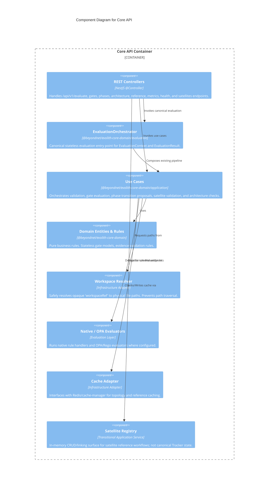

# C4 Level 3: Core API Components

> **Bilingual Navigation:** [Versión en Español](./core-api-components.es.md)

**Status:** Approved  
**Level:** 3 - Components  
**Parent:** [C4 Level 3: Components Hub](./README.md)

## 1. Container Context

The **Core API** is the stateless evaluation surface of Evolith. It receives HTTP REST requests, resolves workspace references to a safe filesystem location, evaluates canonical `EvaluationContext` payloads through `@beyondnet/evolith-core-domain`, serves reference/ruleset reads, and returns technical evaluation results.

It adheres to **Clean Architecture** for evaluation and validation flows. The current implementation also exposes a transitional in-memory satellite registry for compatibility and reference workflows; that registry is not the long-term source of tenant/product truth.

## 2. Component Diagram

## 3. Key Components Breakdown

| Component | Responsibility |
|-----------|----------------|
| **REST Controllers** | Expose real API routes such as `POST /api/v1/evaluate`, `POST /api/v1/gates/:gateId/evaluate`, `POST /api/v1/phases/transition`, `GET /api/v1/rulesets`, `/metrics`, and `/health`. |
| **EvaluationOrchestrator** | Canonical stateless evaluation entry point. It resolves `workspaceRef`, maps the existing pipeline to `EvaluationResult`, and dispatches architecture/checkpoint/topology/blueprint/deployment evaluators. |
| **Use Cases** | Coordinate validation, gate checks, phase transition proposals, satellite validation, and architecture drift checks. |
| **@beyondnet/evolith-core-domain** | Core business logic and contracts, decoupled from NestJS. Defines evaluation contexts/results, gates, evidence, phase transitions, events, providers, and validators. |
| **Workspace Resolver** | Security boundary. Translates an opaque `workspaceRef` into a safe absolute path beneath `WORKSPACE_ROOT`. |
| **Native / OPA Evaluators** | Execute TypeScript rule handlers and OPA/Rego evaluators depending on the selected engine and ruleset. |
| **Satellite Registry** | Current in-memory compatibility surface under `/api/v1/satellites`. It should not be treated as the canonical Tracker state store. |

---
[Back to Level 3: Components Hub](./README.md)
