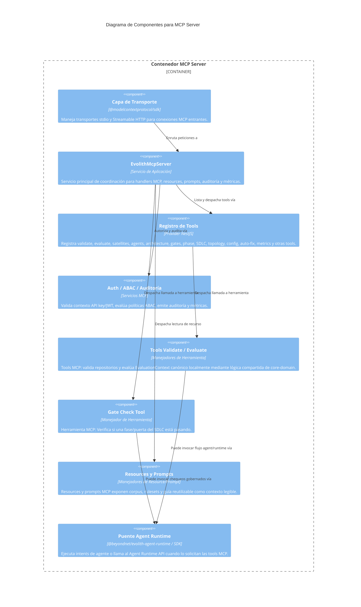

# C4 Nivel 3: Componentes del MCP Server

> **Navegación Bilingüe:** [Ver Versión en Inglés](./mcp-server-components.md)

**Estado:** Aprobado  
**Nivel:** 3 - Componentes  
**Padre:** [C4 Nivel 3: Hub de Componentes](./README.es.md)

## 1. Contexto del Contenedor

El **Standalone MCP Server** expone las capacidades de gobernanza de Evolith hacia agentes IA externos utilizando el Model Context Protocol estándar. Está desacoplado del Evolith CLI como runtime, pero comparte paquetes de dominio y los mismos contratos canónicos de evaluación.

## 2. Diagrama de Componentes

## 3. Desglose de Componentes Clave

| Componente | Responsabilidad |
|------------|-----------------|
| **Capa de Transporte** | SDK estándar de MCP que maneja ciclos de vida stdio y Streamable HTTP. En HTTP producción falla cerrado si no hay API key. |
| **EvolithMcpServer** | Punto de entrada que conecta handlers MCP con registro, resources, prompts, métricas, ABAC y auditoría. |
| **Registro de Tools** | Registro compuesto por módulo desde `src/packages/mcp-server/src/tools/tools.module.ts`; reemplaza canónicamente al paquete ligero retirado `@beyondnet/evolith-mcp-tools`. |
| **Manejadores de Herramientas** | Acciones gobernadas incluyendo `evolith-validate`, `evolith-evaluate`, tools de satélites, agentes, arquitectura, gates/fases, SDLC, topología, configuración, métricas y auto-fix. |
| **Resources y Prompts** | Contexto de solo lectura y payloads de prompt reutilizables expuestos mediante handlers MCP de resource y prompt. |
| **Auth / ABAC / Auditoría** | Autenticación por API key/JWT, chequeos ABAC, gating de tools mutativas, auditoría de llamadas de tools y métricas. |

---
[Volver al Nivel 3: Hub de Componentes](./README.es.md)
