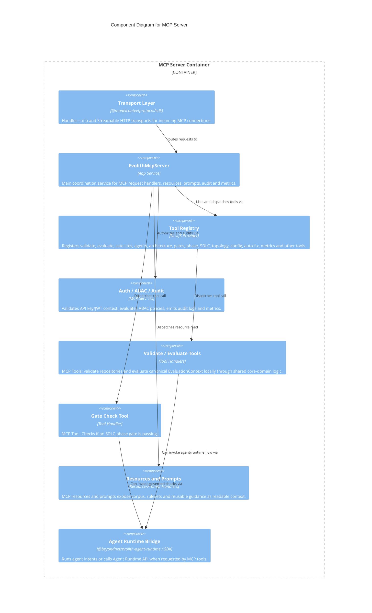

# C4 Level 3: MCP Server Components

> **Bilingual Navigation:** [Versión en Español](./mcp-server-components.es.md)

**Status:** Approved  
**Level:** 3 - Components  
**Parent:** [C4 Level 3: Components Hub](./README.md)

## 1. Container Context

The **Standalone MCP Server** exposes Evolith governance capabilities to external AI agents using the standard Model Context Protocol. It is fully decoupled from the Evolith CLI as a runtime, but it shares domain packages and the same canonical evaluation contracts.

## 2. Component Diagram

## 3. Key Components Breakdown

| Component | Responsibility |
|-----------|----------------|
| **Transport Layer** | Standard MCP SDK managing stdio and Streamable HTTP connection lifecycles. HTTP mode is fail-closed in production without an API key. |
| **EvolithMcpServer** | Application entry point wiring MCP request handlers to the registry, resources, prompts, metrics, ABAC and audit services. |
| **Tool Registry** | Module-composed registry fed by `packages/mcp-server/src/tools/tools.module.ts`; it is the canonical replacement for the retired lightweight `@beyondnet/evolith-mcp-tools` package. |
| **Tool Handlers** | Governed actions including `evolith-validate`, `evolith-evaluate`, satellite tools, agent tools, architecture tools, gate/phase tools, SDLC tools, topology tools, config tools, metrics and auto-fix tools. |
| **Resources and Prompts** | Read-only context and reusable prompt payloads exposed through MCP resource and prompt handlers. |
| **Auth / ABAC / Audit** | API key/JWT authentication, ABAC checks, mutative-tool gating, tool-call audit logs, and metrics. |

---
[Back to Level 3: Components Hub](./README.md)
