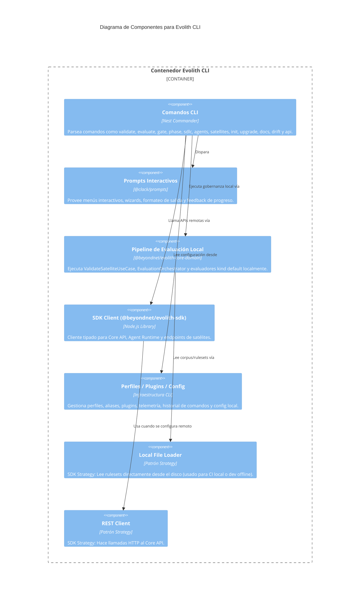

# C4 Nivel 3: Componentes de Evolith CLI

> **Navegación Bilingüe:** [Ver Versión en Inglés](./smart-cli-components.md)

**Estado:** Aprobado  
**Nivel:** 3 - Componentes  
**Padre:** [C4 Nivel 3: Hub de Componentes](./README.es.md)

## 1. Contexto del Contenedor

La **Evolith CLI** es la interfaz interactiva local para ingenieros que trabajan con Evolith y repositorios satélite. Usa comandos Nest Commander, casos de uso compartidos de `@beyondnet/evolith-core-domain`, providers locales de filesystem y clientes `@beyondnet/evolith-sdk` para soportar gobernanza local/offline y llamadas remotas a Core/Agent Runtime.

## 2. Diagrama de Componentes

## 3. Desglose de Componentes Clave

| Componente | Responsabilidad |
|------------|-----------------|
| **Comandos CLI** | Puntos de entrada implementados como providers Nest Commander en `sdk/cli/src/commands/**`. |
| **Prompts Interactivos** | Flujos tipo wizard, menús, progreso y salida formateada para workflows de desarrollador. |
| **Pipeline de Evaluación Local** | Ejecuta `ValidateSatelliteUseCase`, `EvaluationOrchestrator`, evaluadores native/OPA, chequeos de topología y validación de phase gates localmente. |
| **SDK Client** | Cliente HTTP tipado para Core API remoto, Agent Runtime y flujos de registro de satélites. |
| **Perfiles / Plugins / Config** | Shell local para aliases, perfiles, carga de plugins, telemetría, historial de comandos y defaults por ambiente. |

---
[Volver al Nivel 3: Hub de Componentes](./README.es.md)
