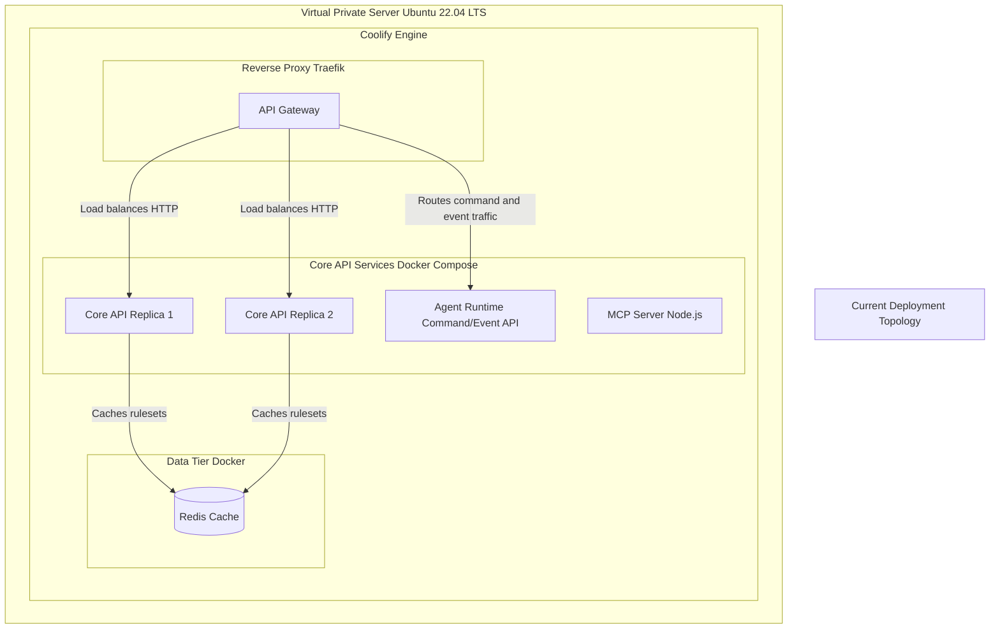
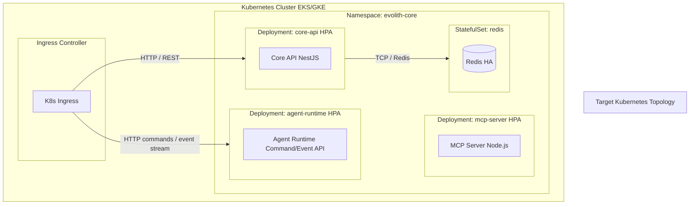

# Architecture View: Deployment

> **Bilingual Navigation:** [Versión en Español](./view-by-deployment.es.md)

**Status:** Approved  
**Parent:** [C4 Master Architecture](./C4-MASTER-ARCHITECTURE.md)

## 1. Current Deployment (VPS / Coolify)

Evolith currently utilizes a high-availability, containerized setup running on a Virtual Private Server orchestrated by Coolify. 
This topology balances cost-efficiency with resilience.

## 2. Future Deployment (Kubernetes)

As the ecosystem scales, Evolith will transition to a Kubernetes-native deployment model to support automated HPA (Horizontal Pod Autoscaling) and strict NetworkPolicies.

---
[Back to Master Architecture](./C4-MASTER-ARCHITECTURE.md)
