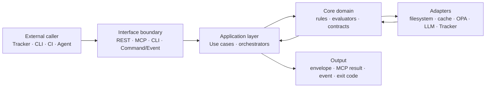
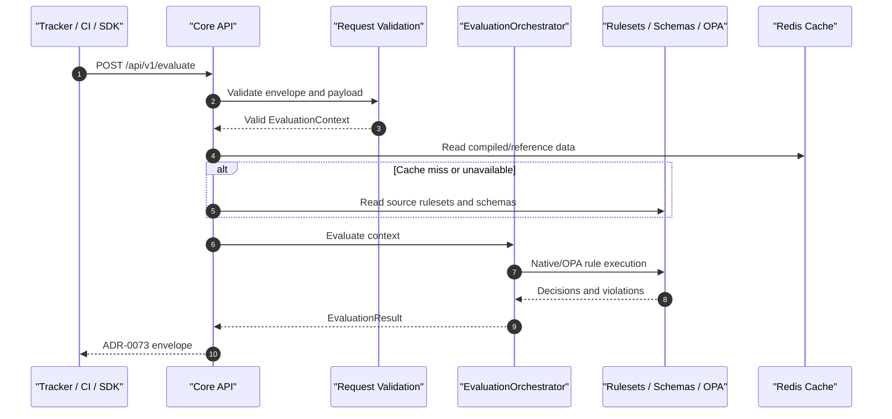
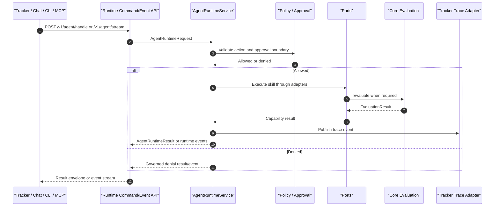

# Architecture View: Core Interface Flows

> **Bilingual Navigation:** [Versión en Español](./view-by-interface-flow.es.md)

**Status:** Approved  
**Parent:** [C4 Master Architecture](./C4-MASTER-ARCHITECTURE.md)  
**Last Updated:** 2026-07-01

## 1. Purpose and Scope

This view documents how communication flows through Evolith Core interfaces. C4 shows the structural shape of the system; this view complements it by making every interface operationally explicit: who calls it, what comes in, what goes out, which layer handles it, and how the system degrades or fails.

Scope includes the implemented Core surfaces in this repository: Core API REST, MCP Server, Agent Runtime Command/Event API, Evolith CLI, SDK-mediated remote calls, health/metrics endpoints, structured corpus reads, Tracker integration boundaries, and the transitional satellite registry.

Out of scope: Tracker UI/BFF internals, UMS internals, vendor-specific LLM behavior, and product-specific tenant authorization. Those belong to their product repositories or runtime-specific profiles.

## 2. Interface Taxonomy

| Interface Type | Primary Caller | Contract Style | State Ownership | Main Output |
|---|---|---|---|---|
| Core API REST | Tracker, CI, SDK clients, Evolith CLI remote mode | Synchronous HTTP request/response | Core owns technical evaluation only; Tracker owns product state | ADR-0073 envelope or RFC 9457 problem |
| MCP Server | AI agents, editor assistants, local agent hosts | MCP stdio or Streamable HTTP tool/resource/prompt call | Core owns tool execution contract; caller owns conversation state | MCP result envelope, resource, prompt, audit/metrics |
| Agent Runtime Command/Event API | Tracker, chat, CLI, MCP bridge, external clients | Explicit command plus optional server-to-client event stream | Runtime owns execution trace; Tracker owns binding workflow state | `AgentRuntimeResult` or event stream |
| Evolith CLI | Developer, CI, local agent process | Terminal command over local filesystem and optional SDK HTTP | Local workspace owns files; Core rules own validation semantics | Console output, JSON envelope, exit code |
| Structured Corpus | Core API, MCP, CLI, Agent Runtime adapters | Filesystem read of schemas, rulesets, OPA, manifests | Repository corpus is source of executable governance truth | Parsed rules, schemas, policies, requirements |
| Health and Metrics | Orchestrator, load balancer, operator | Version-neutral HTTP | Runtime process owns liveness/readiness; metrics are operational evidence | Health JSON or Prometheus text |
| Tracker Trace Boundary | Agent Runtime, Core-facing adapters | HTTP trace/event publish adapter | Tracker owns canonical trace timeline when configured | Accepted trace event or controlled adapter failure |

## 3. End-to-End Communication Map

### 3.1 Layer Flow

Every interface follows the same directional pattern: edge contract, application use case, domain/evaluator, infrastructure adapter, then output envelope or event.



### 3.2 Core State Boundary

Core may receive tenant/product/initiative identifiers as opaque context and may reflect them in `meta.context`, events, or traces for correlation. Core does not authorize users, persist tenant ownership, or make binding product decisions. Tracker remains the canonical owner of tenant state, product state, approvals, and gate decisions.

## 4. Interface Flow Matrix

| Interface | IN | Processing Path | OUT | Resilience Behavior |
|---|---|---|---|---|
| `POST /api/v1/evaluate` | `EvaluationContext`, workspace reference, evidence, optional opaque context | Controller -> validation -> `EvaluationOrchestrator` -> native/OPA evaluators -> corpus/cache | Technical `EvaluationResult` in ADR-0073 envelope | Schema errors fail fast; cache miss falls back to corpus; evaluation failures return problem/envelope, not partial state |
| `POST /api/v1/gates/:gateId/evaluate` | Gate id, phase/evidence payload | `GatesController` -> `EvaluateGateUseCase` -> `PhaseGateValidatorService` | Gate evidence/recommendation | Invalid gate/phase fails validation; result is technical and non-binding until Tracker records decision |
| `POST /api/v1/phases/transition` | Proposed phase transition and evidence | `PhasesController` -> phase transition use case -> gate checks | Transition recommendation | Failed mandatory evidence blocks; Core does not mutate Tracker state |
| `GET /api/v1/rulesets`, gates, requirements | Query path/id | `ReferenceController` -> reference query service -> cache/filesystem | Ruleset, gate, or requirement document | Cache miss reads filesystem; missing reference returns controlled HTTP error |
| MCP tool call | Tool name, tool input, authenticated user context in HTTP mode | MCP transport -> auth/ABAC -> tool registry -> handler -> domain use case | MCP result envelope plus audit/metrics | HTTP auth is fail-closed in production; unknown/unauthorized tool is denied and audited |
| MCP resource/prompt read | Resource URI or prompt name | MCP transport -> resources/prompts service -> corpus/service lookup | Resource or prompt payload | Missing resource/prompt returns protocol error; logs stay on stderr for stdio |
| Agent Runtime `POST /v1/agent/handle` | `AgentRuntimeRequest` command | Controller -> runtime service -> skills -> policy/approval -> ports/adapters | One `AgentRuntimeResult` | Policy or approval denial returns governed result; adapter failures are captured in trace |
| Agent Runtime `POST /v1/agent/stream` | `AgentRuntimeRequest` command | Same runtime path, with server-to-client event stream | Progress/tool/violation/final events | SSE is event transport only; client actions remain explicit HTTP/MCP commands |
| Evolith CLI local command | CLI args, cwd, local files | Nest Commander -> command -> local providers/core-domain | Human output, JSON envelope, exit code | Offline-friendly; invalid args fail before effects; filesystem errors surface as command errors |
| SDK remote call | Typed client request | SDK client -> REST endpoint -> Core/Runtime | Typed response | Network errors stay at SDK boundary; caller decides retry/circuit behavior |
| `/health`, `/metrics` | Probe/read request | Public controller -> service/registry | Health JSON or Prometheus exposition | Public probes bypass API key; metrics errors must not break domain evaluation |
| Satellite registry | Satellite create/list/link payload | `SatellitesController` -> in-memory compatibility service | Registry response | Transitional only; never canonical tenant/product state |

## 5. Process Flows by Interface

### 5.1 Core API REST Evaluation



**Resilience:** validation fails before evaluation; Redis is an optimization and must not become the source of truth; missing rules or invalid evidence return controlled errors. The result is technical evidence, not a Tracker state mutation.

### 5.2 Gate and Phase Governance

Gate evaluation and phase transition endpoints are specialized REST flows over the same evaluation contract. A gate result tells a caller whether evidence satisfies governance criteria; only Tracker or a product workflow records the binding decision.

| Step | Responsibility |
|---|---|
| Caller submits gate/phase evidence | Provide phase, gate, actor class, workspace/evidence |
| Core validates payload | Reject invalid phase keys, actor classes, and malformed evidence |
| Core evaluates rules | Apply phase-gate rules and native/OPA validators |
| Core returns recommendation | Return pass/block/warn details and evidence references |
| Tracker records decision | Persist approval, waiver, or rejection outside Core |

**Resilience:** mandatory evidence failures block; malformed input fails fast; waivers must be explicit governance artifacts, not informal bypasses.

### 5.3 Reference Reads and Ruleset Discovery

Reference endpoints expose active rulesets, gates, phase requirements, and architecture reference data to clients that need discoverability before evaluation.

**IN:** ruleset id, gate id, phase id, topology id, or discovery query.  
**OUT:** structured reference document, ruleset metadata, gate requirements, or controlled not-found error.  
**Process:** controller -> query service -> cache/filesystem -> envelope.  
**Resilience:** cache miss reads repository files; invalid ids fail with problem details; docs never override schema/ruleset truth.

### 5.4 MCP Tools, Resources, and Prompts

MCP exposes the same governance capabilities to agents through governed tools, resources, and prompts. It is not a separate rule engine.

| Sub-interface | IN | OUT | Resilience |
|---|---|---|---|
| Tool call | Tool name and JSON input | Tool result envelope | Unknown tools fail; mutative tools require authorization and audit |
| Resource read | `evolith://...` URI | Resource payload | Missing resources return protocol error |
| Prompt read | Prompt name/arguments | Prompt content | Prompt lookup is deterministic and versioned by server release |
| HTTP transport auth | API key or JWT roles | User context for ABAC | Production HTTP is fail-closed when auth or ABAC policy is missing |
| stdio transport | JSON-RPC stream | JSON-RPC result | Logs go to stderr; stdout remains protocol-only |

**Resilience:** MCP records per-tool metrics and audit events; ABAC evaluates at tool invocation time; OPA policy absence is fail-closed in production for protected decisions.

### 5.5 Agent Runtime Command/Event API



The command/event API separates client intent from server events:

- `POST /v1/agent/handle` submits a command and waits for one final result.
- `POST /v1/agent/stream` submits a command and keeps an event stream open.
- SSE is a server-to-client event transport only. Follow-up actions are new HTTP/MCP commands correlated to the active task.

**Resilience:** policy and approval checks happen before effects complete; adapter failures are captured in the runtime result and trace; stream interruption does not authorize hidden work.

### 5.6 Evolith CLI Local and Remote Flows

The CLI is both a local governance interface and a remote client when configured to call Core API or Agent Runtime through the SDK.

| Mode | IN | Processing | OUT | Resilience |
|---|---|---|---|---|
| Local validation | cwd, files, flags | Commander -> local providers -> core-domain | stdout/JSON, exit code | Works offline; filesystem errors are explicit |
| Gate evaluation | phase/gate flags, evidence | command -> `EvaluateGateUseCase` | gate evidence envelope | Invalid actor/phase fails fast |
| Remote check | SDK config and request | SDK -> HTTPS Core/Runtime | typed response | network errors stay outside domain semantics |
| MCP serve | CLI command delegates to MCP server package | binary/package startup | stdio or HTTP MCP server | production HTTP requires auth |

**Resilience:** commands validate flags before side effects; JSON output is suitable for CI; non-zero exit codes are the automation boundary.

### 5.7 Health, Metrics, and Observability

Operational endpoints are not domain commands. They allow orchestrators and operators to know whether a process is alive, ready, and producing useful telemetry.

| Surface | IN | OUT | Resilience |
|---|---|---|---|
| Core API `/health`, `/health/live`, `/health/ready` | HTTP probe | health/readiness JSON | Public probes bypass API key; readiness can report degraded dependencies |
| Core API `/metrics` | HTTP scrape | Prometheus text | Metrics exposition bypasses ADR envelope when needed by Prometheus |
| MCP `/health` | HTTP probe | transport health JSON | Public liveness works without credentials |
| Agent Runtime `/health` | HTTP probe | runtime health JSON | Public health remains separate from governed commands |
| OTLP/metrics interceptors | request lifecycle | traces, counters, latency | telemetry failure must not mutate domain verdicts |

### 5.8 Tracker Integration and Trace Publishing

Tracker consumes Core and Agent Runtime as an external client. Core does not call Tracker to ask for tenant authority. Agent Runtime may publish trace events through `ITrackerTracePort` when configured.

**IN from Tracker:** authorized product request, workspace reference, opaque context, evidence, command.  
**OUT to Tracker:** evaluation result, runtime result, trace event, or controlled error.  
**Resilience:** if Tracker trace publishing fails, the runtime reports/records adapter failure according to configuration; Core still does not persist Tracker state.

### 5.9 Transitional Satellite Registry

The satellite registry under `/api/v1/satellites` is an in-memory compatibility/reference surface. It supports create/list/read/link workflows for reference scenarios but must not be used as Tracker's canonical state store.

**Resilience:** process restart can lose registry data; clients that need durable tenant/product ownership must use Tracker or a product-owned store.

## 6. Resilience Matrix

| Failure Mode | Boundary That Detects It | Expected Behavior |
|---|---|---|
| Missing or invalid API key | Core/MCP/Runtime guard | Fail closed except public health/readiness routes |
| Invalid JSON or schema mismatch | Controller/validation layer | Reject before domain execution |
| Redis unavailable | Cache adapter | Fall back to filesystem/reference source where supported |
| Missing ruleset/schema | Reference/evaluation layer | Return controlled error; do not invent defaults |
| OPA policy unavailable | Evaluator/ABAC policy layer | Fail closed in production for protected policy decisions; use documented native fallback only where contract allows |
| Tool not authorized | MCP ABAC or runtime policy boundary | Deny, audit, and return governed error/result |
| LLM provider failure | Agent Runtime engine adapter | Return governed runtime error; never bypass policy/gate checks |
| SSE/event stream disconnect | Agent Runtime API/client boundary | Stop delivering events; client must retry/submit an explicit correlated command or query flow |
| Tracker unavailable for trace publish | Tracker trace adapter | Report adapter failure/degraded trace; do not persist product state in Core |
| Filesystem unreadable | CLI/Core/MCP filesystem adapter | Surface command/API error; avoid partial successful verdicts |
| Metrics/telemetry backend unavailable | Observability adapter | Degrade telemetry; do not change domain decision |

## 7. Correlation, Audit, and Idempotency

Every external-facing flow should preserve a correlation id through the envelope, event metadata, audit record, or CLI JSON output. Correlation is not ownership: it links a request to traces and results without giving Core authority over tenant/product state.

| Concern | Contract |
|---|---|
| Correlation | `correlationId`, runtime task id, trace id, or command id should flow through logs and responses |
| Audit | Mutative MCP tools, governed runtime effects, and policy denials must emit audit/trace evidence |
| Idempotency | Clients should treat evaluation as repeatable and state-free; stateful product decisions remain outside Core |
| Retries | Retry only commands that are safe by contract or carry caller-side correlation/idempotency protection |
| Ordering | Event streams are ordered per active command stream, not a global event bus |

## 8. Client Guidance

- Use Core API REST for deterministic evaluation and reference reads.
- Use MCP when an agent needs tool/resource/prompt discovery under ABAC and audit.
- Use Agent Runtime when the client needs governed multi-step agent execution, policy boundaries, approvals, memory, or trace publishing.
- Use Evolith CLI for local/offline governance and CI-friendly command execution.
- Do not use SSE as a command channel. It is an event delivery transport after an explicit command.
- Do not connect agents directly to Tracker for governed context or tools. Use MCP or Agent Runtime.
- Do not treat `/api/v1/satellites` as durable tenant or product ownership.

## 9. Related References

- [C4 Master Architecture](./C4-MASTER-ARCHITECTURE.md)
- [Level 2: Containers](./level-2-containers.md)
- [Agent Runtime Components](./level-3-components/agent-runtime-components.md)
- [Core API Components](./level-3-components/core-api-components.md)
- [MCP Server Components](./level-3-components/mcp-server-components.md)
- [E2E Traceability Matrix](../../control-center/taxonomy/e2e-traceability-matrix.md)
- [Ecosystem and Communication Map](../../../../product/products/ecosystem-and-communication.md)

## 10. JSON Contract Examples (IN/OUT)

Below are representative examples of the JSON structures for the main interfaces (ADR-0073). These payloads illustrate the expected format and can be used as a reference. They are organized by interface surface.

<details>
<summary><b>10.1 Core API REST</b></summary>

The Core API exposes synchronous HTTP endpoints for stateless evaluation and governance.

#### `POST /api/v1/evaluate`
**IN (EvaluationContext):**
```json
{
  "workspaceId": "ws-12345",
  "topologyId": "top-mono-01",
  "evidence": {
    "files": ["src/main.ts", "package.json"],
    "dependencies": ["@nestjs/core"]
  },
  "context": {
    "initiativeId": "init-789",
    "opaqueToken": "ey..."
  }
}
```

**OUT (EvaluationResult Envelope ADR-0073):**
```json
{
  "status": "success",
  "data": {
    "evaluationId": "eval-001",
    "passed": true,
    "violations": [],
    "warnings": [
      {
        "code": "WARN_DEPRECATED_PACKAGE",
        "message": "The package xyz is deprecated."
      }
    ]
  },
  "meta": {
    "timestamp": "2026-07-01T12:00:00Z",
    "correlationId": "corr-abc-123"
  }
}
```

#### `POST /api/v1/gates/:gateId/evaluate`
**IN:**
```json
{
  "phaseId": "discovery",
  "actorClass": "architect",
  "evidence": {
    "documents": ["docs/architecture.md"],
    "approvals": ["usr-999"]
  }
}
```

**OUT:**
```json
{
  "status": "success",
  "data": {
    "gateId": "gate-arch-review",
    "recommendation": "proceed",
    "details": [
      {
        "check": "Document completeness",
        "passed": true
      }
    ]
  },
  "meta": {
    "timestamp": "2026-07-01T12:05:00Z",
    "correlationId": "corr-def-456"
  }
}
```

#### `POST /api/v1/phases/transition`
**IN:**
```json
{
  "workspaceId": "ws-12345",
  "fromPhase": "discovery",
  "toPhase": "ballpark",
  "evidence": {
    "gatesPassed": ["gate-arch-review"]
  }
}
```

**OUT (Envelope):**
```json
{
  "status": "success",
  "data": {
    "transitionId": "trn-888",
    "recommendation": "approved",
    "details": []
  },
  "meta": {
    "timestamp": "2026-07-01T12:15:00Z"
  }
}
```

#### `GET /health/ready`
**OUT:**
```json
{
  "status": "ok",
  "info": {
    "redis": { "status": "up" },
    "database": { "status": "up" }
  },
  "error": {},
  "details": {
    "redis": { "status": "up" },
    "database": { "status": "up" }
  }
}
```
</details>

<details>
<summary><b>10.2 Agent Runtime API</b></summary>

The Agent Runtime API handles orchestrated execution of agent tasks. It separates commands (intent) from the event stream (execution).

#### `POST /v1/agent/handle` (Synchronous Request)
**IN (AgentRuntimeRequest):**
```json
{
  "command": "analyze-code",
  "parameters": {
    "path": "src/domain/"
  },
  "correlationId": "corr-ghi-789"
}
```

**OUT (AgentRuntimeResult Envelope):**
```json
{
  "status": "success",
  "data": {
    "taskId": "task-555",
    "status": "completed",
    "output": {
      "summary": "Analysis complete without issues.",
      "findings": []
    }
  },
  "meta": {
    "timestamp": "2026-07-01T12:10:00Z",
    "correlationId": "corr-ghi-789"
  }
}
```

#### `POST /v1/agent/stream` (SSE Events)
**OUT (Event Stream):**
```text
event: progress
data: {"taskId": "task-555", "step": "analyzing", "percent": 50}

event: tool_call
data: {"tool": "read_file", "params": {"path": "src/main.ts"}}

event: final
data: {"taskId": "task-555", "status": "completed", "summary": "Done."}
```
</details>

<details>
<summary><b>10.3 Model Context Protocol (MCP) Server</b></summary>

The MCP server exposes capabilities as Tools, allowing native integration with LLM orchestrators and agents.

#### Tool Call Request (JSON-RPC)
**IN:**
```json
{
  "jsonrpc": "2.0",
  "id": "1",
  "method": "tools/call",
  "params": {
    "name": "evaluate_architecture",
    "arguments": {
      "path": "./docs"
    }
  }
}
```

#### Tool Call Response (JSON-RPC)
**OUT:**
```json
{
  "jsonrpc": "2.0",
  "id": "1",
  "result": {
    "content": [
      {
        "type": "text",
        "text": "Evaluation passed. No violations."
      }
    ],
    "isError": false
  }
}
```
</details>

<details>
<summary><b>10.4 Evolith CLI</b></summary>

The command-line interface provides local execution for CI/CD pipelines and validation on developer workstations.

#### Command Execution (JSON Output)
**Command:** `evolith evaluate --workspace ./src --format json`

**OUT (Console stdout JSON):**
```json
{
  "status": "success",
  "data": {
    "evaluationId": "cli-local-001",
    "passed": true,
    "violations": []
  },
  "meta": {
    "timestamp": "2026-07-01T12:00:00Z",
    "executionMode": "local-cli"
  }
}
```
</details>

---
[Back to Master Architecture](./C4-MASTER-ARCHITECTURE.md)
