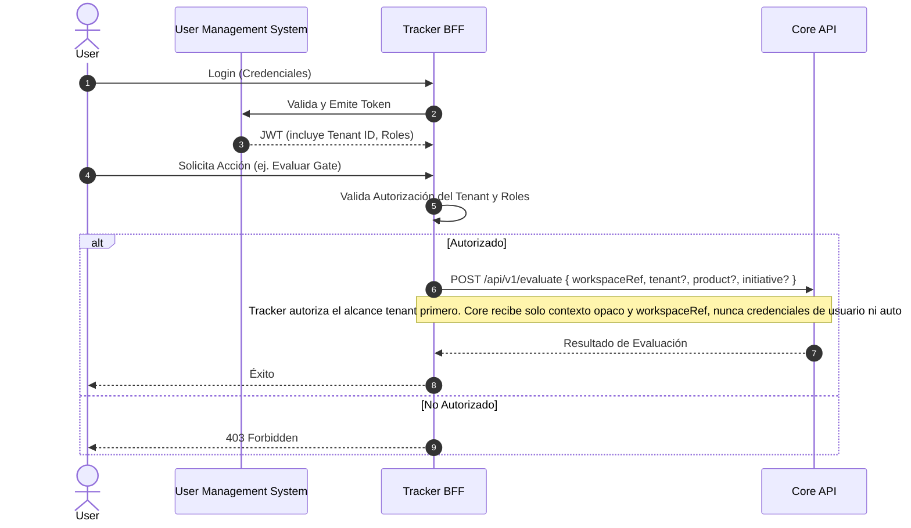

# Vista de Arquitectura: Multi-Tenancy y Autorización

> **Navegación Bilingüe:** [Ver Versión en Inglés](./view-by-tenant.md)

**Estado:** Aprobado  
**Padre:** [C4 Master Architecture](./C4-MASTER-ARCHITECTURE.es.md)

## 1. Estrategia Multi-Tenancy

Evolith sigue una estricta separación de responsabilidades con respecto a multi-tenancy. Tal como lo decreta el **ADR-0101**, el motor Core de Evolith es **stateless para estado canónico de producto y ownership tenant**.

La responsabilidad del aislamiento de tenants, la autorización de usuarios y los registros de propiedad recae enteramente en **Evolith Tracker**. Core puede recibir `tenant`, `product` e `initiative` como contexto opaco de request para trazabilidad y correlación de evaluación, pero no debe tratar esos identificadores como hechos de autorización ni ownership persistido.

## 2. Flujo de Autorización

## 3. Reglas de Límite (Boundaries)
1. **Core API** y **Agent Runtime API** utilizan API Keys (ej., `x-api-key`) para autenticación máquina-a-máquina con el Tracker.
2. **Core API** puede reflejar contexto opaco tenant/product/initiative para correlación, pero nunca autoriza, persiste ni deriva ownership desde `tenantId`.
3. **Tracker** maneja la validación del JWT, el Control de Acceso Basado en Roles (RBAC), y el mapeo del tenant hacia el workspace y subconjuntos de reglas correctos.
4. **Advertencia sobre registro de satélites:** `/api/v1/satellites` es actualmente una superficie in-memory de compatibilidad/referencia en Core API. No es el registro canónico de tenants ni debe usarse como store de estado de Tracker.

---
[Volver a la Arquitectura Maestra](./C4-MASTER-ARCHITECTURE.es.md)
