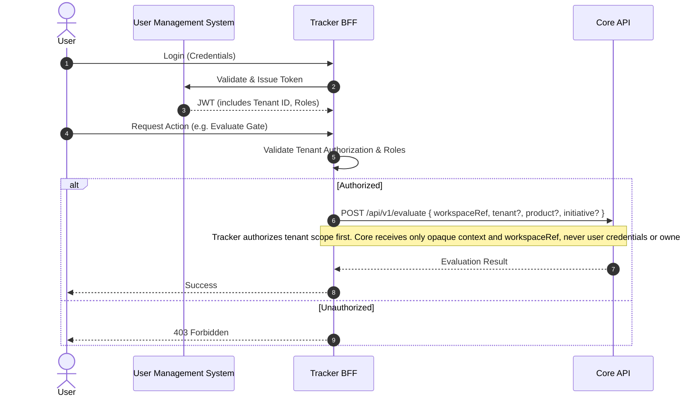

# Architecture View: Multi-Tenancy & Authorization

> **Bilingual Navigation:** [Versión en Español](./view-by-tenant.es.md)

**Status:** Approved  
**Parent:** [C4 Master Architecture](./C4-MASTER-ARCHITECTURE.md)

## 1. Multi-Tenancy Strategy

Evolith follows a strict separation of concerns regarding multi-tenancy. As decreed by **ADR-0101**, the Evolith Core engine is **stateless for canonical product state and tenant ownership**.

The responsibility of tenant isolation, user authorization, and ownership records falls entirely on **Evolith Tracker**. Core may receive `tenant`, `product`, and `initiative` as opaque request context for traceability and evaluation correlation, but it must not treat those identifiers as authorization facts or persisted ownership.

## 2. Authorization Flow

## 3. Boundary Rules
1. **Core API** and **Agent Runtime API** use API Keys (e.g., `x-api-key`) for machine-to-machine authentication with Tracker.
2. **Core API** may reflect opaque tenant/product/initiative context for correlation, but never authorizes, persists, or derives ownership from `tenantId`.
3. **Tracker** handles the JWT validation, Role-Based Access Control (RBAC), and mapping the tenant to the correct workspace and rule subsets.
4. **Satellite registry caveat:** `/api/v1/satellites` is currently an in-memory compatibility/reference surface in Core API. It is not the canonical tenant registry and must not be used as the Tracker state store.

---
[Back to Master Architecture](./C4-MASTER-ARCHITECTURE.md)
