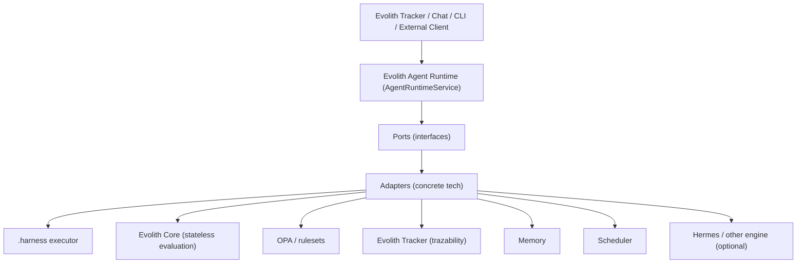
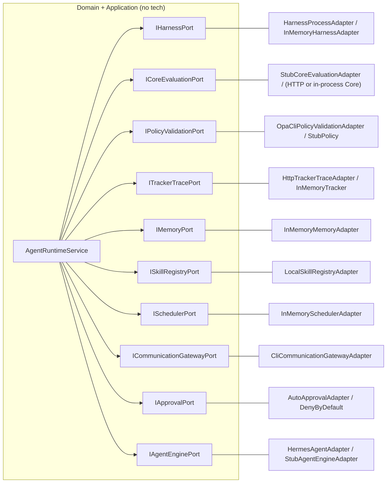
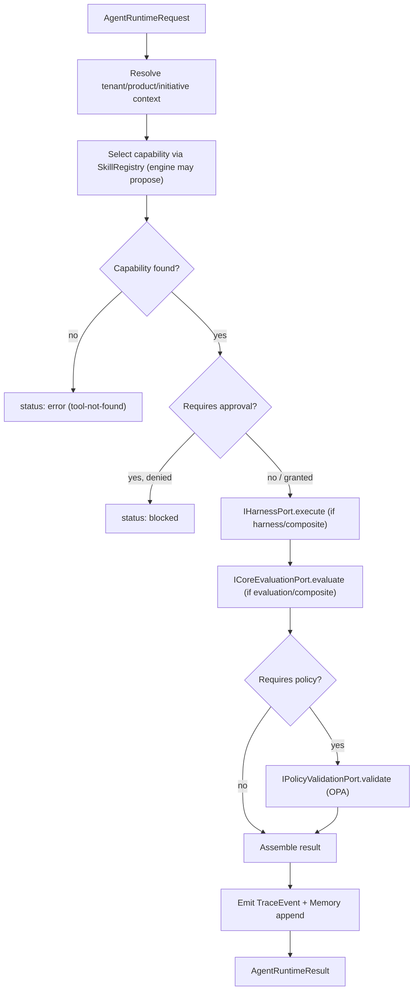
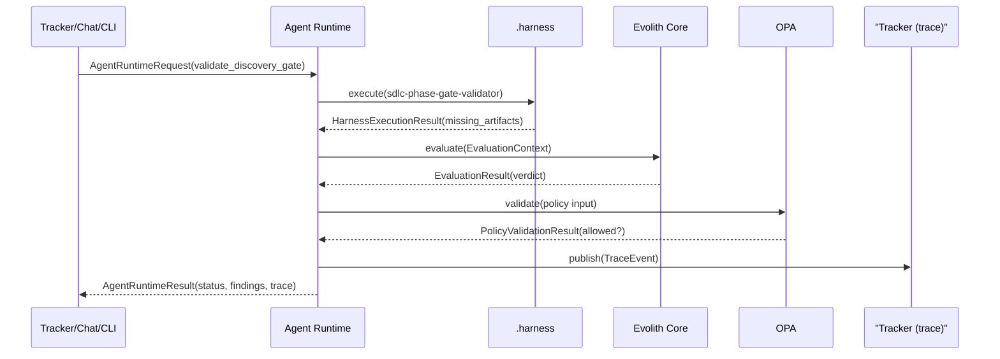
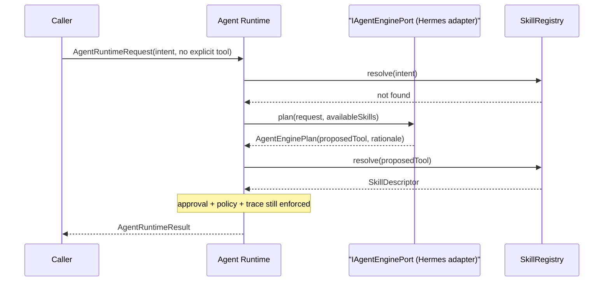

# Evolith Agent Runtime — Architecture

> **Bilingual Navigation:** [Versión en Español](./architecture.es.md)

This document describes the layers, the execution flow, the separation of duties,
and the diagrams for the Evolith Agent Runtime. See also
[Ports and Adapters](./ports-and-adapters.md) and
[.harness Integration](./harness-integration.md).

## 1. What it is

The Agent Runtime is a thin, governed orchestration layer. Given an
`AgentRuntimeRequest` it resolves the tenant/product/initiative context, selects
a governed capability, invokes the right ports, runs validations, returns an
`AgentRuntimeResult`, and emits trazability. It is implemented in
[`src/packages/agent-runtime`](../../../../src/packages/agent-runtime/README.md) following
**Puertos y Adaptadores** so no runtime/LLM technology becomes a domain
dependency. 

> **Important:** The runtime capabilities and their implementation maturity (like the `InteractionAdapterPort`) are strictly governed by the [Adapter Capability Maturity Matrix](../../control-center/maturity-reports/maturity-assessment.md#5-adapter-capability-maturity-agent-runtime).

## 2. Why a new layer that does not replace .harness

`.harness` is the official, versioned, auditable mechanism that **runs** scripts,
playbooks, validators, audits and skills. The Agent Runtime is a different
concern: it **decides what to run, governs it, and records it**. Keeping them
separate means:

- `.harness` stays the single governed executor; the runtime calls it through a
  port (`IHarnessPort`) and never reimplements it.
- The runtime can converse, remember, schedule and recommend — concerns that do
  not belong inside a deterministic executor.
- Either side evolves independently: a sandboxed/remote `.harness` runner is an
  adapter swap; a new reasoning engine is another adapter swap.

## 3. Architecture overview



The runtime depends only on the **Ports** row. Everything below the dashed line
is replaceable without touching the runtime.

## 4. Ports and Adapters map



Full catalog: [Ports and Adapters](./ports-and-adapters.md).

## 5. Execution flow

The base flow folds `.harness` execution and Core evaluation into one governed
result, then validates with OPA and records trazability.



The data contract pipeline, named explicitly:

```text
AgentRuntimeRequest
  -> HarnessExecutionRequest -> HarnessExecutionResult
  -> EvaluationContext (CoreEvaluationRequest) -> EvaluationResult
  -> PolicyValidationResult
  -> AgentRuntimeResult
  -> TrackerTraceEvent
```

Gate validation as a sequence:



Execution via the optional Hermes engine (it only **proposes**; the runtime
still governs):



## 6. Separation of duties

Every result carries a `trace` block that names **who did what**, so audits never
have to trust the runtime's own summary:

| Field | Value | Meaning |
|---|---|---|
| `executedBy` | `agent_runtime` | The runtime orchestrated the call |
| `validatedBy` | `.harness` | The capability that produced the facts |
| `governedBy` | `evolith_core` | The Core evaluated against contracts/rulesets |
| `policyEngine` | `opa` | OPA enforced policy on the result |

The runtime never claims to have governed; the Core and OPA do. This is the
mechanism that keeps the agentic layer honest.

## 7. Tenant, product and initiative as context

Tenant/product/initiative are **received per request** as opaque identifiers in
`RuntimeContext`, echoed into traces, and forwarded to the Core as temporary
evaluation context only (per the stateless Core contract). They are never
embedded in `.harness` and never persisted by the runtime. Evolith Tracker
remains the system of record; the runtime only routes, governs and traces on
those ids.

## 8. MVP scope vs future extensions

| Capability | MVP | Future extension |
|---|---|---|
| Full governed pipeline | Yes | — |
| Stub/in-memory adapters | Yes | — |
| `.harness` process adapter | Yes | Sandboxed/remote runner |
| OPA CLI policy adapter | Yes | Long-lived OPA server adapter |
| HTTP Tracker adapter | Yes | Batching, retries, auth profiles |
| Core evaluation adapter | Stub | In-process `EvaluationOrchestrator` / Core REST |
| Engine | Deterministic stub | Real Hermes client; multi-engine routing |
| Scheduler | In-memory | Durable cron/queue adapter |
| Approval | Auto / deny-by-default | Chat/Tracker HITL workflow |
