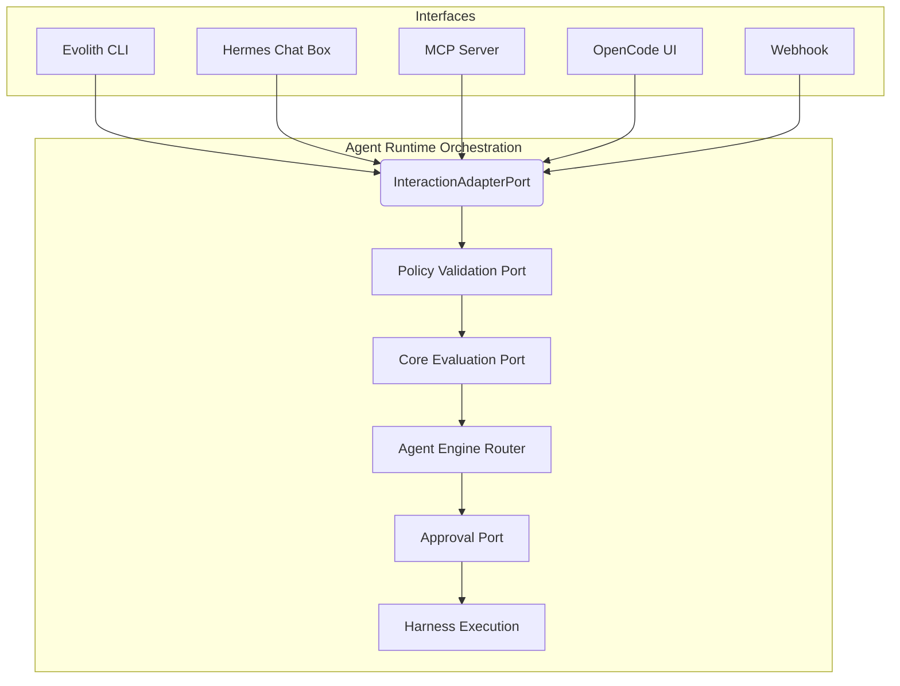
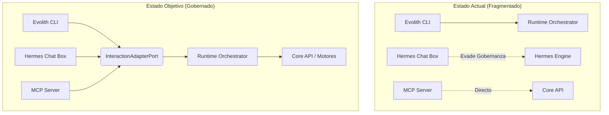
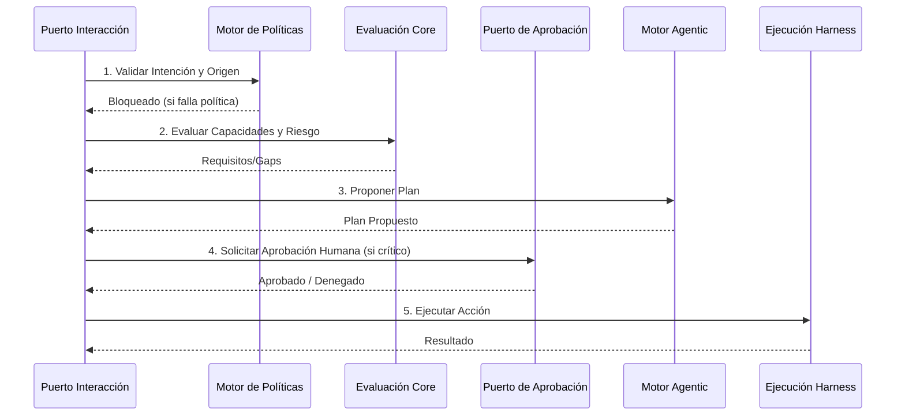
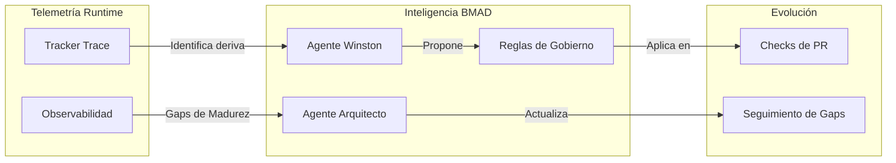

# Evolith Agent Runtime — Puertos y Adaptadores

> **Navegación bilingüe:** [English version](./ports-and-adapters.md)

Toda integración externa es un **puerto** (una interfaz en el dominio). La
tecnología concreta vive solo en **adaptadores**. Esto es lo que mantiene
intercambiables a Hermes, OPA, el Tracker e incluso `.harness`. Fuente:
[`src/packages/agent-runtime/src/domain/ports`](../../../../src/packages/agent-runtime/src/domain/ports).

## Catálogo de puertos

| Puerto | Responsabilidad | Regla de diseño |
|---|---|---|
| `IAgentRuntime` | Puerto de entrada — `handle(request)` | — |
| `IHarnessPort` | Descubrir + ejecutar capacidades de `.harness` | #4 proveedor de capacidades |
| `ICoreEvaluationPort` | Enviar `EvaluationContext`, obtener `EvaluationResult` | Core sin estado |
| `IPolicyValidationPort` | Aplicación de OPA / rulesets | #6/#7 no saltarse gates |
| `ITrackerTracePort` | Publicar eventos de trazabilidad al Tracker | trazabilidad |
| `IMemoryPort` | Memoria de trabajo/conversación | propiedad del runtime |
| `ISkillRegistryPort` | Resolver intent/tool a una skill gobernada | indirección |
| `ISchedulerPort` | Diferir/recurrir trabajo | extensión |
| `ICommunicationGatewayPort` | Adaptar superficies CLI/chat/webhook | #5 |
| `IApprovalPort` | Aprobación humana en el bucle | #7 |
| `IAgentEnginePort` | Abstracción del motor de razonamiento (Router/Hermes/Swarms) | #1/#2 desacople |

Cada puerto tiene un token de inyección en
[`tokens.ts`](../../../../src/packages/agent-runtime/src/domain/tokens.ts) (`Symbol`s
agnósticos de framework) para un cableado opcional con contenedor.

## Adaptadores por defecto (stub/in-memory)

Permiten arrancar y ejecutar el runtime extremo a extremo sin Hermes, sin un Core
en vivo y sin un checkout de `.harness` (regla de diseño #5).
`createAgentRuntime()` los cablea todos.

| Puerto | Adaptador por defecto |
|---|---|
| `IHarnessPort` | `InMemoryHarnessAdapter` (capacidades simuladas) |
| `ICoreEvaluationPort` | `StubCoreEvaluationAdapter` (basado en reglas, determinístico) |
| `IPolicyValidationPort` | `StubPolicyValidationAdapter` (permite, o inyecta un denegador) |
| `ITrackerTracePort` | `InMemoryTrackerTraceAdapter` (recolecta eventos) |
| `IMemoryPort` | `InMemoryMemoryAdapter` |
| `ISkillRegistryPort` | `LocalSkillRegistryAdapter` (sembrado desde `DEFAULT_SKILLS`) |
| `ISchedulerPort` | `InMemorySchedulerAdapter` |
| `ICommunicationGatewayPort` | `CliCommunicationGatewayAdapter` |
| `IApprovalPort` | `AutoApprovalAdapter` |
| `IAgentEnginePort` | `RoutingAgentAdapter` (por defecto usa el emparejador heurístico Stub) |

## Adaptadores para producción

Sustituye cualquier adaptador por defecto por uno real sin tocar el runtime:

| Puerto | Adaptador real | Notas |
|---|---|---|
| `IHarnessPort` | `HarnessProcessAdapter` | Lee `.harness/manifest.yaml`, lanza scripts/OPA |
| `IPolicyValidationPort` | `OpaCliPolicyValidationAdapter` | Invoca `.harness/bin/opa` (fail-closed) |
| `ITrackerTracePort` | `HttpTrackerTraceAdapter` | Hace POST de eventos (inyecta `fetch`/headers) |
| `ICoreEvaluationPort` | (documentado) `EvaluationOrchestrator` en proceso o Core REST | Extensión futura |

## Adaptadores de motor opcionales (Hermes / Swarms)

`IAgentEnginePort` es donde se enchufa cualquier framework de LLM/agente.
`HermesAgentAdapter` y `SwarmsAgentAdapter` cargan sus clientes de forma perezosa (import dinámico) para que el
paquete compile y el runtime arranque con dependencias externas **no** instaladas. El motor solo
**propone** un tool y argumentos; el runtime sigue aplicando aprobación, política
y trazabilidad sobre la propuesta. Consulta
[Extender](./extending.es.md#integrar-hermes-como-adaptador-reemplazable).

## Cómo un puerto se convierte en resultado

El servicio de aplicación (`AgentRuntimeService`) combina lo que se haya
ejecutado:

- la salida de harness se mapea con `fromHarness` (lee `{status, findings,
  missing_artifacts, recommendations}`),
- la salida del Core se mapea con `fromEvaluation` (gaps, riesgos,
  recomendaciones, evidencia faltante),
- la salida de OPA se combina con `applyPolicy` (las violaciones se vuelven
  findings; no permitido fuerza `blocked`).

Las tres son funciones puras en
[`result-assembler.ts`](../../../../src/packages/agent-runtime/src/application/result-assembler.ts),
de modo que el mapeo de estado/findings es testeable de forma aislada.

## Mapas de Arquitectura y Evolución de Madurez

Los siguientes diagramas ilustran la alineación estratégica, los gaps actuales y los bucles de gobernanza relacionados con el `InteractionAdapterPort` y la madurez general de capacidades.

### 1. Mapa de Capacidades de Adaptadores (Enrutamiento de Interfaces)

Todas las superficies externas deben enrutarse a través del único `InteractionAdapterPort` para evitar evadir la gobernanza.

### 2. Gap Actual vs Objetivo (Puerto de Interacción)

El estado fragmentado actual permite que ciertas interfaces (como Chat o MCP) ocasionalmente evadan el runtime core. El estado objetivo aplica el límite.

### 3. Flujo de Gobernanza (HITL y OPA)

La secuencia lógica que toda petición que ingresa al `InteractionAdapterPort` debe atravesar antes de llegar a la ejecución de `.harness`.

### 4. Bucle de Retroalimentación BMAD

Cómo los adaptadores del runtime retroalimentan con inteligencia a los agentes de `.bmad-core` para cerrar gaps.

El cierre operativo de este bucle lo define el
[Bucle de Mejora Continua del Harness](../../../../.harness/playbooks/self-improving-loop.es.md):
cada ejecución aprobada debe emitir evidencia de progress-audit, registrar
hallazgos abiertos como gaps y promover lecciones repetidas a activos durables
del harness.
