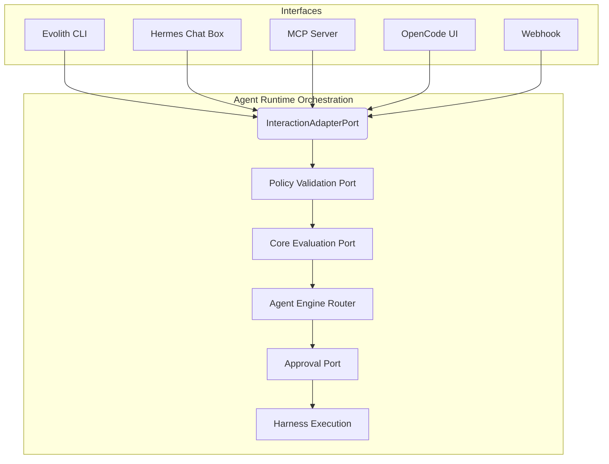
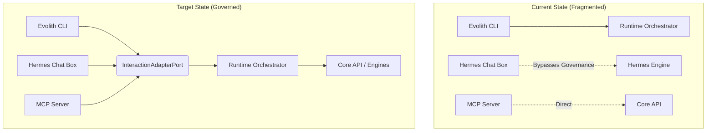
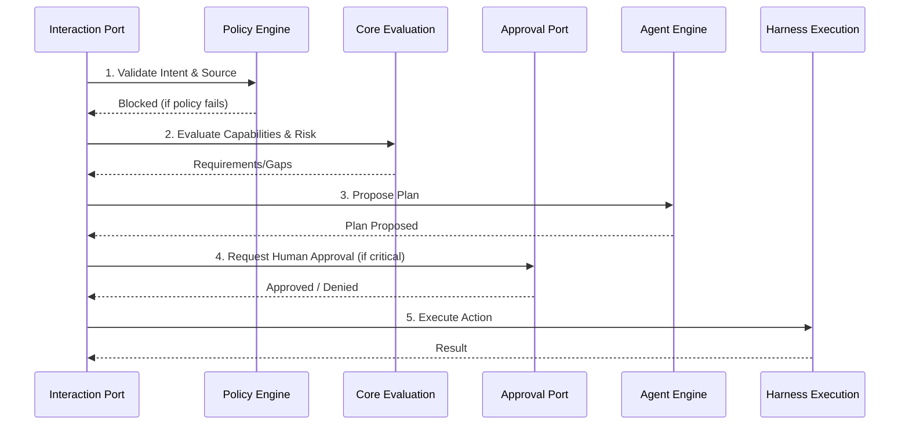
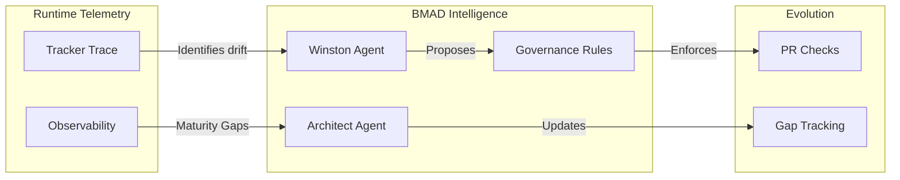

# Evolith Agent Runtime — Ports and Adapters

> **Bilingual Navigation:** [Versión en Español](./ports-and-adapters.es.md)

Every external integration is a **port** (an interface in the domain). Concrete
technology lives only in **adapters**. This is what keeps Hermes, OPA, the
Tracker, and even `.harness` swappable. Source:
[`packages/agent-runtime/src/domain/ports`](../../../../src/packages/agent-runtime/src/domain/ports).

## Port catalog

| Port | Responsibility | Design rule |
|---|---|---|
| `IAgentRuntime` | Inbound driving port — `handle(request)` | — |
| `IHarnessPort` | Discover + execute `.harness` capabilities | #4 capability provider |
| `ICoreEvaluationPort` | Send `EvaluationContext`, get `EvaluationResult` | Core stays stateless |
| `IPolicyValidationPort` | OPA / ruleset enforcement | #6/#7 cannot skip gates |
| `ITrackerTracePort` | Publish trazability events to Tracker | trazability |
| `IMemoryPort` | Conversation/working memory | runtime-owned |
| `ISkillRegistryPort` | Resolve intent/tool to a governed skill | indirection |
| `ISchedulerPort` | Defer/recur work | extension |
| `ICommunicationGatewayPort` | Adapt CLI/chat/webhook surfaces | #5 |
| `IApprovalPort` | Human-in-the-loop sign-off | #7 |
| `IAgentEnginePort` | Reasoning engine abstraction (Router/Hermes/Swarms) | #1/#2 decoupling |

Each port has a DI token in
[`tokens.ts`](../../../../src/packages/agent-runtime/src/domain/tokens.ts) (framework
agnostic `Symbol`s) for optional container wiring.

## Default (stub/in-memory) adapters

These let the runtime boot and run end-to-end with no Hermes, no live Core, and
no `.harness` checkout (design rule #5). `createAgentRuntime()` wires them all.

| Port | Default adapter |
|---|---|
| `IHarnessPort` | `InMemoryHarnessAdapter` (simulated capabilities) |
| `ICoreEvaluationPort` | `StubCoreEvaluationAdapter` (rule-based, deterministic) |
| `IPolicyValidationPort` | `StubPolicyValidationAdapter` (allow, or inject a denier) |
| `ITrackerTracePort` | `InMemoryTrackerTraceAdapter` (collects events) |
| `IMemoryPort` | `InMemoryMemoryAdapter` |
| `ISkillRegistryPort` | `LocalSkillRegistryAdapter` (seeded from `DEFAULT_SKILLS`) |
| `ISchedulerPort` | `InMemorySchedulerAdapter` |
| `ICommunicationGatewayPort` | `CliCommunicationGatewayAdapter` |
| `IApprovalPort` | `AutoApprovalAdapter` |
| `IAgentEnginePort` | `RoutingAgentAdapter` (defaults to Stub heuristic matcher) |

## Production-facing adapters

Swap any default for a real adapter without touching the runtime:

| Port | Real adapter | Notes |
|---|---|---|
| `IHarnessPort` | `HarnessProcessAdapter` | Reads `.harness/manifest.yaml`, spawns scripts/OPA |
| `IPolicyValidationPort` | `OpaCliPolicyValidationAdapter` | Shells out to `.harness/bin/opa` (fail-closed) |
| `ITrackerTracePort` | `HttpTrackerTraceAdapter` | POSTs events (inject `fetch`/headers) |
| `ICoreEvaluationPort` | (documented) in-process `EvaluationOrchestrator` or Core REST | Future extension |

## Optional engine adapters (Hermes / Swarms)

`IAgentEnginePort` is where any LLM/agent framework plugs in. `HermesAgentAdapter` and `SwarmsAgentAdapter`
lazy-load their clients (dynamic import) so the package builds and the runtime boots
with external dependencies **not** installed. The engine only **proposes** a tool + arguments;
the runtime still enforces approval, policy and trazability on the proposal. See
[Extending](./extending.md#integrating-hermes-as-a-replaceable-adapter).

## How a port becomes a result

The application service (`AgentRuntimeService`) folds whatever ran:

- harness output is mapped by `fromHarness` (reads `{status, findings,
  missing_artifacts, recommendations}`),
- Core output is mapped by `fromEvaluation` (gaps, risks, recommendations,
  missing evidence),
- OPA output is folded by `applyPolicy` (violations become findings; not-allowed
  forces `blocked`).

All three are pure functions in
[`result-assembler.ts`](../../../../src/packages/agent-runtime/src/application/result-assembler.ts),
so the status/finding mapping is unit-testable in isolation.

## Architecture Maps & Maturity Evolution

The following diagrams illustrate the strategic alignment, current gaps, and governance loops related to the `InteractionAdapterPort` and overall capability maturity.

### 1. Adapter Capability Map (Interface Routing)

All external surfaces must route through the single `InteractionAdapterPort` to prevent bypassing governance.

### 2. Current vs Target Gap (Interaction Port)

The current fragmented state allows certain interfaces (like Chat or MCP) to occasionally bypass the core runtime. The target state enforces the boundary.

### 3. Governance Flow (HITL & OPA)

The logical sequence that every request entering the `InteractionAdapterPort` must traverse before reaching `.harness` execution.

### 4. BMAD Feedback Loop

How runtime adapters feed intelligence back into `.bmad-core` agents to close gaps.

Operational closure for this loop is defined by the
[Harness Self Improving Loop](../../../../.harness/playbooks/self-improving-loop.md):
each approved run must emit progress-audit evidence, register unresolved
findings as gaps, and promote repeated lessons into durable harness assets.
