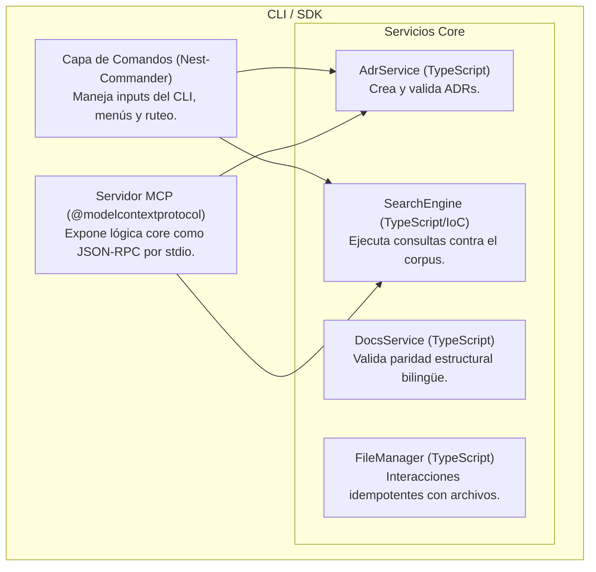
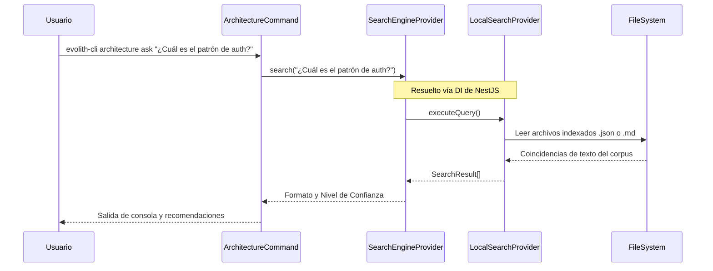
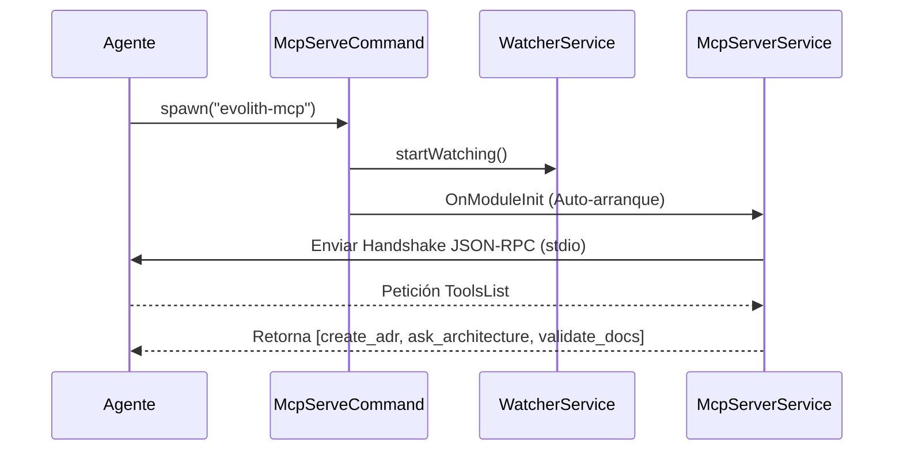

# Evolith SDK: Diseño Técnico

Este documento detalla los componentes internos y flujos de ejecución del Evolith SDK y su CLI.

## Arquitectura de Componentes (Modelo C4)

El SDK depende de la arquitectura de inyección de dependencias de NestJS donde los comandos CLI sirven solo como la capa de presentación, delegando la lógica de negocio en módulos Core aislados.

## Flujo de Inversión de Control (IoC) del Motor de Búsqueda

## Flujo de Inicialización MCP

