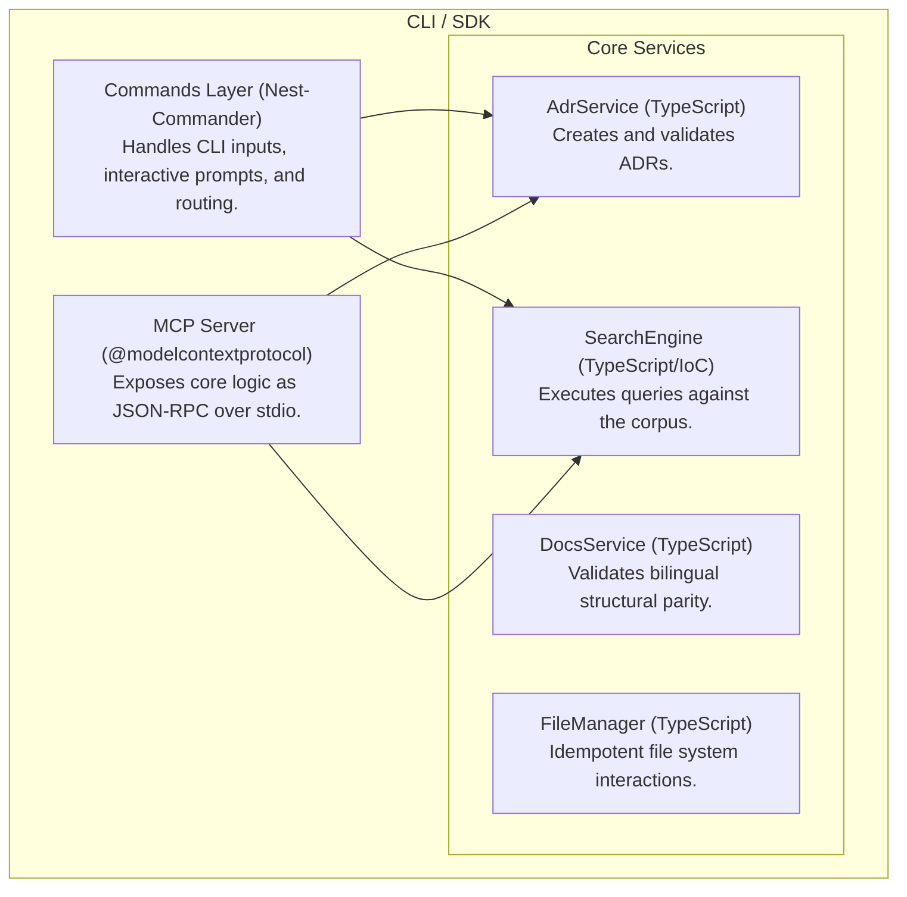
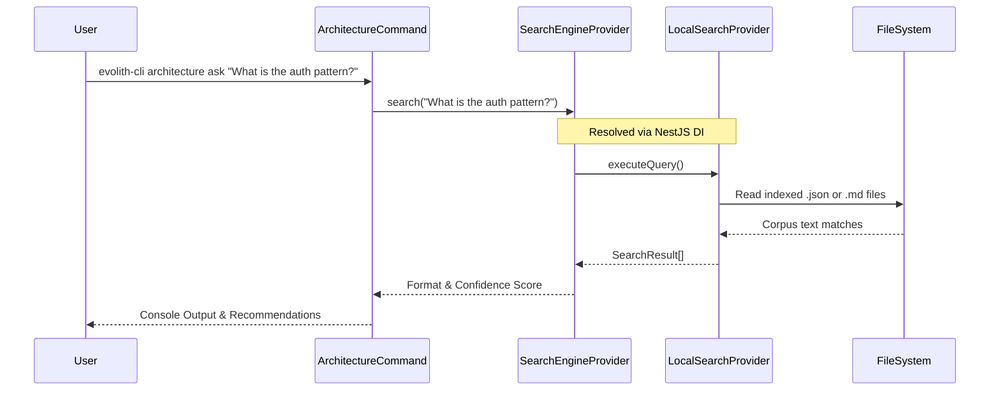
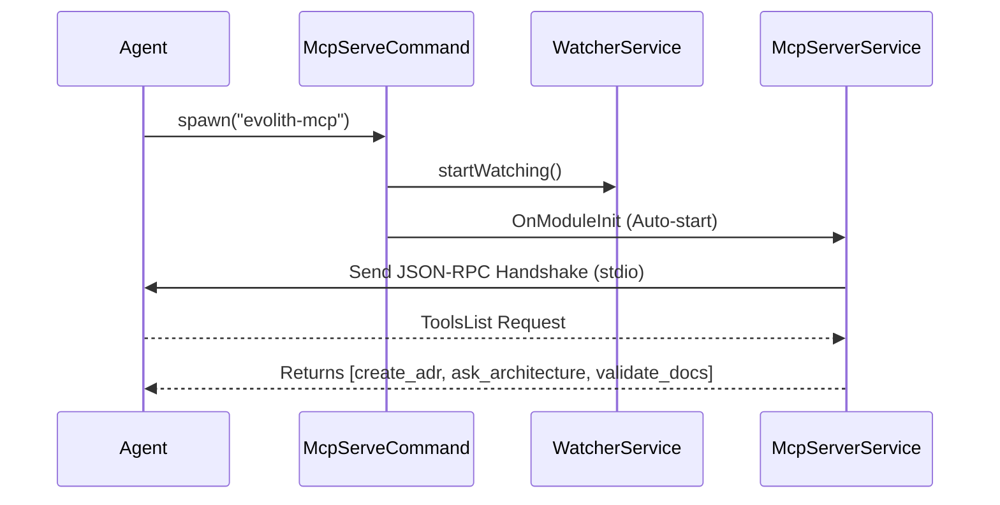

# Evolith SDK: Technical Design

This document details the internal components and execution flows of the Evolith SDK and CLI.

## Component Architecture (C4 Model)

The SDK relies on a NestJS dependency injection architecture where CLI commands serve only as the presentation layer, relying on isolated Core modules for business logic.

## Search Engine Inversion of Control (IoC) Flow

## MCP Initialization Flow

