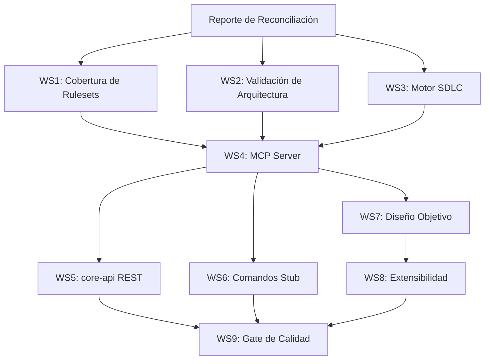

# Evolith Core — Evaluación de Fortaleza como Data Inteligente

> **Bilingual Navigation:** [English Version](./evolith-core-intelligent-data-strength-assessment.md)

**Estado:** Seguimiento Activo
**Propietario:** Junta de Arquitectura de Evolith
**Última Actualización:** 2026-06-26
**Alcance:** Interfaces evolith-cli + MCP + core-api al 100% ejecutable
**Visión Relacionada:** [Marco de Validación Estratégica y Composición de Evolith](../../../../product/suite/methods/evolith-strategic-validation-and-composition-framework.md)
**Sustituye:** `product/products/smart-cli/docs/planning/sdk-cli-mcp-current-state-assessment.md` (SUPERSEDED — solo como contexto)

Este documento define los flujos de trabajo de implementación para llevar las interfaces de Evolith (evolith-cli, MCP, core-api) al estado 100% ejecutable, validando el core como data inteligente. Es el plan de implementación autoritativo, reconciliado contra los tableros de gobernanza vivos.

---

## 0. Paso Obligatorio previo a la implementación

Antes de escribir código, lee y reconcilia el estado real contra estos tableros vivos. Trata su estado y prioridad como autoritativos:

- [Tablero de Seguimiento de Gaps](../gaps/gap-tracking.md)
- [Catálogo de Referencia de Gaps](../gaps/gap-reference-catalog.md)
- [Resumen Ejecutivo de Gobernanza](./executive-summary.md)
- [Análisis de Gaps SDK/CLI/MCP](../../../../product/products/smart-cli/docs/planning/sdk-cli-mcp-gap-analysis.md)
- [Hoja de Ruta de Implementación SDK/CLI/MCP](../../../../product/products/smart-cli/docs/planning/sdk-cli-mcp-implementation-roadmap.md)

Si algún ítem de abajo ya está cerrado en el tablero, márcalo DONE y no lo rehagas. Si el tablero tiene ítems no listados aquí, INCLÚYELOS.

---

## 1. Principio de Producto (La Vara)

evolith-cli, MCP y core-api son INTERFACES INTELIGENTES, no tubos pasivos. Cada una debe:

- **Orquestar**, **consultar** y **VALIDAR** cada etapa SDLC y cada arquitectura
- Ejecutar la lógica ella misma (invocar OPA, resolver el gate, emitir veredicto)
- Entregar al consumidor (LLM/agente/Evolith Tracker) un **VEREDICTO YA RESUELTO**, no data cruda para que el consumidor razone

Consumidor externo de referencia: Evolith Tracker (vive fuera de este repo).

---

## 2. Nota de Gobernanza

El freno "no implementar hasta aprobación del Architecture Board" aplica al NUEVO DISEÑO OBJETIVO (Evidence Graph, Gate Decision, Phase Transition, provider ports, tenant authority). Asume que ese freno fue levantado para esta tarea. Aun así: por cada pieza del nuevo diseño, verifica que exista el ADR que la gobierna; si falta, GENERA el ADR antes del código y referéncialo.

---

## 3. Plantilla de Reporte de Reconciliación

| ID | Ítem | Estado en Tablero | Acción |
|---|---|---|---|
| WS1-01 | Ruleset f1-modular-monolith | `TODO` | Implementar |
| WS1-02 | Ruleset f2-distributed-modules | `TODO` | Implementar |
| ... | ... | ... | ... |

> **Nota:** Esta tabla debe ser poblada escaneando el tablero de seguimiento de gaps antes de comenzar cualquier implementación.

---

## 4. Flujos de Trabajo — Implementar al 100%

### WS1 — Cobertura de Rulesets (Validación del Core)

**Estado base:** ~40%. **Meta:** 100% de los rulesets del repo evaluables por la CLI.

- Implementa los rulesets NO cubiertos: `f1-modular-monolith`, `f2-distributed-modules`, `f3-microservices`, `compliance-baseline`, `definition-of-done`, `engineering-manifesto`, `repository-taxonomy`, `phase-gates`, `quality-thresholds`, `satellite-contracts`, `executive-scorecards` (reconcilia esta lista contra el repo real).
- Cada ruleset debe ejecutarse vía OPA/Rego REAL (motor invocado, input evaluado), no chequeo hardcodeado en TypeScript.
- Añade test unitario por ruleset, incluido `RulesetValidatorService` (hoy sin tests).

### WS2 — Validación de Arquitectura (Hoy Ausente)

`evolith-cli validate` debe verificar:

- Reglas F1/F2/F3 por topología (las 8 topologías de los ejes del repo: progressive-axis, integration, execution, data, ai).
- Límites hexagonales, aislamiento de capa de dominio, multi-tenancy.
- Frontera Fase 1 sin datos de negocio (presupuesto/ROI/costos); únicos autorizados: ACL de Evolith Tracker y Funnel 0. Reporta violaciones.

### WS3 — Motor SDLC Ejecutable (Hoy Mock)

Reemplaza los MOCK/POC por lógica real:

- `sdlc handoff` (Phase Transition): valida que el gate de salida pase antes de permitir la transición; emite Gate Decision con evidencia.
- `sdlc generate-domain`: generación real, no [MOCK].
- Modela cada quality gate como DATO consultable: qué artefactos exige y qué rulesets deben pasar. Mapa gate → artefactos requeridos → reglas.

### WS4 — MCP Server al 100% (Bloqueante Crítico para Consumo por LLM)

**Estado base:** transportes JSON-RPC stdio + HTTP/SSE existen; handlers de tools/resources/prompts/metrics existen pero falta evidencia y verde.

- Expón como TOOLS MCP las operaciones de evaluación: validar ruleset, validar arquitectura, evaluar gate, resolver fase — devolviendo veredicto resuelto.
- Expón el corpus (topologías, ADRs, rulesets) como RESOURCES para retrieval.
- Conecta `WatcherService` → MCP: que el drift arquitectónico detectado se notifique a los clientes MCP (hoy solo loguea).
- Produce SMOKE EVIDENCE del MCP (el board lo exige para release).

### WS5 — core-api (REST)

- Expón vía REST las mismas operaciones de evaluación que MCP/CLI, enrutando a la MISMA capa de lógica (sin duplicar reglas). Un solo motor, tres fachadas.
- Define contrato de ingestión: shape con el que un cliente externo (p.ej. Evolith Tracker) declara su arquitectura y estado SDLC para ser evaluado.
- OpenAPI actualizado que describa OPERACIONES de evaluación, no solo recursos.

### WS6 — Comandos Stub Restantes

Implementa lógica real de:

- `agents` (instalación/onboarding de agentes)
- `upgrade` (upgrade seguro de satélites)
- `docs` (scaffolding)
- `scaffold` (reemplazar el exec mockeado por setTimeout por ejecución real)

### WS7 — Nuevo Diseño Objetivo (Requiere ADR por Pieza)

Implementa, con su ADR previo: Evidence Graph, Gate Decision, Phase Transition, provider ports (modelo de plugins: tool adaptable/intercambiable/reemplazable), tenant authority. Core define, providers ejecutan, CLI/MCP evalúan, Tracker decide y audita.

### WS8 — Extensibilidad (Open-Source, Colaboradores)

- Sistema de plugins para comandos (hoy agregar comando exige tocar el core).
- Esquema de contribución para que un colaborador externo agregue topologías, diseños o rulesets, con validación automática del aporte y gate de calidad en PR.

### WS9 — Calidad y Release-Gate

- Suite de tests COMPLETA en verde (unit + e2e reales, no stubs que solo ejecutan el comando sin verificar comportamiento).
- Paridad bilingüe EN/ES (incluye las notas de planning del SDK que hoy no tienen contraparte ES). El hook de paridad debe pasar.
- Cobertura de documentación vía el harness (`COVERAGE_REPORT.md` en verde).

---

## 5. Criterios de Aceptación ("100%" Medible)

1. Un consumidor externo (LLM o Evolith Tracker) puede, vía MCP o REST o CLI:
   - Enviar el estado de un proyecto → recibir veredicto de gate resuelto (pasa/falla + qué regla + por qué + evidencia). Demuéstralo con un caso E2E "hello-world de evaluación" end-to-end.
2. 100% de rulesets del repo evaluables vía OPA real.
3. Las 8 topologías con validación de arquitectura activa.
4. Gates SDLC ejecutables (cero mocks).
5. Las tres interfaces enrutan al MISMO motor (sin lógica duplicada).
6. Suite verde + paridad EN/ES + smoke MCP presente.

---

## 6. Entregables

1. Reporte de reconciliación: qué del board ya está DONE vs. lo que falta.
2. Plan de ejecución ordenado por dependencia (qué WS desbloquea a cuál).
3. Implementación por WS con tests.
4. El caso E2E "hello-world de evaluación" funcionando.
5. ADRs nuevos generados para las piezas del WS7.
6. Lista de violaciones detectadas (Fase 1 con datos de negocio / paridad).

---

## 7. Restricciones

- Stack: TypeScript/NestJS/React, monorepo, OPA/Rego, MCP. No te desvíes.
- No dupliques lógica de validación entre CLI/MCP/REST: una capa, tres fachadas.
- No inventes comandos ni rulesets: reconcilia contra el repo. AUSENTE es válido.
- Reglas en Rego ejecutable, no chequeos decorativos en TS.
- Empieza por el reporte de reconciliación. No escribas código hasta entregarlo.

---

## 8. Grafo de Dependencias

---

## 9. Referencias

- [Tablero de Seguimiento de Gaps](../gaps/gap-tracking.md)
- [Catálogo de Referencia de Gaps](../gaps/gap-reference-catalog.md)
- [Resumen Ejecutivo de Gobernanza](./executive-summary.md)
- [Plan de Implementación del Corpus de Referencia Multi-Topología](../audits/multi-topology-reference-corpus-implementation-plan.md)
- [Análisis de Gaps SDK/CLI/MCP](../../../../product/products/smart-cli/docs/planning/sdk-cli-mcp-gap-analysis.md)
- [Hoja de Ruta de Implementación SDK/CLI/MCP](../../../../product/products/smart-cli/docs/planning/sdk-cli-mcp-implementation-roadmap.md)
- [ADR-0090 Política de Lenguaje de Reglas](../../sdlc/governance/adr-0090-rule-language-policy.md)

---
[Volver al Hub de Visión](../../README.es.md)